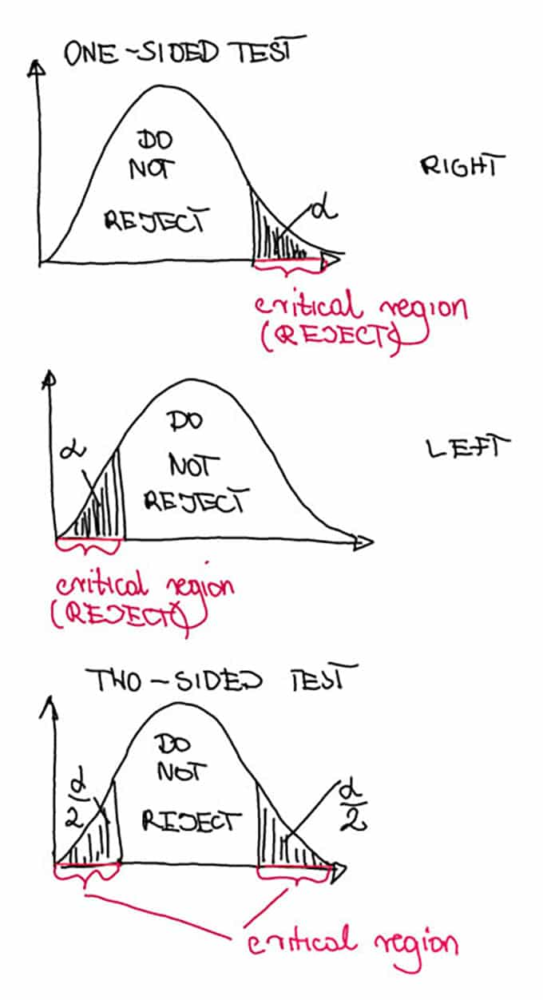
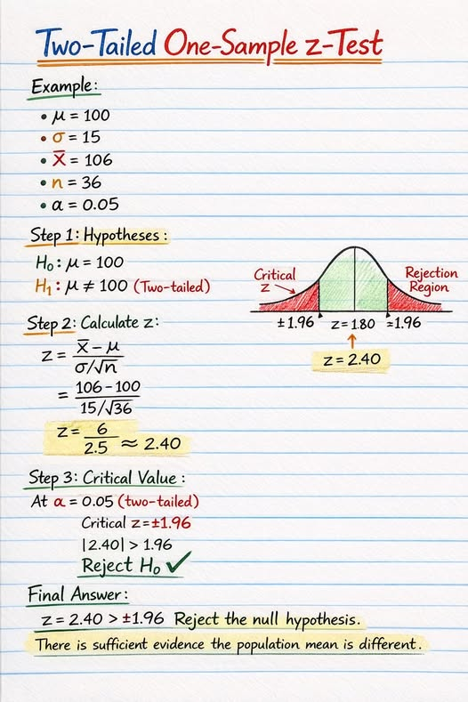

# 📐 01 — Foundations of Hypothesis Testing (L5/L6 Interview Edition)

> *"The null hypothesis is never proven or established, but is possibly disproved, in the course of experimentation."* — Karl Popper

---

## 🧠 What is Hypothesis Testing?

Hypothesis testing is a formal statistical procedure to decide whether there is enough evidence in your sample data to reject a default assumption (the null hypothesis) in favour of an alternative claim.

    Plain English: You start by assuming "nothing interesting is happening." You then collect data and ask: "Is my data surprising enough to disprove that assumption?" If yes — you have a finding. If no — you don't have enough evidence to claim otherwise.

    Analogy: It works like a court trial. The null hypothesis is "innocent until proven guilty." You need sufficient evidence (data) to convict (reject H₀). Failing to convict does not prove innocence — it just means the evidence wasn't strong enough.

```
H₀  (Null hypothesis)        — The default assumption. No effect, no difference.
H₁  (Alternative hypothesis) — What you're trying to detect. Some effect exists.
```


### Core Idea (Intuition First)

Think of it like a **court trial**:
- The defendant is **innocent until proven guilty** → The null hypothesis is assumed true until data proves otherwise.
- You need *evidence beyond reasonable doubt* → You need a *statistically significant* result.
- You can only **"fail to convict"** — you can't prove innocence → You can only *fail to reject* H₀, not *accept* it.

### The Scientific Process Mapped

```
Real World Question
       ↓
Formulate H₀ and H₁
       ↓
Collect Sample Data
       ↓
Compute Test Statistic
       ↓
Compare to Null Distribution
       ↓
Make Decision (Reject / Fail to Reject H₀)
       ↓
Draw Conclusion in Context
```

---

## 🎯 The Question L5/L6 Candidates Almost Never Get Asked — But Should

**"Why do we test H₀ and try to disprove it, instead of directly testing whether H₁ is true?"**

This is the question that separates someone who memorized the framework from someone who understands *why* it's built this way. Here's the real answer, in three layers.

### Layer 1: You need a fully specified distribution to compute anything

A p-value is `P(data this extreme | hypothesis)`. To compute that probability, the hypothesis needs to pin down **one exact distribution** for your test statistic.

- `H₀: μ = 50` is a **simple/point hypothesis** — it names one exact value, which gives you one exact sampling distribution (e.g., N(50, σ²/n)). You can calculate exact probabilities against it.
- `H₁: μ ≠ 50` is a **composite hypothesis** — it's true for infinitely many values (50.001, 51, 60, 1000...), each with a *different* sampling distribution. There is no single "the H₁ distribution" to compute a probability against.

You simply cannot compute `P(data | H1)` in the two-tailed case — there's no one number to condition on. You *can* always compute `P(data | H0)`. That's not a philosophical preference, it's a mathematical necessity — the entire p-value machinery only works because H₀ is precise.

### Layer 2: It mirrors proof by contradiction

In math, to prove statement A, you often assume ¬A and derive a contradiction. Hypothesis testing does the same thing epistemically: you assume the "boring" claim (no effect) is true, and check whether your data would be a bizarre coincidence under that assumption. If the data would be *too* bizarre (p < α), the boring assumption looks untenable — you reject it. You never directly "prove" your research claim; you only make the null look implausible enough to abandon.

### Layer 3: Falsifiability (Popper) — science disproves, it doesn't confirm

You can never collect *enough* evidence to positively confirm a universal claim like "this drug works" — there's always a next patient who might break the pattern. But a *single* disconfirming data point can, in principle, break a precise claim. This is why the entire frequentist apparatus is oriented around **falsifying a precise claim (H₀)** rather than **confirming a vague one (H₁)**. It's logically cheaper and more rigorous to disprove than to prove.

> **One-liner for the interview:** *"We test H₀ because it's the only hypothesis precise enough to have a computable sampling distribution — H₁ is typically composite, so there's no single distribution to test it against directly."*

**Bonus depth (shows range):** This is a distinctly *frequentist* framing. Bayesian hypothesis testing flips this entirely — it computes `P(H1 | data)` directly via Bayes' rule, using a prior over H₁. If an interviewer pushes on "why not just compute the probability H1 is true," this is your opening to mention that Bayesian A/B testing does exactly that, at the cost of needing a defensible prior.

---

## 📌 Null Hypothesis (H₀)

### Definition

The **null hypothesis** is the default assumption — the "nothing interesting is happening" statement. It represents:
- No effect
- No difference
- No relationship
- Status quo

### Mathematical Form

$$H_0: \theta = \theta_0$$

Where $\theta$ is the population parameter of interest (mean, proportion, variance, etc.) and $\theta_0$ is a specific claimed value.

### Common Forms

| Context | H₀ |
|---|---|
| One-sample mean | $H_0: \mu = \mu_0$ |
| Two-sample comparison | $H_0: \mu_1 = \mu_2$ |
| Proportion | $H_0: p = p_0$ |
| Correlation | $H_0: \rho = 0$ |
| Regression coefficient | $H_0: \beta_1 = 0$ |

### Real-World Examples

- "The new drug has **no effect** on blood pressure compared to placebo."
- "Clicking the blue button **does not change** conversion rate vs. the green button."
- "Customer age is **not correlated** with purchase value."

### ⚠️ Critical Nuance: H₀ is Falsifiable, Not Proven

You **never prove H₀ is true**. A failure to reject simply means *you don't have enough evidence to disprove it*. Ties directly back to the Layer 3 falsifiability point above — internalize that link, interviewers will probe it from both angles.

---

## 📌 Alternative Hypothesis (H₁ or Hₐ)

### Definition

The **alternative hypothesis** is what you're trying to find evidence *for* — the research claim. It represents the presence of an effect, difference, or relationship.

### Mathematical Form

$$H_1: \theta \neq \theta_0 \quad \text{(two-tailed)}$$
$$H_1: \theta > \theta_0 \quad \text{(right-tailed)}$$
$$H_1: \theta < \theta_0 \quad \text{(left-tailed)}$$

### Key Properties
- Must be mutually exclusive with H₀
- Should be specified *before* seeing the data (pre-registration)
- Drives the directionality of your test
- **Is composite in the two-tailed case** — this is precisely why you can't test it directly (see above)

---





## 🔁 One-Tailed vs Two-Tailed Tests

### Two-Tailed Test

**Use when:** You care about deviation in *either direction*.

$$H_0: \mu = 50 \quad \text{vs} \quad H_1: \mu \neq 50$$

Rejection region: both tails of the distribution.

$$\text{Reject } H_0 \text{ if } |Z| > z_{\alpha/2}$$

**Example:** Testing whether a coin is *biased at all* (could be heads-biased or tails-biased).

**Alpha split:** Each tail gets $\alpha/2$. If $\alpha = 0.05$, critical values are $\pm 1.96$.

---

### Right-Tailed (Upper-Tailed) Test

**Use when:** You only care if the parameter is *greater than* the null value.

$$H_0: \mu \leq \mu_0 \quad \text{vs} \quad H_1: \mu > \mu_0$$

Rejection region: right tail only.

$$\text{Reject } H_0 \text{ if } Z > z_{\alpha}$$

**Example:** Does the new drug *increase* mean survival time?

---

### Left-Tailed (Lower-Tailed) Test

**Use when:** You only care if the parameter is *less than* the null value.

$$H_0: \mu \geq \mu_0 \quad \text{vs} \quad H_1: \mu < \mu_0$$

Rejection region: left tail only.

$$\text{Reject } H_0 \text{ if } Z < -z_{\alpha}$$

**Example:** Is the new manufacturing process *reducing* defect rate?

---

### Decision Guide: One vs Two-Tailed

| Situation | Test Type |
|---|---|
| "Is there any difference?" | Two-tailed |
| "Is A better than B?" | One-tailed |
| "Did the metric improve?" | One-tailed |
| "Did anything change?" | Two-tailed |
| A/B test: "Does variant beat control?" | One-tailed (directional) |
| A/B test: "Is there any effect?" | Two-tailed |

### ⚠️ Pitfall: Choosing Tails After Seeing Data

**Never** switch from two-tailed to one-tailed after seeing the direction of the result. This is a form of p-hacking.

> Rule of Thumb: **When in doubt, use two-tailed.** It's more conservative and more defensible.

---

## 📊 Step-by-Step Framework (Universal)

```
Step 1: State H₀ and H₁ clearly (before data collection)
Step 2: Choose significance level α (typically 0.05)
Step 3: Choose the appropriate test (Z, t, χ², etc.)
Step 4: Collect data / compute test statistic
Step 5: Compute p-value (or find critical value)
Step 6: Decision rule:
        - If p-value < α → Reject H₀
        - If p-value ≥ α → Fail to Reject H₀
Step 7: State conclusion in the context of the problem
```

---

## ⚡ Rapid-Fire One-Liners (Say These Fast, Say Them Clean)

| Question | One-Liner Answer |
|---|---|
| What is a p-value? | The probability of seeing data this extreme or more, **assuming H₀ is true**. |
| Does p-value = P(H₀ is true)? | No — that's the single most common misinterpretation; p-value is P(data\|H₀), not P(H₀\|data). |
| Why "fail to reject" instead of "accept H₀"? | Absence of evidence isn't evidence of absence — we haven't proven H₀, just failed to disprove it. |
| Why do we negate H₀ instead of testing H₁ directly? | H₀ is a precise, single-value hypothesis with one computable distribution; H₁ is usually composite and has none. |
| What's statistical vs. practical significance? | Statistical significance says the effect is unlikely due to chance; practical significance says it's big enough to act on. |
| What does α = 0.05 mean? | We accept a 5% chance of rejecting H₀ when it's actually true (Type I error rate), decided *before* the test. |
| Can you ever "prove" H₁? | No — you can only make H₀ implausible enough to reject; that's indirect support, not proof. |
| When do you use a one-tailed test? | Only when you have a strong pre-registered directional hypothesis and genuinely don't care about the opposite direction. |
| What's the danger of one-tailed tests? | You get more power in your expected direction, but zero ability to detect a significant effect in the opposite direction. |

---

### The General Formula

Every hypothesis test computes a **test statistic** of this form:

```
Test statistic = (Observed value − Expected value under H₀) / Standard Error

                       signal
              =       ────────
                        noise
```

A large test statistic means your observation is many standard errors away from what H₀ predicts — strong evidence against H₀.

**Specific formulas by test:**

```
z-test (large n or σ known):     z = (X̄ − μ₀) / (σ / √n)

t-test (small n, σ unknown):     t = (X̄ − μ₀) / (s / √n)

Proportion z-test (A/B):         z = (p̂₁ − p̂₂) / √[p̂(1−p̂)(1/n₁ + 1/n₂)]

Chi-squared test:                 χ² = Σ (Observed − Expected)² / Expected
```

---

### The Decision Rule

```
Compute test statistic  →  find p-value  →  compare to α

If  p ≤ α   →  Reject H₀    ("statistically significant")
If  p > α   →  Fail to reject H₀  ("insufficient evidence")
```

Common significance levels:

| α | Confidence | Used when |
|---|-----------|-----------|
| 0.05 | 95% | Most standard experiments |
| 0.01 | 99% | Higher-stakes decisions |
| 0.001 | 99.9% | Medical, safety-critical |
| 0.1 | 90% | Exploratory research |

---

### Key Terms at a Glance

| Term | Symbol | Meaning |
|------|--------|---------|
| Null hypothesis | H₀ | Assumption of no effect |
| Alternative hypothesis | H₁ | Claim you want to test |
| Significance level | α | Max tolerable false positive rate |
| p-value | p | P(data this extreme \| H₀ true) |
| Test statistic | z, t, χ² | Standardised signal-to-noise ratio |
| Critical value | z*, t* | Threshold for rejecting H₀ |
| Type I error | α | False positive — reject true H₀ |
| Type II error | β | False negative — miss real effect |
| Statistical power | 1 − β | Probability of detecting a real effect |
| Effect size | d, δ | Magnitude of the true difference |

---

## 🧩 Tricky Q&A — Traps L5/L6 Interviewers Actually Use

**Q1: "You ran a one-tailed test expecting the metric to increase, but the data moved sharply in the opposite direction — a huge, obvious decrease. Can you claim significance?"**
> **Trap:** People instinctively say "yes, it's a huge effect, of course it's significant." **Correct answer: No.** A one-tailed test's rejection region lives entirely on one side of the distribution. If you defined H₁: μ > μ₀, there is *no* rejection region on the left side — no matter how extreme the drop, it falls in the "fail to reject" zone by construction. This is exactly why one-tailed tests must be chosen for principled reasons before the data comes in, and why "when in doubt, use two-tailed" is the safer default.

**Q2: "We ran 20 independent tests, each with a true null effect (no real difference anywhere). How many would you expect to show p < 0.05 purely by chance?"**
> **Answer:** About 1 (20 × 0.05 = 1). This is the multiple-comparisons problem, and it's the reason large-scale experimentation platforms (Google, Airbnb, Netflix) apply corrections like Bonferroni or Benjamini-Hochberg (FDR) when running many simultaneous tests or subgroup cuts — otherwise "significant" results are largely noise.

**Q3: "I doubled my sample size and my p-value dropped from 0.08 to 0.01, even though the effect size stayed exactly the same. Did the treatment get 'more real'?"**
> **Answer:** No — larger n shrinks the standard error, so the same effect size produces a larger test statistic and smaller p-value. This is exactly why, at Google/Meta scale with millions of users, you can get statistically significant results for effects so tiny they're practically meaningless. Always report effect size and confidence intervals alongside p-values, not p-values alone.

**Q4: "My p-value came out to exactly 0.05. Is that significant?"**
> **Answer:** It's a boundary case, and treating 0.05 as a sacred cliff is itself bad practice. Two datasets differing by noise alone can flip a result from 0.049 to 0.051 — the underlying evidence didn't meaningfully change. The better move: report the exact p-value and confidence interval, and avoid binary "significant/not significant" framing when you're this close to the threshold.

**Q5: "If I fail to reject H₀, have I shown there's no effect?"**
> **Answer:** No — this only shows insufficient evidence to detect an effect *given your sample size and variance*. It could be a real Type II error (underpowered test). This is why reporting power/minimum detectable effect (MDE) alongside a null result matters — "we found no effect" and "we couldn't have detected an effect this small anyway" are very different claims.

**Q6: "Why can't we just flip the logic and assume the effect exists (H₁) until proven otherwise?"**
> **Answer:** Because H₁ is typically composite (true for a whole range of values), there's no single sampling distribution to test data against — you'd need to pick one specific effect size to even start computing probabilities, which reintroduces exactly the specificity that made H₀ usable in the first place. (This is the deep-dive answer from the "why negate H₀" section — worth having ready verbatim.)

**Q7: "Two teams run the exact same experiment on the exact same data, one reports p=0.04 (two-tailed) and 'ships it,' the other pre-registered a one-tailed test and gets p=0.02 for the same direction. Which do you trust more?"**
> **Answer:** Trust the one-tailed result *only if* the directional hypothesis was genuinely pre-registered before seeing data — otherwise this is a red flag for "I peeked at the two-tailed result, didn't like the p-value, and switched tests to make it significant," a classic p-hacking move interviewers plant on purpose.

---

## 🚨 Common Pitfalls

1. **Setting up H₁ as the null**: Always put "no effect" in H₀.
2. **Post-hoc directionality**: Deciding one-tailed vs. two-tailed after seeing the result.
3. **Conflating statistical and practical significance**: A significant result isn't necessarily meaningful.
4. **Collecting data without specifying H₀ first**: Leads to data dredging.
5. **Testing the wrong parameter**: Make sure H₀ and H₁ match what you actually want to know.
6. **Treating "reject H₀" as "H₁ is proven"**: It's evidence against H₀, not proof of H₁ — the asymmetry is the whole point of the framework.


*Next: [02 — Type I & Type II Errors →](02_errors.md)*
