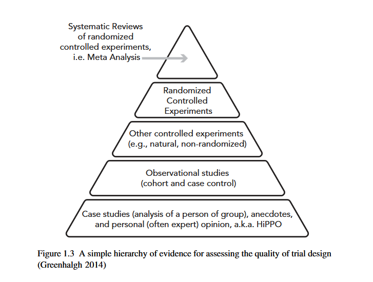
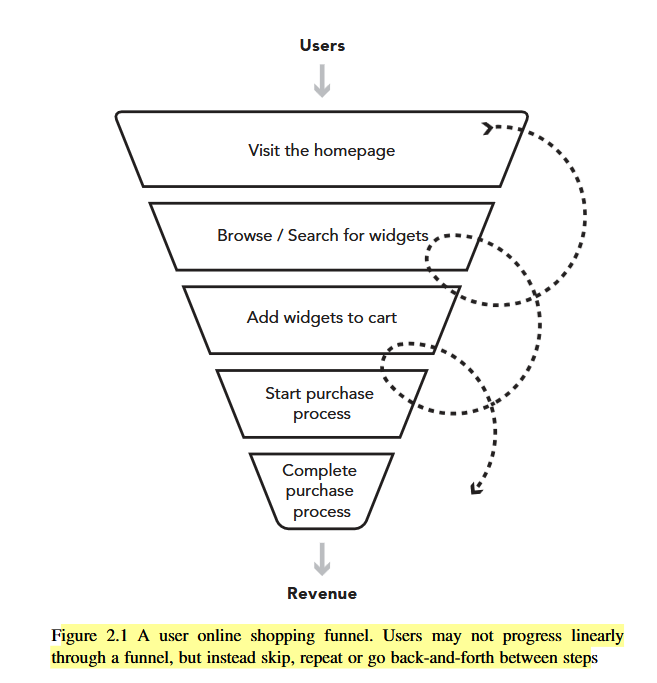
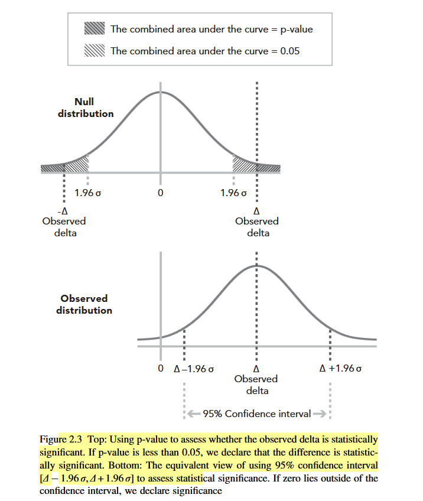

# Chapter 1: Introduction and Motivation


## The Bing Ad Headline Experiment (Motivating Example)

- A Bing engineer proposed merging the ad title with the first line of body text to create a longer headline.
- The idea was low-priority and sat in the backlog for **6+ months**.
- When finally coded and tested via an A/B experiment, a **revenue-too-high alert** fired — usually a sign of a bug (e.g., double-billing), but here the result was **legitimate**.
- Outcome: **+12% revenue** → over **$100M/year** in the US alone, with no significant harm to user-experience metrics.

### Key Takeaways from This Example

| Theme | Insight |
|---|---|
| Idea assessment | It is very hard to predict the value of any given idea |
| Small changes, big impact | Days of work → $100M/year ROI |
| Rarity of big wins | Bing runs 10,000+ experiments/year; breakthroughs happen once every few years |
| Low overhead matters | Experimentation infrastructure (ExP) made it easy to run the test scientifically |
| OEC must be holistic | Revenue alone is not enough — user experience metrics must also be tracked |

---

## Core Terminology

**A/B Test (Controlled Experiment)**
A comparison of two variants — Control (A) and Treatment (B) — where users are randomly assigned to one variant and their interactions are logged and compared.

Also called: field experiments, split tests, bucket tests, flights, randomized controlled experiments.

**Overall Evaluation Criterion (OEC)**
A single quantitative measure of the experiment's objective. Requirements:
- Must be **measurable in the short term** (duration of the experiment)
- Must **causally predict long-term strategic goals**
- Should ideally be a **single metric** (possibly a weighted combination)
- Must not be easily "gamed" (e.g., raw revenue can be gamed by adding more ads)

In statistics: also called Response Variable, Dependent Variable, Outcome, or Fitness Function.

**Parameter**
A controllable variable believed to influence the OEC. Also called a factor or variable. Parameters take on values called *levels*.

**Variant**
A specific user experience being tested. In a simple A/B test, there are two variants: Control and Treatment. The Control is the existing baseline; Treatments are the new ideas being evaluated.

**Randomization Unit**
The entity (usually a **user**) that is pseudo-randomly assigned to a variant via hashing. Requirements:
- Assignment must be **persistent** (same user → same variant across visits)
- Assignment must be **independent** (knowing one user's assignment reveals nothing about another's)

---

## Why Experiment? Correlation vs. Causality

### The Core Problem
Observational data creates misleading correlations. Two examples:

1. **Netflix churn fallacy**: Users who adopt a feature churn at half the normal rate. But this doesn't mean the feature *causes* lower churn — both outcomes may be driven by a third factor (e.g., general user engagement).
2. **Office 365 paradox**: Heavy users see more errors and crashes, yet churn less. Error messages do *not* reduce churn; **usage level** is the common cause.

> Correlation does not imply causality.

### Hierarchy of Evidence (Greenhalgh / Bailar)
From least to most trustworthy:

```
Anecdotes / Expert Opinion (HiPPO)
         ↓
Observational Studies (cohort, case-control)
         ↓
Other Controlled Experiments (non-randomized, natural)
         ↓
Randomized Controlled Experiments  ← Gold Standard
         ↓
Systematic Reviews / Meta-Analysis  ← Highest evidence

```

**HiPPO** = Highest Paid Person's Opinion — a term used to describe intuition-based decision making that experiments are meant to replace.

### Why Online Controlled Experiments Are the Best Tool
- Establish causality with high probability
- Detect **small changes** that other methods miss (high sensitivity)
- Surface **unexpected effects** — crashes, performance degradation, cannibalization of other features

---

## Necessary Ingredients for Running Useful Controlled Experiments

1. **Experimental units** that can be assigned to variants with no (or minimal) interference between groups.
2. **Enough units** — thousands minimum; more users = ability to detect smaller effects.
3. **Agreed-upon metrics / OEC** that are reliably measurable. Surrogates are acceptable when direct measurement is too hard.
4. **Easy-to-make changes** — software is ideal; server-side changes are faster to deploy and test than client-side.

---

## The Three Organizational Tenets

### Tenet 1: The Organization Wants to Make Data-Driven Decisions
- Must define an OEC measurable over short durations (1–2 weeks)
- "Profit" is a poor OEC — short-term tactics can inflate it while hurting long-term health
- **Customer Lifetime Value** is a strategically strong OEC
- *Data-informed* and *data-driven* are used interchangeably; both mean using data (not just intuition) to guide decisions

### Tenet 2: The Organization Invests in Experimentation Infrastructure
- Reliable randomization, telemetry collection, and easy software deployment are prerequisites
- Controlled experiments pair well with **Agile development**, **Customer Development**, and **MVPs**
- Getting numbers is easy; getting numbers **you can trust** is hard

### Tenet 3: The Organization Acknowledges It Is Poor at Predicting Idea Value
Data points on success rates across companies:
- **Microsoft**: ~1/3 of tested ideas actually improve the metrics they target
- **Bing / Google** (well-optimized domains): success rate ~10–20%
- **Slack**: ~30% of monetization experiments are positive
- **Netflix**: reportedly considers ~90% of ideas to be wrong
- **Quicken Loans** (5 years of testing): correct about outcomes ~33% of the time

The consistent lesson: intuition is a poor guide. Experimentation is how you find out what actually works.

---

## Improvements Are Incremental ("Inch by Inch")

Most metric gains come from many small improvements (0.1%–2%), not single breakthroughs. When an experiment only affects a subset of users, the overall impact is diluted accordingly.

### Examples of Sustained Incremental Progress
- **Google Ads (2011)**: Hundreds of experiments over a year → improved ad quality and lower average prices for advertisers
- **Bing Relevance Team**: Goal of 2% OEC improvement per year, achieved through thousands of small certified experiments
- **Bing Ads**: Grew revenue 15–25%/year through monthly "packages" of many small shipped experiments; some months were even slightly negative due to external constraints

---

## Examples of Surprising, High-Impact Experiments

### 41 Shades of Blue (Google & Bing)
- Google tested 41 color gradations for search result links
- Despite being a trivially small visual change, the winning color significantly improved user engagement
- Bing's color experiments improved task completion rates and generated **$10M+/year** in the US

### Amazon Credit Card Offer Placement (2004)
- A credit card offer on the home page had high profit but low click-through
- Moving it to the **shopping cart page** (where users have clear purchase intent) dramatically increased profit — tens of millions of dollars annually

### Amazon Personalized Cart Recommendations
- An engineer built a prototype for recommendations based on cart contents
- A senior VP opposed it, fearing it would distract users from checking out
- A controlled experiment proved it was highly valuable; the feature launched and is now standard across many e-commerce sites

### Speed / Performance (Bing)
- A JavaScript change that shortened HTML → improved performance → better user metrics
- Every **10ms of improvement** funded the fully loaded annual cost of one engineer
- By 2015, every **4ms of improvement** funded an engineer's annual cost (because revenue had grown so much)
- Amazon: a **100ms slowdown** reduced sales by 1%

### Malware Reduction (Bing)
- Freeware-injected ads polluted Bing pages with irrelevant, low-quality ads
- Experiment with 3.8M users: restricted DOM modifications to trusted sources only
- Result: all key metrics improved — sessions per user, search success rate, time-to-click, and revenue up by several million dollars; page-load time improved by hundreds of milliseconds

### Amazon Search Algorithm — "People Who Searched for X Bought Y"
- Extended the recommendation algorithm to use purchase behavior after ambiguous queries (e.g., "24" → returns the TV show, not random products)
- Despite a known weakness (results sometimes didn't contain query terms), controlled experiment showed a **3% increase in overall Amazon revenue** — hundreds of millions of dollars

---

## Strategy, Tactics, and Experiments

Controlled experiments and business strategy are **synergistic**, not competing.

### Scenario 1: Established Product + Enough Users
Experiments help **hill-climb** toward a local optimum:
- Identify high-ROI areas
- Optimize non-obvious variables (color, spacing, latency)
- Iterate toward better redesigns rather than risky full redesigns (which often fail to beat the original)
- Optimize backend algorithms (recommendations, ranking, infrastructure)

The OEC *encodes* the strategy — experiments are the feedback loop that tells you if your tactics are advancing it.

### Scenario 2: Strategy May Need a Pivot
When hill-climbing isn't enough, you may need to jump to a different region of the idea space:
- Consider **primacy effects** and **change aversion** in short-term results
- Test multiple tactics, not just one — a single failing experiment doesn't invalidate the strategy
- Use **MVPs** to cheaply explore new directions

**Bing + Social Media (failed pivot)**: After $25M+ investment and two years of experiments integrating Facebook/Twitter results, no significant metric improvement was found — the strategy was abandoned.

### Guardrail Metrics
Not everything can be traded off. Guardrail metrics define what the organization is *not* willing to sacrifice. Example: software crashes are a guardrail — no feature improvement justifies increasing crash rates.

### OEC as Strategic Integrity Mechanism
The OEC makes strategy explicit and aligns bottom-up work (features and tactics) with top-down direction (strategic goals). Without a good OEC, you may be optimizing the wrong thing entirely.

---

## Key Concepts Summary

| Term | Definition |
|---|---|
| A/B Test | Experiment comparing Control vs. Treatment via random user assignment |
| OEC | Quantitative goal metric; must be short-term measurable and predict long-term success |
| HiPPO | Highest Paid Person's Opinion; intuition-based decision-making |
| Randomization Unit | Entity (usually user) assigned to a variant; must be persistent and independent |
| Guardrail Metric | A metric the org will not allow to degrade, regardless of other gains |
| Primacy Effect | Users are accustomed to the old design; short-term data may not reflect true long-term impact |
| MVT / Multivariate Test | Experiment testing multiple parameters simultaneously |
| Multi-Armed Bandit | Experiment that dynamically reallocates traffic toward winning variants over time |

---


---

## Chapter 2

This chapter walks through a complete, concrete A/B test from start to finish: hypothesis formation, metric selection, statistical design, execution, and decision-making. The running example is a fictional e-commerce site selling widgets. The principles apply broadly — websites, desktop apps, mobile apps, game consoles, assistants, and more.

---

## Setting Up the Example

### The Business Context
The marketing team wants to send promotional emails with coupon codes. But before building a full coupon system, there is a concern: just *seeing* a coupon code field at checkout might distract users, cause them to search for codes elsewhere, and ultimately **reduce revenue** — even if there are no actual codes available.

### The Fake Door (Painted Door) Approach
Rather than building the full system upfront, the team uses a **fake door** strategy: implement only the coupon code field UI. Whatever the user enters returns "Invalid Coupon Code." The goal is to measure the *impact of the field's presence alone* on revenue, before committing to full implementation.

- **Control**: Original checkout page (no coupon field)
- **Treatment 1**: Coupon/gift code field placed below the credit card section (inline)
- **Treatment 2**: Coupon code entry as a popup triggered by a link

Testing two UI implementations simultaneously is common practice — it separates evaluation of the *idea* (adding a coupon field) from the *implementation* (how it is displayed).

### The Funnel Model
Online shopping follows a funnel (though users rarely move linearly through it):

```
Users
  ↓
Visit Homepage
  ↓
Browse / Search for Widgets
  ↓
Add Widgets to Cart
  ↓
Start Purchase Process
  ↓
Complete Purchase Process
  ↓
Revenue
```

Users skip steps, go back, or repeat. Despite this messiness, the funnel is a useful mental model for identifying *where* in the flow a change takes effect.

### Hypothesis
> "Adding a coupon code field to the checkout page will degrade revenue-per-user for users who start the purchase process."

This is the refined hypothesis — note the specificity: the metric is *revenue-per-user* (not total revenue), and the population is *users who start the purchase process* (not all visitors).

---

## Choosing the Right Metric (OEC)

### Why Not Total Revenue?
Total revenue depends on the raw number of users in each variant. Even with equal traffic allocation, random chance can cause variant sizes to differ slightly. Using total revenue would conflate the *effect of the change* with *random size differences*.

**Solution**: Normalize by actual sample size → use **revenue-per-user** as the OEC.

### Choosing the Right Denominator
Who counts as "a user" in the denominator? Three options:

| Denominator Option | Assessment |
|---|---|
| All users who visited the site | Valid, but noisy — includes users who never reached checkout and could not be affected |
| Only users who completed a purchase | **Wrong** — assumes the change only affects purchase amount, not purchase rate. If fewer users complete checkout, revenue-per-user among completers may actually look unchanged or even rise, masking a real problem |
| **Users who started the purchase process** ✓ | **Best choice** — captures all users exposed to the change, excludes unaffected users who would dilute the signal |

The general principle: include all *potentially affected* users, exclude all *definitely unaffected* users.

---

## Hypothesis Testing: Statistical Foundations

### Null Hypothesis Framework
- The **Null Hypothesis (H₀)**: The Control and Treatment have the same mean (i.e., no effect).
- We compute the **p-value**: the probability of observing a difference *at least as large as the one observed* if H₀ were true.
- If p-value < **0.05** → reject H₀ → the result is **statistically significant**.
- Equivalently: if the **95% confidence interval** for the difference does *not* include zero → statistically significant.

### Confidence Interval
For large sample sizes, the 95% CI is approximately:

```
[Δ − 1.96σ,  Δ + 1.96σ]
```

Where:
- Δ = observed difference between Treatment and Control means
- σ = standard error of that difference

The CI covers the true difference 95% of the time. If zero lies outside this interval, significance is declared.

### Statistical Power
**Statistical power** = the probability of correctly detecting a real effect when one exists (i.e., rejecting H₀ when it is actually false).

- More users → higher power
- Industry standard: design for **80–90% power**
- Power analysis is used *before* running the experiment to determine the required sample size

### Statistical vs. Practical Significance
These are two separate concepts and both matter:

| Concept | Meaning |
|---|---|
| Statistical significance | Confidence that the observed difference is not due to random chance |
| Practical significance | Whether the *size* of the difference is large enough to matter for the business |

Example thresholds:
- Large platform (Google, Bing): a **0.2%** change may be practically significant given billions of dollars at stake
- Early-stage startup: a **2%** change might still be too small; they need **10%+ improvements**
- In the chapter's example: a **≥1% change** in revenue-per-user is defined as practically significant

> A result can be statistically significant (real, not noise) but practically insignificant (too small to act on). Always define practical significance *before* running the experiment.

---

## Designing the Experiment

Four key design decisions:

### 1. Randomization Unit
**Users** — by far the most common choice. Each user is assigned persistently to one variant across all their visits. (Alternatives: pages, sessions, user-days — discussed in Chapter 14.)

### 2. Target Population
Which users should the experiment include? You can restrict by:
- Language / locale (if the change only applies to certain languages)
- Geographic region
- Platform or device type
- In this example: **all users**, analyzed among those who reach the checkout page

### 3. Experiment Size
Size (number of users) directly determines precision. Tradeoffs:

| Change | Effect on Sample Size Needed |
|---|---|
| Use purchase indicator (yes/no) instead of revenue-per-user as OEC | Smaller variance → fewer users needed |
| Raise the practical significance bar (e.g., only care about 5%+ changes) | Easier to detect → fewer users needed |
| Lower the p-value threshold (e.g., 0.01 instead of 0.05) | More certainty required → more users needed |

Other size considerations:
- **Safety**: For risky changes, start with a small fraction of users first (ramp-up), but this doesn't change the *final* target size
- **Traffic sharing**: If multiple experiments run simultaneously, each gets a smaller slice — trade off simultaneity vs. individual experiment speed
- **Overpowering** is generally fine and often recommended — it gives power to detect effects within subpopulations (e.g., users in a specific country) and across secondary metrics

### 4. Experiment Duration
Longer runtime = more users = more power, but with diminishing returns (user accumulation is sub-linear due to repeat visitors).

Factors that determine how long to run:

| Factor | Guidance |
|---|---|
| **Day-of-week effect** | User behavior differs between weekdays and weekends; run for **at least one full week** |
| **Seasonality** | Avoid periods that are anomalous (holidays, sales events) unless that's specifically what you're studying — this is *external validity* |
| **Primacy effect** | Users are accustomed to the old UI; short-term data may understate long-term impact of a new design |
| **Novelty effect** | Users may click a new feature out of curiosity, inflating short-term metrics; monitor for decay over time |
| **Variance growth** | Some metrics (e.g., cumulative session counts) have variance that grows over time, so longer doesn't always mean better — see Chapter 18 |

### Final Design for the Coupon Experiment
1. Randomization unit: **user**
2. Target: **all users**; analyze those who reach checkout
3. Power: **80% power** to detect a **≥1% change** in revenue-per-user (requires power analysis to compute exact sample size)
4. Split: **34% Control / 33% Treatment 1 / 33% Treatment 2**
5. Duration: **minimum 4 days** from power analysis; run for a **full week** to capture day-of-week effects; extend if primacy/novelty effects are detected

> Note: When the number of Treatments increases, consider making the Control group larger than each Treatment to maximize efficiency (see Chapter 18).

---

## Running the Experiment and Getting Data

Two infrastructure requirements to run any experiment:

**Instrumentation**
Logging system that records user interactions and tags each event with the experiment variant the user was assigned to. (See Chapter 13 for details.)

**Experimentation Infrastructure**
The platform that handles experiment configuration, variant assignment (randomization), and traffic allocation. (See Chapter 4 for details.)

Once data is collected, compute summary statistics and visualize results.

---

## Interpreting the Results

### Step 1: Sanity Checks via Guardrail Metrics (Invariants)
Before examining results, verify the experiment was run correctly. Guardrail metrics are metrics that should *not* change between variants. If they do change, the result is likely a bug or data pipeline error, not a real treatment effect.

Two types of invariant metrics:

| Type | Examples |
|---|---|
| **Trust-related guardrails** | Sample sizes match configured split ratios; cache-hit rates are equal across variants |
| **Organizational guardrails** | Latency — should not change just because a coupon field was added; if it does, something is wrong |

If sanity checks fail → investigate experiment design, infrastructure, or data processing before proceeding.

### Step 2: Examine Results

Results from the coupon experiment:

| Comparison | Revenue/User (Treatment) | Revenue/User (Control) | Difference | p-value | 95% CI |
|---|---|---|---|---|---|
| Treatment 1 vs. Control | $3.12 | $3.21 | −$0.09 (−2.8%) | 0.0003 | [−4.3%, −1.3%] |
| Treatment 2 vs. Control | $2.96 | $3.21 | −$0.25 (−7.8%) | 1.5e-23 | [−9.3%, −6.3%] |

Both p-values are well below 0.05 → reject H₀ → statistically significant results.

### Step 3: Interpret the Findings
- The hypothesis was confirmed: adding a coupon code field **reduces revenue**
- The mechanism: fewer users complete the purchase process (checkout abandonment increases)
- Treatment 2 (popup) is substantially worse than Treatment 1 (inline field)
- The original marketing plan's projected small revenue gain from coupon emails cannot overcome the baseline drag of just *having the field*

**Decision**: Abandon the coupon code feature entirely. The painted door approach saved significant engineering investment.

---

## From Results to Decisions

Statistical results alone do not make a decision. Context matters.

### Factors That Inform a Launch Decision

**1. Metric Tradeoffs**
What if metrics move in opposite directions? Examples:
- User engagement increases, but revenue decreases → launch?
- CPU utilization increases → does the operational cost outweigh the benefit?

There is no universal answer; it depends on organizational priorities and the OEC structure.

**2. Cost of Launching**
Two components:
- **Build cost**: Cost to finish the feature from the experimental prototype to full production. If already built, the marginal cost of launching is near zero. If the painted door was cheap but the real system is expensive, that factors heavily into the decision.
- **Maintenance cost**: New code has more bugs, is less tested, adds complexity, and makes future changes harder. High maintenance cost raises the bar for practical significance.

The higher the cost, the higher the practical significance threshold should be set.

**3. Cost of Wrong Decisions**
Not all mistakes are equal:
- If a change has a short lifespan (e.g., a promotional banner up for three days), the cost of a wrong call is low → lower the bar for statistical and practical significance
- If a change affects core infrastructure permanently, the cost of a mistake is high → raise both bars

---

## The Six Decision Cases (Figure 2.4)

Results are summarized as an observed delta (black box) with a confidence interval, compared against the practical significance boundary (dashed lines).

| Case | Statistical Significance | Practical Significance | Recommendation |
|---|---|---|---|
| **1** | Not significant | Not significant | No effect; iterate or abandon |
| **2** | Significant | Significant | Launch — easy decision |
| **3** | Significant | **Not** significant | Confident about the size; size too small to justify launch cost |
| **4** | Not significant | CI extends beyond practical boundary in both directions | Underpowered; cannot draw conclusion; run a larger follow-up experiment |
| **5** | Not significant | Likely significant (best estimate exceeds boundary) | Promising but uncertain; rerun with more power |
| **6** | Significant | Likely significant (but CI overlaps boundary) | Launching is reasonable; consider rerunning with more power for certainty |

### Key Takeaway for Ambiguous Cases
When results don't give a clean answer, be explicit about:
- What factors are being weighed
- How those factors translate to specific statistical and practical significance thresholds

Documenting this reasoning creates a consistent decision framework across experiments, not just a one-off judgment call.

---

## Key Concepts Summary

| Term | Definition |
|---|---|
| Fake Door / Painted Door | Testing user behavior toward a feature without fully building it; measures demand or impact cheaply |
| Funnel | A model of sequential user steps toward conversion; useful for identifying where a change takes effect |
| Revenue-per-user | OEC normalized by actual sample size; preferred over raw total revenue |
| Null Hypothesis (H₀) | Assumption that Control and Treatment have the same mean; rejected when p-value < 0.05 |
| p-value | Probability of observing the measured difference (or more extreme) if H₀ were true |
| 95% Confidence Interval | Range that contains the true difference 95% of the time; ≈ [Δ − 1.96σ, Δ + 1.96σ] |
| Statistical Power | Probability of detecting a real effect; typically designed at 80–90% |
| Statistical Significance | Confidence that the result is not due to chance (p < 0.05) |
| Practical Significance | Whether the magnitude of the effect is large enough to matter for the business |
| Invariant Metric | A metric that should not change between variants; used as a sanity check |
| Trust Guardrail | Invariant verifying the experiment infrastructure worked correctly (e.g., sample size ratios) |
| Organizational Guardrail | Invariant reflecting a business-level concern (e.g., latency, crash rate) |
| Day-of-week Effect | Behavioral differences between weekday and weekend users; reason to run ≥ 1 full week |
| External Validity | Whether results generalize beyond the experiment's time/context/population |
| Primacy Effect | Short-term bias from users being habituated to the old design |
| Novelty Effect | Short-term bias from users exploring a new feature out of curiosity, inflating early metrics |
| Power Analysis | Pre-experiment calculation to determine the minimum sample size needed to detect a given effect |

---
# Chapter 3 — Twyman's Law and Experimentation Trustworthiness
*Trustworthy Online Controlled Experiments: A Practical Guide to A/B Testing*

---

## Twyman's Law

> "Any figure that looks interesting or different is usually wrong." — A.S.C. Ehrenberg (1975)

> "Any statistic that appears interesting is almost certainly a mistake." — Paul Dickson (1999)

> "The more unusual or interesting the data, the more likely they are to have been the result of an error of one kind or another." — Marsh & Elliott (2009)

William Anthony Twyman was a UK radio/television audience measurement veteran. He apparently never put the law in writing — hence multiple variants exist.

**Core intuition:**
- Surprisingly **positive** result → inclination to celebrate and build a story around it
- Surprisingly **negative** result → inclination to find a flaw and dismiss it
- Reality: extreme results are more often due to **instrumentation errors, data loss/duplication, or computational errors**

**Analogy to software engineering:**
- Databases have integrity constraints
- Defensive programming uses `assert()`s
- Experimentation should run analogous checks (e.g., if every user must be in Control OR Treatment, having many users in *both* is a red flag)

---

## Misinterpretation of Statistical Results

### 1. Lack of Statistical Power

In **Null Hypothesis Significance Testing (NHST)**:
- Null hypothesis (H₀): no difference between Control and Treatment
- Reject H₀ if data provides strong evidence against it

**Common mistake:** Assuming a non-significant result means there is *no treatment effect*.

The experiment may simply be **underpowered** — not enough users to detect the effect size present.

> An evaluation of 115 A/B tests at GoodUI.org found most were underpowered (Georgiev 2018).

**Best practices:**
- Define what is *practically significant* in your context (see Ch. 2)
- Ensure sufficient statistical power to detect changes of that magnitude or smaller
- If an experiment affects only a small subset of users, **analyze just that subset** — a large effect on a small group gets diluted in the overall population (see Ch. 20)

---

### 2. Misinterpreting P-values

**Correct definition:**
> The p-value is the probability of obtaining a result equal to or more extreme than what was observed, **assuming the Null hypothesis is true**.

The conditioning on H₀ being true is critical.

**Common misconceptions** (from *A Dirty Dozen: Twelve P-Value Misconceptions*, Goodman 2008):

| # | Misconception | Why It's Wrong |
|---|---------------|----------------|
| 1 | p = .05 means H₀ has only a 5% chance of being true | p-value is calculated *assuming* H₀ is true; it says nothing about H₀'s probability |
| 2 | Non-significant (p > .05) means no difference | Results are consistent with H₀ *and* a range of other values; could be underpowered |
| 3 | p = .05 means data would occur only 5% of the time under H₀ | Incorrect — p-value includes results *equal to or more extreme* than observed |
| 4 | p = .05 means rejecting H₀ has only 5% false positive rate | False positive rate requires Bayes' Theorem and a prior probability |

**Analogy for misconception #4:**
Trying to transmute lead (atomic number 82) to gold (79) via heat/pressure/elixirs. Any rejection of H₀ (no change) must be a false positive since chemistry cannot change atomic number → 100% of rejections are false positives, regardless of p-value.

**Additional hidden assumptions in p-values:**
- Data was randomly sampled
- Statistical test assumptions hold
- No intermediate analysis that influenced which result to present
- p-value was not cherry-picked for its small size (Greenland et al. 2016)

Violating these invalidates the standard p-value interpretation.

---

### 3. Peeking at P-values

Continuously monitoring p-values during an experiment (e.g., stopping as soon as p < 0.05) results in **significant bias** — inflating statistical significance by **5–10×**.

Early versions of **Optimizely** encouraged this; it was a known problem.

**Two remedies:**
1. **Sequential tests with always-valid p-values** (Johari et al. 2017) or a **Bayesian testing framework** (Deng, Lu & Chen 2016) — used by Optimizely after redesign
2. **Predetermined experiment duration** (e.g., one week) before evaluating significance — used by Google, LinkedIn, and Microsoft

---

### 4. Multiple Hypothesis Tests

**Illustrative story** (*What is a p-value anyway?*, Vickers 2009):
> Statistician: How did you choose multinomial logistic regression?
> Surgeon: I tried every analysis in the software drop-down menus and picked the one with the smallest p-value.

This is the **multiple comparisons problem** — when selecting the lowest p-value across multiple tests, both the p-value and effect size estimates are likely biased.

**Four ways this manifests:**
1. Looking at **multiple metrics**
2. Looking at p-values **across time** (peeking)
3. Looking at **population segments** (countries, browser type, heavy/light users, new/tenured)
4. Running **multiple iterations** of an experiment — e.g., an A/A test run 20 times may yield p < 0.05 by chance alone

**Solution:** **False Discovery Rate** (Hochberg & Benjamini 1995) — see Ch. 17

---

### 5. Confidence Intervals

Confidence intervals quantify uncertainty in the Treatment effect. The confidence level = how often the CI should contain the true Treatment effect.

**Duality with p-values:** A 95% CI that does not cross zero ↔ p-value < 0.05 (for a no-difference H₀)

**Common mistake #1:** Looking at CIs for Control and Treatment *separately* and assuming overlap = no significant difference.
- **Wrong.** CIs can overlap by up to **29%** and the difference can still be statistically significant (van Belle 2008, §2.6)
- The reverse *is* true: if 95% CIs do *not* overlap → Treatment effect is significant (p < 0.05)

**Common mistake #2:** Believing "a 95% CI has a 95% chance of containing the true Treatment effect" for *a specific interval*.
- **Wrong.** For a specific CI, the true value is either 100% inside it or 0% inside it.
- The 95% refers to: if you computed CIs across *many* studies, 95% of them would contain the true value (Greenland et al. 2016)

---

## Threats to Internal Validity

*Internal validity = correctness of experimental results within the study, without generalizing.*

---

### 1. Violations of SUTVA

**SUTVA = Stable Unit Treatment Value Assumption** (Imbens & Rubin 2015)

States that experiment units (e.g., users) do **not interfere with one another** — each user's behavior is determined solely by their own variant assignment, not others'.

**Settings where SUTVA is violated:**
- **Social networks** — a feature can spill over to a user's network
- **Skype** — peer-to-peer calls create interference between users in different variants
- **Co-authoring tools** (e.g., Microsoft Office, Google Docs) — collaborative editing
- **Two-sided marketplaces** (Airbnb, eBay, Lyft, Uber, ad auctions) — lowering prices for Treatment affects Controls via the marketplace mechanism
- **Shared resources** (CPU, storage, caches) — if Treatment leaks memory and causes system slowdowns, all variants are affected; a crash in Treatment can take down Control users too, masking the delta

See Ch. 22 for ways to address SUTVA violations.

---

### 2. Survivorship Bias

Analyzing only users who have been active for some time (e.g., 2 months) introduces survivorship bias — you only see those who "survived" a selection process.

**Classic example — WWII bomber armor:**
> The military recorded where returning planes were damaged and wanted to add armor to those spots. Abraham Wald pointed out these were the *worst* places — armor should go where returning planes had *no* bullet holes, because planes hit there never made it back to be inspected. (Denrell 2005; Dmitriev et al. 2016)

---

### 3. Intention-to-Treat

In some experiments, attrition from variants is **non-random**:
- Medical: patients stop taking medication due to side effects
- Online: advertisers offered a campaign optimization but only *some* choose to apply it

Analyzing only those who actually received the treatment → **selection bias** → overstates Treatment effect.

**Intention-to-Treat (ITT):** Use the *initial assignment* regardless of whether the treatment was actually applied. The measured effect = effect of the *offer/intention*, not actual execution.

Relevant for display advertising and email marketing where Control group exposure isn't observed (Barajas et al. 2016).

---

### 4. Sample Ratio Mismatch (SRM)

**SRM:** The ratio of users between variants is not close to the designed ratio.

Example: if 1:1 split is designed but actual split is significantly off → something is wrong. With large N, a ratio outside [0.99, 1.01] for a 1.0 design almost certainly indicates a serious issue.

**System response:** Generate a strong warning and hide scorecards/reports if p-value of the ratio is very low (e.g., < 0.001).

**Common causes of SRM:**

**a) Browser redirects** (Kohavi & Longbotham 2010)
- Redirecting Treatment to another page consistently causes SRM
- Reasons:
  - **Performance:** Extra redirect adds hundreds of milliseconds → affects metrics (Ch. 5)
  - **Bots:** Handle redirects differently; may crawl the redirected page more
  - **Asymmetry:** Users may bookmark or share the Treatment URL, causing contamination since the Treatment page typically doesn't verify the user's randomization assignment
- Fix: Prefer server-side mechanisms. If redirects are unavoidable, redirect *both* Control and Treatment equally

**b) Lossy instrumentation** (Kohavi & Longbotham 2010; Kohavi et al. 2012)
- Web beacons (1×1 GIF) used for click tracking are inherently lossy
- Normally this is fine (similar loss across all variants), but if Treatment changes the *loss rate* — e.g., by affecting page layout or timing — low-activity users may appear at different rates → SRM
- Placement of the web beacon on the page affects timing → can skew instrumentation

**c) Residual / carryover effects**
- New experiments have higher bug rates; experiments may be aborted and restarted after bug fixes
- Some users already experienced the buggy Treatment → residual effect can last months (Kohavi et al. 2012; Lu & Liu 2014)
- Mitigation: Run pre-experiment A/A tests (Ch. 19); proactively re-randomize users
- **LinkedIn example:** A new People You May Know algorithm was highly beneficial, increasing visits. When stopped and restarted, carryover effects were strong enough to create an SRM and invalidate results (Chen, Liu & Xu 2019)
- **Browser cookies:** An educational campaign showed a message max 3 times (tracked via cookie). Restarting the experiment means some Treatment users have non-zero cookie counts → fewer/no impressions → dilutes Treatment effect or creates SRM

**d) Bad hash function for randomization**
- Yahoo! used Fowler-Noll-Vo hash: fine for single-layer randomization, failed for overlapping/concurrent experiments (Zhao et al. 2016)
- Cryptographic hash functions (e.g., MD5) are good but slow (Kohavi et al. 2009)
- Microsoft uses Jenkins SpookyHash (non-cryptographic, fast)

**e) Triggering impacted by Treatment**
- Triggering (selecting which users enter the experiment) based on attributes that *change over time* can cause SRM
- Example: Email campaign triggers for users inactive ≥ 3 months. If campaign is effective, users become active → next campaign iteration has an SRM because the triggering pool changes

**f) Time-of-Day effects**
- Real example: email A/B test (different body text for Control/Treatment) showed SRM in open rates
- Root cause: emails sent to Control first (during work hours) and Treatment second (after work) due to implementation convenience
- Opening behavior differs significantly by time of day

**g) Data pipeline impacted by Treatment**
- **MSN Info Pane experiment:** Treatment increased slides from 12 to 16
- Initial result: significant *reduction* in user engagement + SRM (ratio = 0.992 vs 1.0; p-value = 0.0000007)
- Investigation: increased engagement caused heavy users to be flagged as **bots** and removed from analysis
- After correcting bot filtering: Treatment actually *increased* engagement by **3.3%** — a complete reversal
- Note: For Bing, >50% of US traffic is bots; >90% in China and Russia

**Key takeaway on SRM:**
Even a small imbalance can completely reverse the apparent Treatment effect. SRMs are often caused by missing users who are either extremely engaged (heavy users) or completely inactive (zero clicks).

---

## Threats to External Validity

*External validity = extent to which results generalize to other populations or time periods.*

**Across populations:** Usually addressable — just rerun the experiment in the new context (e.g., test US wins in other markets separately rather than assuming generalizability).

**Across time:** Much harder. Holdout experiments left running for months can assess long-term effects (Hohnhold, O'Brien & Tang 2015). See Ch. 19.

---

### 1. Primacy Effects

When a change is introduced, users may need time to adapt because they are **primed to the old behavior**. Machine learning algorithms may also need time to learn better models (depending on update cycle).

Result: Treatment effect may appear small initially but grows over time as users and models adapt.

---

### 2. Novelty Effects

A new feature, especially a visible one, attracts initial curiosity. If users don't find it genuinely useful, repeat usage drops. The Treatment effect **declines over time**.

**Example 1 — Colleen Szot infomercial** (*Yes! 50 Scientifically Proven Ways to be Persuasive*, Goldstein, Martin & Cialdini 2008):
- Changed "Operators are waiting, please call now" → "If operators are busy, please call again"
- Mechanism: social proof ("lines are busy = others are calling = I should too")
- Ploys like this have a **short shelf life** — a controlled experiment would show an effect that quickly diminishes

**Example 2 — MSN Outlook link change:**
- Microsoft changed the Outlook.com link/icon to open the Outlook Mail application directly
- Unexpectedly: **28% increase in clicks** on that link in Treatment vs Control
- Not because users liked it more — users were **confused** that Outlook.com didn't open and clicked the link multiple times → confound disguised as engagement

**Example 3 — Kaiwei Ni Instagram ad:**
- Showed a fake stray hair on the phone screen → users swiped to remove it → accidentally clicked the ad
- Account was disabled by Instagram (Tiffany 2017)

---

### Detecting Primacy and Novelty Effects

**Method:** Plot the Treatment effect over time. If it is increasing or decreasing over time, the constant-effect assumption is violated → the experiment needs to run longer to determine when the effect stabilizes.

**Additional technique:** Take only users who appeared in the **first 1–2 days** of the experiment and track their Treatment effect over time separately — isolates novelty from general trends.

> In the MSN mail link example, the percentage of users clicking the link clearly *decreased* over time — the initial spike was novelty/confusion, not genuine engagement.

See Ch. 23 for caveats when running experiments for extended periods.

---

## Segment Differences

Analyzing metrics by segments can reveal genuine insights or uncover flaws (Twyman's law applies here too).

**Useful segments:**
- **Market/country** — localization failures can tank specific markets
- **Device/platform** — iOS, Android, browser version; manufacturer add-ons (Samsung, Motorola) can break features
- **Time of day / day of week** — weekend users may behave very differently
- **User type** — new vs. existing; when "new" is defined matters (experiment start vs. 1 month prior)
- **Account characteristics** — single vs. shared (Netflix), single vs. family traveler (Airbnb)

**Two uses of segmented views:**

**1. Segmented view of a metric** (independent of experiment)
- Example: Bing mobile ad CTR segmented by OS showed striking differences (iOS > Windows Phone > Android)
- Initial story: loyalty/behavior differences between OS users
- Actual cause: **different click-tracking methodologies** → different loss rates
  - iOS & Windows Phone: redirect-based tracking (high fidelity, slower UX)
  - Android: web beacon tracking (faster UX, lossy)
  - Windows Phone extra anomaly: a **bug** was recording swipes as clicks → artificially high CTR

**2. Segmented view of Treatment effect** (Heterogeneous Treatment Effects / CATEs)
- Example: UI change showed small positive Treatment effect across almost all browser segments
- Exception: **Internet Explorer 7** had a strongly negative Treatment effect
- Cause: JavaScript incompatibility with IE7, preventing users from clicking links
- Finding this required drilling into browser segments → Conditional Average Treatment Effects (CATEs)

Techniques for identifying interesting segments: **Decision Trees** (Athey & Imbens 2016), **Random Forests** (Wager & Athey 2018). But remember to correct for multiple hypothesis testing when scanning many segments.

---

### Analysis by Segments Impacted by Treatment Can Mislead

If Treatment causes users to **migrate between segments**, both segments can show improvement while the overall metric declines (or vice versa). This is *not* Simpson's Paradox — it's a migration artifact.

**Example:**
- Feature F users: avg 20 sessions/user. Non-F users: avg 10 sessions/user.
- Treatment causes users with 15 sessions/user to *stop* using F
- Effect: sessions/user *rises* for F users (removed below-average users) AND *rises* for non-F users (added above-average users)
- But aggregate sessions/user can move in any direction (Dmitriev et al. 2016, §5.8)

**Rule:** Segment only by values determined *before* the experiment, so Treatment cannot cause users to shift segments. Use aggregate (non-segmented) Treatment effect as the primary signal.

---

## Simpson's Paradox

*(Based on Crook et al. 2009)*

When an experiment runs in **multiple phases with different traffic allocations** (ramp-up — see Ch. 15), combining results can produce a directionally *incorrect* estimate of the Treatment effect.

Treatment can be **better than Control in every individual phase** yet appear **worse overall** when phases are combined.

**Example (Table 3.1):** 1M visitors/day on Friday and Saturday

| Day | C/T Split | Control CTR | Treatment CTR |
|-----|-----------|-------------|---------------|
| Friday | 99% / 1% | 20,000/990,000 = **2.02%** | 230/10,000 = **2.30%** ✓ |
| Saturday | 50% / 50% | 5,000/500,000 = **1.00%** | 6,000/500,000 = **1.20%** ✓ |
| **Total** | — | 25,000/1,490,000 = **1.68%** | 6,230/510,000 = **1.20%** ✗ |

Treatment wins each day individually, but loses overall because Saturday (worse conversion day overall) contributed far more Treatment users than Friday.

**Why it's not a math error:** It's a weighted average effect. Saturday's low overall conversion rate disproportionately weighted the Treatment average because Treatment had 50x more Saturday users than Friday users.

**Other real-world scenarios where Simpson's Paradox can arise:**
- Non-uniform browser sampling → overall Treatment looks positive, but worse for every browser segment
- Country-specific allocations (US at 1%, Canada at 50%) → aggregate can reverse per-country conclusions
- High-value customer protection (top 1% only get 1% exposure) → aggregate direction can be misleading
- Multi-datacenter upgrades → combined satisfaction data can show decrease even when each DC improved

> Pearl (2009): Observational data alone cannot resolve this paradox — the causal model determines whether to use aggregate or subpopulation data. The **Sure-Thing Principle** (Theorem 6.1.1): if an action increases the probability of event E in *every* subpopulation, it must increase it in the whole population.

Simpson's Paradox occurrences are not uncommon in real experiments (Xu, Chen & Fernandez et al. 2015; Kohavi & Longbotham 2010). **Be careful when aggregating data collected at different traffic percentages.**

---

## Encourage Healthy Skepticism

> "It had been six months since we started concerted A/B testing efforts at SumAll, and we had come to an uncomfortable conclusion: most of our winning results were not translating into improved user acquisition. If anything, we were going sideways..." — Peter Borden (2014)

Trustworthy experimentation requires investment in tests that may *invalidate* your results. Good data scientists:
- Look for anomalies
- Question results that seem too good
- Invoke Twyman's Law proactively

Investing in trustworthiness infrastructure (SRM checks, instrumentation validation, integrity tests) is investing in the unknown — but essential for results that actually mean something.

---

## Summary of Key Concepts

| Concept | Brief Description |
|---------|-------------------|
| Twyman's Law | Surprising results are usually wrong — investigate before celebrating |
| Underpowered experiments | Non-significant ≠ no effect; check power before concluding |
| p-value | Prob. of data at least this extreme *given* H₀ is true — not prob. that H₀ is true |
| Peeking | Continuous monitoring inflates false positive rate by 5–10× |
| Multiple comparisons | Cherry-picking lowest p-value biases estimates; use FDR correction |
| Confidence intervals | CI overlap ≤ 29% can still be significant; a specific CI is 100% or 0% containing true value |
| SUTVA violations | User interference (social networks, marketplaces, shared resources) corrupts results |
| Survivorship bias | Analyzing only surviving users hides effects on those who churned |
| Intention-to-treat | Use initial assignment, not actual receipt of treatment, to avoid selection bias |
| SRM | Ratio mismatch signals instrumentation/pipeline bugs — can completely reverse results |
| Primacy effects | Users primed on old behavior; effects may grow as they adapt |
| Novelty effects | Initial curiosity spike; true effect is lower; look for declining trend over time |
| Simpson's Paradox | Treatment can win each subgroup yet lose in aggregate due to weighted averaging |
| Segment migration | Improvements in all segments can mask overall decline if Treatment moves users between segments |

# Chapter 4 — Experimentation Platform and Culture
*Trustworthy Online Controlled Experiments: A Practical Guide to A/B Testing*

---

> "If you have to kiss a lot of frogs to find a prince, find more frogs and kiss them faster and faster."
> — Mike Moran, *Do It Wrong Quickly* (2007)

Running trustworthy controlled experiments is the scientific gold standard. But making experiments *easy to run* also **accelerates innovation** — decreasing the cost of trying new ideas and learning from them in a virtuous feedback loop.

This chapter covers:
- Experimentation maturity models
- Leadership and process
- Build vs. buy decisions
- Technical infrastructure and tools

---

## Experimentation Maturity Models

*(Fabijan, Dmitriev & Olsson et al. 2017; Fabijan, Dmitriev & McFarland et al. 2018; Optimizely 2018c; Wider Funnel 2018; Brooks Bell 2015)*

Four phases of maturity (following Fabijan et al. 2017):

### Phase 1: Crawl (~10 experiments/year, ~once/month)

**Goal:** Build foundational prerequisites.
- Establish **instrumentation** and basic data science capabilities
- Compute summary statistics needed for hypothesis testing
- Design, run, and analyze a **few experiments**
- Success = results that meaningfully guide forward progress
- Critical to generate momentum to advance to the next stage

### Phase 2: Walk (~50 experiments/year, ~once/week)

**Goal:** Shift from prerequisites to running *more* experiments.
- Define **standard metrics**
- Get the organization running more experiments
- Improve trust by:
  - Validating instrumentation
  - Running A/A tests
  - Running Sample Ratio Mismatch (SRM) tests (see Ch. 21)

### Phase 3: Run (~250 experiments/year, ~once/day)

**Goal:** Run experiments **at scale**.
- Metrics are comprehensive
- Achieve an agreed-upon set of metrics, or codify an **OEC** capturing tradeoffs between multiple metrics
- Experimentation used to evaluate **most** new features and changes

### Phase 4: Fly (thousands/year)

**Goal:** A/B experiments as the **norm for every change**.
- Feature teams analyze most experiments — especially straightforward ones — **without data scientists**
- Focus shifts to **automation** to support scale
- Establish **institutional memory**: record of all experiments and changes
- Share surprising results and best practices
- Goal: improve the culture of experimentation

### Scale Summary

| Phase | Frequency | Volume |
|-------|-----------|--------|
| Crawl | ~once/month | ~10/year |
| Walk | ~once/week | ~50/year |
| Run | ~once/day | ~250/year |
| Fly | — | thousands/year |

Roughly **4–5× increase** per phase.

> As an organization progresses, the technical focus, the OEC, and even team setups shift.

---

## Leadership

Leadership buy-in is **critical** for establishing a strong experimentation culture and embedding A/B testing as an integral part of product development.

### Organizational Stages in Learning to Experiment (Kohavi 2010)

1. **Hubris** (pre-experimentation): Measurement and experimentation are considered unnecessary because of confidence in the **HiPPO** (Highest Paid Person's Opinion)
2. **Measurement and control**: Organization starts measuring key metrics and controlling for unexplained differences. Still strong HiPPO dependence; entrenched norms can cause rejection of contradictory new knowledge — the **Semmelweis Reflex** (Wikipedia 2019)
   > Thomas Kuhn: paradigm shifts happen "only through something's first going wrong with normal research" (Kuhn 1996)
3. **Fundamental understanding**: Through persistent measurement, experimentation, and knowledge gathering — causes are understood, models actually work

### What Executive Buy-in Must Include

- **Shared goal metrics and guardrail metrics** (Ch. 18) — ideally codified into an OEC (Ch. 7)
- **Shift goal-setting from features to metrics:**
  - Old: ship feature X and Y
  - New: do NOT ship a feature unless it *improves* key metrics
  - This is a fundamental, difficult cultural change, especially for large established teams
- **Empower teams to innovate** within organizational guardrails (Ch. 21); expect ideas to fail; show humility when their own ideas don't move metrics; establish a **culture of failing fast**
- **Expect proper instrumentation and high data quality**
- **Review experiment results** — know how to interpret them, enforce standards on interpretation (e.g., minimize p-hacking / data dredging), give transparency on how results affect decisions
- **Experiments inform both optimization and strategy:**
  - Example: Bing's integration with Facebook and Twitter was abandoned after experiments showed no value for two years
  - Example: Testing whether videos in promotional emails increase conversion rates requires testing multiple implementations
- **Ensure a portfolio of high-risk/high-reward projects** relative to incremental ones; understand many — even most — will fail; learning from failures is critical
- **Support long-term learning:** run experiments just to collect data or establish ROI; experimentation isn't just ship/no-ship decisions
- **Improve agility with short release cycles** to create a healthy, quick feedback loop; requires sensitive surrogate metrics (Ch. 7)

> Leaders cannot just provide the platform and tools. They must provide the right **incentives, processes, and empowerment** for data-driven decisions. This is especially crucial in the **Crawl and Walk phases**.

---

## Process

As an organization advances through maturity phases, establishing **educational processes and cultural norms** is necessary to ensure trustworthy results.

> Note: At a 2019 summit with 13 online companies, establishing cultures and processes that encourage experimentation and innovation continued to be a persistent challenge (Gupta, Kohavi et al. 2019).

### Just-in-Time Education

**Example from Google (search team):**
- Experimenters had to complete a **checklist** reviewed by experts before running an experiment
- Questions ranged from "What is your hypothesis?" and "How big of a change do you care about?" through to power analysis
- Since teaching everyone to do a proper power analysis was unrealistic, the checklist linked to a **power calculator tool**
- Once the org was sufficiently up-leveled, the explicit checklist was no longer needed

Experimenters generally only need hand-holding the first few times. They become faster and more independent with each subsequent experiment. Experienced experimenters also serve as expert reviewers and help teammates.

Both **LinkedIn** and **Microsoft** (and Google occasionally) hold classes to keep employees aware of experimental concepts (Kohavi, Crook & Longbotham 2009). Classes have grown in popularity as the culture becomes more accepting of experiments.

### Experiment Review Meetings

Regular experiment review meetings for analysis results provide just-in-time education benefits:
- Experts examine results first for **trustworthiness** (often finding instrumentation issues, especially for first-timers)
- Then: useful discussions leading to launch/no-launch recommendations
- These discussions broaden understanding of goal, guardrail, quality, and debug metrics (Ch. 6)
- Developers become more likely to anticipate issues during development
- Metric tradeoffs get codified into an OEC (Ch. 7)
- **Failed experiments** are discussed and learned from — high-risk/high-reward ideas often fail on first iteration; learning is critical for refinement

Over time, experts see **patterns** across experiments and how an experiment's impact relates to similar prior ones → leads to **meta-analysis** (Ch. 8).

An unintended but positive outcome: experiment review forums **bring together different teams** so they can learn from each other. (Teams must share the same product, metrics, and OEC for sufficient shared context; if too diverse or tooling too immature, the meeting becomes unproductive — effectiveness likely begins in late Walk or Run phases.)

### Sharing Learnings Broadly

- Regular **newsletters**
- Twitter feed / curated homepage
- "Social network" attached to the experiment platform to encourage discussion (used at Booking.com)
- **Institutional memory** (Ch. 8) becomes increasingly valuable in the Fly phase

### Intellectual Integrity

For experimentation to succeed and scale, there must be a culture where **the learning matters most**, not the results or whether the change ships. Full transparency on experiment impact is critical.

Ways to achieve this:
- **Compute many metrics** and ensure OEC, guardrail, and related metrics are highly visible on the dashboard — teams cannot cherry-pick results
- **Send out newsletters/emails** about surprising results (failures AND successes), meta-analyses, and how teams incorporate experiments (Ch. 8)
- **Make it hard to launch a Treatment** that negatively impacts important metrics — ranging from a warning to the experimenter, to notifying metric owners, to (with caution) blocking a launch. Note: blocking can be counterproductive — better to have a culture where metrics are openly discussed
- **Embrace learning from failed ideas** — most ideas will fail; the key is learning from failure

---

## Build vs. Buy

Figure 4.1 shows how **Google, LinkedIn, and Microsoft** scaled experimentation over the years (year-1 = year experimentation scaled to >365/year):
- Order-of-magnitude growth over the next four years for Bing, Google, and LinkedIn
- Early years: growth was slowed by the experimentation **platform capabilities itself**
- Microsoft Office (started using controlled experiments for feature rollouts at scale in 2017): platform was not a limiting factor (leveraged Bing's platform) → grew **>600% in 2018**
- Growth slows when the org reaches "test everything" and the limiting factor becomes ability to **convert ideas into deployable code**

> Today, Google, LinkedIn, and Microsoft each run over **20,000 controlled experiments/year** (counting methodologies differ — e.g., ramping from 1% → 5% → 10% can count as 1 or 3 experiments).

Building vs. buying is an **ROI decision** (statistics in Fabijan et al. 2018).

### Can an External Platform Provide the Functionality You Need?

- **Experiment types:** frontend vs. backend, server vs. client, mobile vs. web. Many third-party solutions are not versatile enough:
  - JavaScript-based solutions don't work for backend experiments and don't scale well for many concurrent experiments
  - Some vendors are strong in one channel but weak in others (e.g., great mobile SDK but weak web; or great WYSIWYG editor but crashy mobile SDK)
- **Website speed:** Several external solutions require additional JavaScript, which slows page loads (Optimizely 2018, Kingston 2015, Neumann 2017, Kesar 2018, Abrahamse 2016). As shown in Ch. 5, increased latency impacts user engagement
- **Dimensions and metrics:** Some external platforms limit what metrics you can compute:
  - Complex metrics requiring **sessionization** are not possible in external solutions
  - **Percentile metrics** (commonly used for latency — tail is more sensitive than average) often not supported
  - Harder to establish a common language of dimensions and metrics across systems
- **Randomization unit and data sharing:** Restrictions on passing user information to external parties (privacy; see Ch. 9) may be limiting or costly
- **Data accessibility:** Is data logged to external parties easily accessible? Do you need dual-logging? What happens when summary statistics diverge — are there reconciliation tools? Often underestimated complexities that reduce trust
- **Integration of additional data sources:** Purchase data, returns, demographics? Some external systems don't allow joining such external data
- **Near real-time (NRT) results:** Useful for quickly detecting and stopping bad experiments — not always available externally
- **Institutional memory:** Many third-party systems don't have this feature
- **Re-implementation cost:** Many WYSIWYG systems require re-implementation of the feature after experiment — at scale, this creates a queue of re-implementation work

### What Would the Cost Be to Build Your Own?
Building a scalable system is both **hard and expensive** (see technical platform discussion later in the chapter).

### What's the Trajectory of Your Experimentation Needs?
This is about **anticipation**, not current volume — how many experiments will the org run if it truly embraces experimentation. If momentum and demand suggest growth beyond what an external solution can accommodate: **build**. Building takes longer, but integrating an external solution also takes significant effort — especially if you need to switch solutions as the company scales.

### Do You Need Deep Integration with Configuration and Deployment?
Experimentation can be an integral part of a **continuous deployment process**. There's a lot of synergy between experimentation and how engineering handles configuration and deployment (Ch. 15). Deep integration may be harder with a third-party solution.

> Your organization may not be ready for the investment and commitment of building your own platform — it may make sense to start with an external solution to demonstrate impact before making the case for building internally.

---

## Infrastructure and Tools

An experiment platform must ensure the **trustworthiness** of results, not just accelerate innovation. The goal: make experimentation **self-service** and minimize the incremental costs of running a trustworthy experiment.

The platform must cover every step: designing, deploying, and analyzing experiments (Gupta et al. 2018).

### Four High-Level Components (from Bing, LinkedIn, Google)

1. **Experiment definition, setup, and management** — via UI or API, stored in experiment system configuration
2. **Experiment deployment** — variant assignment and parameterization (server- and client-side)
3. **Experiment instrumentation**
4. **Experiment analysis** — definition and computation of metrics and statistical tests (p-values, etc.)

---

### 1. Experiment Definition, Setup, and Management

Experimenters need a way to easily define, setup, and manage the experiment lifecycle. An experiment specification needs: owner, name, description, start/end dates, and other fields (Ch. 12).

**Why multiple iterations per experiment are needed:**
- To evolve the feature based on experiment results (including bug fixes)
- To progressively roll out to a broader audience — via pre-defined rings (developers → all employees → broader population) or larger traffic percentages (Xia et al. 2019)

All iterations should be managed under the same experiment. Generally, one iteration per experiment should be active at any time (though different platforms may need different iterations).

**Required platform functionalities:**
- Write, edit, and save **draft experiment specifications**
- Compare draft iteration with current (running) iteration
- View **history/timeline** of an experiment (even after it stops running)
- **Auto-assign** generated experiment IDs, variants, and iterations (needed for instrumentation)
- **Validate** specifications — no configuration conflicts, invalid targeting audience, etc.
- **Check status** and start/stop an experiment
  - To guard against human error: only experiment owners or special-permission individuals can *start* an experiment
  - Due to asymmetry of harming users: **anyone can stop** an experiment (alerts are sent to owners)
- Pre-launch: check experiment variants before they go live (test code, permission/approval from trusted experts)

**In the Fly phase, also need:**
- **Automation** of experiment release and ramp-up (Ch. 15)
- **Near-real-time monitoring and alerting** to catch bad experiments early
- **Automated detection and shutdown** of bad experiments

---

### 2. Experiment Deployment

After creating the specification, it must be deployed to affect user experience. Two components:

1. **Experimentation infrastructure:** experiment definitions, variant assignments, other information
2. **Production code changes:** implement variant behavior per experiment assignment

**The infrastructure must provide:**

**a) Variant assignment:**
Given a user request and its attributes (country, language, OS, platform), which experiment and variant is that request assigned to? Assignment is based on:
- The experiment specification
- A pseudo-random hash of an ID: `f(ID)`
- Usually a **user ID** for consistent assignment
- Must be **independent**: knowing one user's assignment tells you nothing about another's (Ch. 14)

**b) Production code, system parameters and values:**
How do you ensure the user receives the appropriate experience?

This interface is the **Variant Assignment Service** (Figure 4.2). It can return just the variant assignment or a full configuration with parameter values for performance reasons. It doesn't need to be a distinct server — it can be a shared library embedded in the client or server. **A single implementation is critical** to prevent inadvertent divergence and bugs.

**Important subtlety at scale: Atomicity**
Do all servers simultaneously switch to the next iteration of an experiment? Atomicity is critical in web services where a single request calls hundreds of servers. Example: a search query requires multiple servers each handling a disjoint part of the search index — if the ranking algorithm has changed, all servers must use the same algorithm. Fix: parent service performs variant assignment and passes it down to child services.

**Where in the flow does variant assignment happen?**
Options: outside production code entirely (traffic splitting at front door), client-side (mobile app), or server-side.

Key questions to guide this decision:
- At what point do you have all required information for variant assignment? (User ID, language, device are available early; account age, time of last visit, visit frequency may require a lookup → pushes assignment later in the flow)
- Do you allow assignment at one point or multiple points?
  - In early stages (Walk or early Run): **recommend a single assignment point** to keep it simple
  - Multiple assignment points require orthogonality guarantees (see Concurrent Experiments)

**Three architecture choices for providing the Treatment:**

**Architecture 1: Code fork based on variant assignment**
```
variant = getVariant(userId)
if (variant == Treatment) then
    buttonColor = red
else
    buttonColor = blue
```
- **Advantage:** Variant assignment happens close to the actual code change → handling triggering is easier; Control and Treatment populations contain only affected users (Ch. 20)
- **Disadvantage:** Escalating technical debt — managing forked code paths becomes very challenging

**Architecture 2: Parameterized system**
```
variant = getVariant(userId)
buttonColor = variant.getParam("buttonColor")
```
Or fully parameterized:
```
variant = getVariant(userId)
...
buttonColor = variant.getParam("buttonColor")
```
- **Advantage:** Reduces code debt while maintaining easier triggering handling
- Microsoft Office uses the first option here, but implemented a system where a **bug ID is passed as an experiment parameter**, triggering an alert after 3 months to remind engineers to remove experimental code paths

**Architecture 3: No explicit getVariant() call**
```
buttonColor = config.getParam("buttonColor")
```
- Variant assignment happens early in the flow; a configuration with the variant and all parameter values is passed down through the remaining flow
- Each system parameter has a **default setting** (e.g., default `buttonColor` is blue); for Treatment, only specify which parameters change and their values
- **Advantage:** More performant at scale — as systems grow to hundreds/thousands of parameters, caching parameter handling becomes critical
- **Disadvantage:** Handling triggering is more challenging (variant assignment happens early)
- Used by **Google** (shifted from Architecture 1 due to performance + technical debt + difficulty reconciling code paths) and **Bing**

> Regardless of architecture: **measure the cost and impact of running the experimentation platform itself** — running some traffic outside the platform is itself an experiment to measure its overhead (latency, CPU, machine cost).

---

### 3. Experiment Instrumentation

Assumed: you already log basic instrumentation (user actions, system performance — see Ch. 13).

When testing new features, **update instrumentation to reflect those features** — this allows proper analysis. Leadership must ensure instrumentation is constantly reviewed and improved (focus of the Crawl phase).

For experiments, also **instrument every user request and interaction with which variant and iteration is running**. The iteration is important especially at experiment start or ramp-up, since not all servers/clients will simultaneously change the user treatment (Ch. 12).

**Counterfactual logging:**
In Run and Fly phases, you often want to log the **counterfactual** — what *would have happened*. For example, for a Treatment user, log what search results would have been returned under Control.

- In Architecture 3 (variant assignment early), counterfactual logging is challenging but necessary (Ch. 20)
- Counterfactual logging can be expensive performance-wise → may need guidelines about when it is needed
- If the product has a user feedback mechanism, **log the feedback alongside the variant IDs** — helpful when feedback is specific to a variant

---

## Scaling Experimentation: Digging into Variant Assignment

As companies move from Walk to Run phase, experiments need sufficient statistical power → a sufficient percentage of users must be assigned to each variant. To scale the **number** of experiments, users must be in **multiple experiments simultaneously**.

---

### Single-Layer Method (also called "numberline")

In the Walk phase, experiments are few. Traffic is divided so each experiment variant receives a specified fraction of total traffic.

**Example (Figure 4.3):** 1,000 disjoint buckets, assigned via `f(UID) % 1000`
- Experiment A: Control (m1–200, 20%), Treatment 1 (m201–400, 20%), Treatment 2 (m401–600, 20%)
- Experiment B: Control (m601–800, 20%), Treatment (m801–1000, 20%)

Assignment must be **random but deterministic**. Two key properties to verify:
- Roughly **equal number of users** in each bucket; slicing by country/platform/language across buckets should also be roughly equal
- **Key metrics** (goal, guardrail, quality) should have roughly the same values within normal variability

> Google, Microsoft, and many other companies found errors in randomization code by monitoring bucket characteristics. Common issue: **carry-over effects** (Ch. 23) — prior experiments tainting buckets. Solution: **re-randomize / shuffle** buckets with every experiment so they are no longer contiguous (Kohavi et al. 2012).

**Advantages of Single-Layer:**
- Simple
- Multiple experiments can run simultaneously (each user is in only one experiment)
- Plausible choice in early maturity phases

**Disadvantage:**
- Limits the number of concurrent experiments — must ensure each has enough traffic for adequate power
- Managing traffic is operationally challenging even in early phases

**How companies managed this before automation:**
- LinkedIn: teams negotiated traffic "ranges" via email
- Bing: managed by a program manager (office "usually packed with people begging for experimental traffic")
- Google: started with email and instant messaging negotiation, then a program manager

All three eventually shifted to **programmatic assignment** because manual methods don't scale.

---

### Concurrent (Overlapping) Experiments

To scale beyond what the Single-Layer method allows: each user can be in **multiple experiments simultaneously**.

**Approach: Multiple experiment layers**
Each layer behaves like the Single-Layer method. To ensure **orthogonality** across layers, add the **layer ID** to the hash: `f(UID, layerID)`.

When a request comes in, variant assignment is done once **per layer** (Figure 4.4: example with two layers — ads layer and search layer). Production code and instrumentation must handle a **vector of variant IDs**.

#### Option 1: Full Factorial Platform Design

Every user is simultaneously in all experiments — assigned to a variant (Control or Treatment) for every running experiment. Each experiment gets a unique layer ID → all experiments are orthogonal.

**Advantage:** Simple, scales the number of experiments easily in a decentralized manner; each experiment enjoys the full amount of available traffic for maximum power

**Disadvantage:** Does not prevent **collisions** — Treatments from two different experiments may give users a poor experience if they coexist
- Example: Experiment One tests blue text; Experiment Two tests blue background → users in both Treatments see blue text on a blue background (horrible UX)
- In statistical terms, these experiments **interact** — independently measured results for each may also be incorrect without accounting for interactions
- Note: not all interactions are antagonistic — sometimes being in both Treatments helps more than the sum
- Microsoft's experimentation platform has a robust system for **automated detection of interactions** (Kohavi et al. 2013)

A factorial platform design may be preferred if the **reduction in statistical power from splitting traffic outweighs the concern of interaction**.

#### Option 2: Nested Platform Design (Tang et al. 2010)

System parameters are partitioned into layers. Experiments that might produce a poor UX in combination **must be in the same layer** and are prevented by design from running for the same user.

Example layers:
- Layer for common UI elements (header and its contents)
- Layer for body
- Layer for back-end systems
- Layer for ranking parameters
- etc.

#### Option 3: Constraints-Based Platform Design (Kohavi et al. 2013)

Experimenters specify **constraints**; the system uses a **graph-coloring algorithm** to ensure no two experiments sharing a concern are exposed to the same user. Automated interaction detection (Kohavi et al. 2013) can be added.

> **Google, LinkedIn, Microsoft, and Facebook** all use some variation of nested or constraints-based designs (Xu 2015; Bakshy, Eckles & Bernstein 2014).

---

## Experimentation Analytics

Automated analysis is crucial for:
- Saving teams from time-consuming ad hoc analysis
- Ensuring the methodology behind reports is **solid, consistent, and scientifically founded**

Assumes: goal, guardrail, and quality metrics are already chosen; tradeoffs codified into an OEC.

### Step 1: Data Processing ("Cooking the Data")

Since instrumentation about a user request may happen in multiple systems, data processing typically involves:
- **Sorting and joining** different logs
- **Cleansing** the data
- **Sessionizing** the data
- **Enriching** the data

### Step 2: Data Computation

Goal: summarize and highlight key metrics to guide launch/no-launch decisions.

Compute:
- OEC, guardrail metrics, quality metrics
- Segmented by country, language, device/platform
- P-values and confidence intervals
- **Trustworthiness checks** first (especially SRM check) before checking the OEC, doing any segmentation, etc.
- Automated identification of interesting segments (Ch. 3)

> Important ordering: look at **trustworthiness checks first**, before OEC and segmentation. But before looking at the data at all, the data cooking and computation processes must themselves be thoroughly tested.

### Step 3: Data Visualization

Highlight key metrics and interesting segments in an easy-to-understand way. Can be as simple as an Excel-like spreadsheet.

Best practices:
- Present metrics as **relative change**
- Clearly indicate statistical significance — often via **color-coding**
- Use **common, tracked, frequently reviewed, and agreed-upon metric definitions** to foster intellectual integrity

**Handling metrics at scale (Run and Fly phases):**
- At large scale there can be **thousands of metrics** — group by tier (company-wide → product-specific → feature-specific; Xu et al. 2015, Dmitriev & Wu 2016) or by function (OEC, goal, guardrail, quality, debug; Ch. 7)
- Multiple testing becomes more important as metrics grow
- Common question: "Why did this irrelevant metric move significantly?"
  - Education helps; also: offer p-value threshold options smaller than the standard 0.05 to filter to the most significant metrics (Xu et al. 2015)

**Per-metric views across all experiment results:**
- Allow stakeholders to monitor global health of key metrics
- See which experiments are most impactful
- Encourages conversations between experiment owners and metric owners → increases overall experimentation knowledge

### Institutional Memory via Visualization

Visualization is a gateway for **institutional memory** — capturing what was experimented, why decisions were made, and successes/failures that lead to knowledge discovery.

Examples of institutional memory use:
- **Meta-analysis** on which kinds of experiments tend to move certain metrics, and which metrics tend to move together (beyond natural correlation) — see Ch. 8
- **Onboarding new employees** — visuals help them quickly form intuition, understand corporate goals, and learn the hypothesis process
- **Rerunning failed experiments** with historical results and refined parameters after the ecosystem evolves

---

## Summary of Key Concepts

| Topic | Key Point |
|-------|-----------|
| Maturity phases | Crawl → Walk → Run → Fly; ~4–5× experiment volume increase per phase |
| HiPPO | Highest Paid Person's Opinion; the pre-data-driven default to overcome |
| Semmelweis Reflex | Organizations rejecting knowledge that contradicts entrenched beliefs |
| Leadership role | Set metric-based goals, empower teams, expect failures, enforce integrity |
| Just-in-time education | Checklists, power calculators, expert review meetings |
| Institutional memory | Record of all experiments; increasingly valuable in Fly phase |
| Build vs. buy | ROI decision; consider metric complexity, data privacy, scale trajectory |
| Variant assignment | Must be random, deterministic, and independent |
| Atomicity | All servers must switch simultaneously for consistent experience |
| Architecture 1 | Code forks; easy triggering, but technical debt |
| Architecture 2 | Parameterized; reduces debt, easier triggering |
| Architecture 3 | Config-driven (used by Google, Bing); most performant, harder triggering |
| Single-layer | Simple; limits concurrent experiments; each user in one experiment |
| Concurrent/overlapping | Users in multiple experiments; need orthogonality guarantees |
| Full factorial | Maximum power; risks interaction (poor UX, biased results) |
| Nested design | Prevents bad UX combos by partitioning parameters into layers |
| Constraints-based | Graph-coloring algorithm to enforce experiment constraints |
| Counterfactual logging | Log what would have happened; needed for advanced analysis (Ch. 20) |
| Data cooking | Sort, join, cleanse, sessionize, enrich logs before analysis |
| Trustworthiness first | Always check SRM and integrity before looking at OEC or segments |

# Chapter 5 — Speed Matters: An End-to-End Case Study
*Trustworthy Online Controlled Experiments: A Practical Guide to A/B Testing*

---

## Why Performance Matters

- Faster product = better key metrics (revenue, satisfaction, engagement)
- **Slowdown experiments** are the controlled technique to quantify the impact of latency on any metric
- By slowing down the Treatment relative to Control, you isolate latency as the single variable and measure its effect on any metric
- Under mild, verifiable assumptions: improving performance (reducing latency) improves revenue and satisfaction symmetrically

**Empirical benchmarks:**
- Amazon: 100 msec slowdown → 1% decrease in sales (Linden 2006)
- Bing (2012): every 100 msec speedup → 0.6% revenue improvement (Kohavi et al. 2013)
- Bing (2015 follow-up): every 4 msec improvement funds one engineer for a year
- Bing (2017): every 100 msec improvement = $18M incremental annual revenue

**Recommendation:** Use **latency as a guardrail metric** in your experimentation system.

---

## What Slowdown Experiments Answer

- What is the immediate revenue impact of a given performance change?
- Is there a long-term impact (e.g., reduced churn) from performance improvements?
- If a new feature degrades metric X, would speeding up the implementation recover the loss? (New features are often initially inefficient — this mapping helps quantify the tradeoff)
- Where in the product is latency reduction most critical? (e.g., "below the fold" and right-pane elements have been found to be less critical)

**Design principle:** To isolate latency, slow the Treatment relative to Control — do not attempt to actually improve performance for the experiment, as that is difficult to engineer cleanly.

**Practical note on third-party JavaScript:** Some personalization/optimization products require a blocking JavaScript snippet at the top of the HTML page. This causes a roundtrip to the provider and transfers tens of kilobytes of JavaScript (Schrijvers 2017, Optimizely 2018b). The latency increase from this snippet can offset any gain in goal metrics. **Recommendation: prefer server-side personalization** — have the server do variant assignment (Ch. 12) and generate the HTML for that variant.

---

## Key Assumption: Local Linear Approximation

The entire framework rests on one assumption:

> The metric (e.g., revenue) vs. performance graph is **well approximated by a linear line** around today's performance point.

This is a **first-order Taylor-series (linear) approximation**.

**Interpretation:**
- When you slow down the Treatment, you move to the *right* of today's performance on the metric-vs-time curve and measure the metric delta
- The assumption: moving to the *left* (i.e., improving performance) produces approximately the same metric delta in the opposite direction

**Why this is a reasonable assumption:**
1. Faster is intuitively better in search. No reason to expect discontinuities or dramatic non-linearities around today's operating point. Large changes (e.g., +3 sec) could produce cliffs; small ones (±100 msec) are unlikely to
2. **The linearity assumption can be empirically tested:** Run slowdown experiments at two different magnitudes (e.g., 100 msec and 250 msec). If the delta at 250 msec ≈ 2.5× the delta at 100 msec, linearity holds. Bing did exactly this and confirmed linearity within confidence intervals for several key metrics

---

## How to Measure Website Performance

### Why It's Non-Trivial

- Servers handling requests must have **synchronized clocks** — clock skew between servers contributes to data quality issues (e.g., negative durations)
- Do **not** mix client and server times — they can be in different time zones (Ch. 13); client clocks are often unreliable (sometimes years off when batteries die)

### Page Load Time (PLT) — Step-by-Step (Figure 5.2)

For a highly optimized site (e.g., a search engine):

| Timestamp | Event |
|-----------|-------|
| **T0** | User initiates request (types query, hits return) |
| **T1** | Request arrives at server |
| **T2** | Server sends Chunk 1 (first HTML chunk) |
| **T3** | Client receives Chunk 1 |
| **T4** | Server starts sending Chunk 2 (URL-dependent HTML) |
| **T5** | Client receives Chunk 2, requests additional assets (images, etc.) |
| **T6** | Browser fires `onload` event for `<body>`; log beacon sent |
| **T7** | Log beacon (1×1 image request) arrives at server |

**Chunk 1** = page-independent content: header, navigation, JavaScript functions. Serves as visual feedback that the request was received. Can be sent quickly because nothing needs to be computed.

**Chunk 2** = URL/query-dependent HTML. The server must compute this before sending.

**True PLT experienced by user:** `T6 − T0`

**Approximation used:** `T7 − T1`

**Why this approximation works:** The travel time for the initial request (T1−T0) ≈ travel time for the `onload` beacon (T7−T6), since both are small HTTP requests. So the two travel times cancel, making `T7−T1 ≈ T6−T0`.

**Modern browsers:** W3C Navigation Timing API provides multiple PLT-related measurements (www.w3.org/TR/navigation-timing/). Numbers from Navigation Timing match the above approximation well.

---

## The Slowdown Experiment Design

### Where to Insert the Delay

- **Not Chunk 1:** Chunk 1 is sent before any URL-dependent computation — there is no realistic server-side improvement to make here. Also, delaying Chunk 1 deprives users of visual feedback that the request was received, creating negative effects unrelated to overall site performance
- **Correct location: Chunk 2** — delay the server's response after it has finished computing the URL-dependent HTML, simulating a slower back-end computation

### How Long Should the Delay Be?

Three competing factors:

| Factor | Direction |
|--------|-----------|
| Larger delay → smaller confidence intervals → more accurate slope estimate | Push delay **longer** |
| Larger delay → linear approximation becomes less accurate | Push delay **shorter** |
| Larger delay → more harm to users (slower experience) | Push delay **shorter** |

**Bing's choice:** 100 msec and 250 msec slowdowns — deemed reasonable balancing all three factors.

### Constant vs. Proportional Delay

- A **constant** delay models a server-side back-end delay — chosen by Bing for this experiment
- A **proportional** delay (e.g., % of current PLT) would be appropriate if modeling network-relative differences (e.g., users in South Africa already have slow PLT, so 250 msec may be imperceptible)

### First vs. Later Pages in Session

Some speedup techniques (e.g., JavaScript caching) primarily improve performance on pages *after* the first in a session. The experiment design should account for whether the target optimization affects the first page or later pages.

---

## Impact of Different Page Elements

Not all parts of a page are equally latency-sensitive:

- **Algorithmic search results (Bing):** Highly sensitive — slowdowns had material impact on revenue and key user metrics
- **Right-pane elements (Bing):** Much less sensitive — a 250 msec slowdown experiment on right-pane elements (loaded after `window.onload`) showed **no statistically significant impact** on key metrics, despite ~20 million users in the experiment

**Takeaway:** Prioritize performance improvements to the critical rendering path and above-the-fold content.

---

## Limitations of `window.onload` as a PLT Metric

`window.onload` is commonly used to mark the end of useful browser activity, but it has **severe deficiencies with modern web pages:**

- **Amazon example (Souders 2013):** Above-the-fold content renders in 2.0 sec; `window.onload` fires at 5.2 sec
- **Gmail example:** `window.onload` fires at 3.3 sec, but only a progress bar is visible; above-the-fold content appears at 4.8 sec

The mismatch between `window.onload` and actual perceived readiness motivates the concept of **perceived performance**.

---

## Perceived Performance Metrics

"Perceived performance" = users begin interpreting the page once enough of it is showing. Easier to state abstractly than to measure in practice.

Several proposed metrics:

### 1. Time to First Result
- When a list is shown (e.g., Twitter), the time until the first item is visible
- Simple but limited to list-based UIs

### 2. Above the Fold Time (AFT)
*(Brutlag, Abrams & Meenan 2011)*
- Time until pixels above the fold are painted
- Requires heuristics for: videos, animated GIFs, rotating galleries, other dynamic above-the-fold content
- Thresholds on "percent of pixels painted" can avoid trivial elements from extending measured time

### 3. Speed Index
*(Meenan 2012)*
- Generalization of AFT
- Averages the time when all visible page elements display
- Does not suffer from trivial late-loading elements
- Still affected by dynamic content changing above the fold

### 4. Page Phase Time and User Ready Time
*(Meenan, Feng & Petrovich 2013)*
- **Page Phase Time:** Identifies which rendering phase satisfies perceived performance; phases determined by pixel-change velocity
- **User Ready Time:** Measures time until the essential elements (defined per context) are ready to use

### 5. Time-to-User-Action (e.g., Time-to-Click)
- Avoids the need for perceived performance definitions entirely
- Works well when an expected user action exists after page load
- **Time-to-successful-click:** a click that does not result in the user returning within 30 seconds (avoids "bait" clicks)
- Robust to many changes; no heuristics needed
- **Limitation:** Only works when an action is expected. If a user queries "time in Paris" and gets an instant answer, there is nothing to click

---

## Interpreting Extreme Results

### Overstated claims — be skeptical

- **Marissa Mayer / Google (SERP 10→30 results):** Claimed 20% traffic and revenue drop, attributed to 0.5 sec slowdown. Multiple factors changed simultaneously; performance alone unlikely accounts for the full loss (Kohavi et al. 2014)
- **Dan McKinley / Etsy (200 msec delay):** Claimed no impact from 200 msec delay. More likely explanation: **insufficient statistical power** to detect the difference, not that performance is truly irrelevant. Telling an organization performance doesn't matter causes gradual degradation until users abandon

### A genuine exception
- In rare scenarios, **too fast** can reduce user trust (e.g., users suspect the action wasn't completed). Some products intentionally add fake progress bars to convey that work is being done (Bodlewski 2017)

### Principles for evaluating performance experiment results
- Apply appropriate trust levels to any result
- Even validated results on one site may not generalize to another
- Report **replications** of prior experiments (successful or not) — this is how science works
- Twyman's Law applies: if the result looks surprising (extremely large or zero impact), investigate before concluding

---

## Summary of Key Concepts

| Concept | Detail |
|---------|--------|
| Slowdown experiment | Slow the Treatment to isolate latency as the single variable; measure impact on any metric |
| Linearity assumption | Metric ≈ linear in latency around today's operating point; enables inferring speedup impact from slowdown data |
| Testing linearity | Run slowdowns at two magnitudes (e.g., 100 msec, 250 msec); verify delta scales proportionally |
| PLT approximation | True PLT = T6−T0; approximated by T7−T1 (log beacon arrival minus request arrival) |
| Chunk 1 vs. Chunk 2 | Never delay Chunk 1; delay Chunk 2 (URL-dependent, server-computed) |
| Constant vs. proportional delay | Constant for server-side modeling; proportional if modeling network-relative effects |
| Page element sensitivity | Algorithmic results = high sensitivity; right pane / below-the-fold = low sensitivity |
| `window.onload` deficiency | Fires long after above-the-fold content is usable; poor proxy for perceived performance |
| Perceived performance metrics | AFT, Speed Index, Page Phase Time, User Ready Time, Time-to-successful-click |
| Latency as guardrail metric | Recommended practice — use latency as a guardrail in any experiment that touches performance |
| Server-side over client JS | Prefer server-side personalization to avoid blocking JavaScript snippet overhead |
# Chapters 6 & 7 — Organizational Metrics + Metrics for Experimentation and the OEC
*Trustworthy Online Controlled Experiments: A Practical Guide to A/B Testing*

---

# Chapter 6 — Organizational Metrics

---

## Metrics Taxonomy

Three-layer taxonomy used for organizational metrics (applicable to a whole company or a specific team):

### 1. Goal Metrics
*(also called: success metrics, true north metrics)*

- Reflect what the organization **ultimately cares about**
- Process: first articulate the goal **in words** — why does the product exist? what does success look like? — then transform into metrics
- The transformation is often **imperfect**: goal metrics are usually proxies, requiring iteration over time
- Usually a **single metric or very small set** that best captures ultimate success
- May **not be easy to move in the short term** — each initiative may have small impact, or impacts may take a long time to materialize
- Leaders must engage in defining these; answers are often tied to a mission statement

### 2. Driver Metrics
*(also called: sign post metrics, surrogate metrics, indirect metrics, predictive metrics)*

- **Shorter-term, faster-moving, more sensitive** than goal metrics
- Reflect a **mental causal model** of what it takes to succeed — hypotheses on the drivers of success, not just what success looks like
- A good driver metric indicates movement in the right direction toward goal metrics

**Useful frameworks for identifying drivers:**
- **HEART framework** (Rodden, Hutchinson & Fu 2010): Happiness, Engagement, Adoption, Retention, Task Success
- **PIRATE framework / AARRR** (McClure 2007): Acquisition, Activation, Retention, Referral, Revenue
- **User funnels** in general — break down the steps that lead to success (e.g., acquire users → engage them → retain them → achieve revenue)

### 3. Guardrail Metrics

Two types:
1. **Organizational guardrails** — protect the business; discussed in Ch. 6 and sidebar below
2. **Trustworthiness guardrails** — assess internal validity of experiment results; discussed in Ch. 21

**Role:** Ensure progress toward success with the **right balance** and without violating important constraints.

**Properties:**
- Guardrail metrics are frequently **more sensitive** than goal or driver metrics
- Most teams should not be actively *moving* guardrail metrics — but must ensure they don't degrade them

**Examples of organizational guardrail constraints:**
- Goal = maximize user registrations, but don't let per-user engagement drop drastically
- Password management: goal = security (no hijackings), guardrails = ease-of-use and accessibility (how often users are locked out)
- Page-load-time: not a goal metric, but must not be degraded by feature launches (Ch. 5)

### Other Metric Taxonomies

- **Asset vs. engagement metrics:**
  - Asset = accumulation of static assets (total Facebook users, total connections)
  - Engagement = value a user receives from an action or from others using the product (sessions, pageviews)
- **Business vs. operational metrics:**
  - Business = track health of the business (revenue-per-user, DAU)
  - Operational = track operational concerns (queries per second)

### Additional Metric Types Used in Experimentation

- **Data quality metrics:** Ensure internal validity and trustworthiness of experiments (see Ch. 3, Ch. 21)
- **Diagnosis / debug metrics:** Provide additional granularity when goal/driver/guardrail metrics indicate a problem. Too detailed for ongoing tracking, but useful when drilling down
  - Example: If CTR is a key metric, have ~20 sub-metrics for clicks on specific page areas
  - Example: Decompose revenue into:
    - **Revenue indicator** (Boolean 0/1: did the user purchase at all?)
    - **Conditional revenue** (revenue if purchased, null otherwise — average only over purchasing users)
    - Average overall revenue = product of the two; each tells a different story: did more/fewer people purchase, or did average purchase price change?

---

## Metrics at Company vs. Team Level

- Goals, drivers, and guardrails must be defined at **both company and team level**
- Each team contributes differently — some focus on adoption, others on engagement, retention, performance, latency
- Each team must articulate their goal and **hypothesis on how their metrics relate to overall company metrics**
- The same metric can play **different roles** for different teams:
  - Most product teams: latency = guardrail
  - Infrastructure teams: latency = goal metric; business metrics = guardrails
- **Ambiguous example:** A support site team sets "time-on-site" as a key driver — but is more time better or worse? This discussion is valuable for aligning at every level
- Multiple teams each with their own goal/driver/guardrail metrics — all must **align upward** to the overall organizational direction (Parmenter, *Key Performance Indicators*, 2015)

---

## Formulating Metrics: Principles and Techniques

### Key Principles

**Goal metrics must be:**
- **Simple:** easily understood and broadly accepted by stakeholders
- **Stable:** should not need updating every time a new feature launches

**Driver metrics must be:**
- **Aligned with the goal:** validate that they are actually drivers of success — run experiments expressly for this purpose
- **Actionable and relevant:** teams must be able to act on product levers to move these metrics
- **Sensitive:** leading indicators for goal metrics; sensitive enough to measure impact from most initiatives
- **Resistant to gaming:** think through the incentives a metric creates and how it might be gamed (see Sidebar: Gameability)

### Techniques for Developing Metrics

- **Use less-scalable methods to generate hypotheses, then validate at scale:**
  - User surveys and UER studies (Ch. 10) can reveal behaviors correlated with success/happiness
  - Explore those behavior patterns in online logs at scale
  - Example: bounce rate — short stay correlates with dissatisfaction; combine observation with data analysis to determine the precise threshold (1 pageview? 20 seconds?) for defining the metric (Dmitriev & Wu 2016; Huang, White & Dumais 2012)

- **Consider quality when defining metrics:**
  - A click is a "bad" click if the user immediately clicks the back button
  - A signup is a "good" signup if the user actively engages after
  - A LinkedIn profile is a "good" profile if it contains sufficient information (education, current/past positions)
  - Building quality concepts (e.g., via human evaluation — Ch. 10) into goal and driver metrics makes movements more interpretable

- **Keep statistical models in metric definitions interpretable and validated over time:**
  - Example: Lifetime Value (LTV) based on predicted survival probability — if the survival function is too complex, it's hard to get stakeholder buy-in and hard to investigate sudden drops
  - Netflix uses **bucketized watch hours** as a driver metric because they are interpretable and indicative of long-term user retention (Xie & Aurisset 2016)

- **Sometimes it's easier to measure what you do NOT want:**
  - How long does a user need to stay to be "satisfied"? Hard to define.
  - On task-based sites (e.g., search): short visit to a linked page often correlates with failure; long visit can mean success *or* frustration
  - Negative metrics (dissatisfaction proxies) are useful as guardrail or debug metrics

- **Remember that metrics are themselves proxies — each has failure cases:**
  - Example: optimizing CTR may increase clickbait → create additional metrics (e.g., human relevance evaluation — Ch. 10) to counterbalance

---

## Evaluating Metrics

Most evaluation happens during formulation, but ongoing evaluation is required:

- Before adding a new metric: does it provide additional information beyond existing metrics?
- LTV metrics must be evaluated over time to ensure prediction errors stay small
- Metrics used heavily in experimentation must be evaluated periodically for **gaming** (e.g., whether a threshold in the metric definition causes disproportionate focus on moving users across that threshold)

### Establishing Causal Relationships (Driver → Goal)

This is the **hardest challenge** — we often only have a hypothesized causal model, not a verified one.

> Kaplan & Norton (1996): "Ultimately, causal paths from all the measures on a scorecard should be linked to financial objectives."

> Spitzer (2007): "Measurement frameworks are initially composed of hypotheses of the key measures and their causal relationships. These hypotheses are then tested with actual data, and can be confirmed, disconfirmed, or modified."

**Approaches to causal validation:**

1. **Use other data sources** — surveys, focus groups, UER studies — check whether they all point in the same direction
2. **Analyze observational data** — a carefully conducted observational study can help *invalidate* hypotheses, though causality is hard to establish (Ch. 11)
3. **Check whether similar validation is done at other companies** — e.g., multiple companies have shared studies showing site speed impacts revenue (Ch. 5); app size impacts downloads (Reinhardt 2016, Tolomei 2017)
4. **Run an experiment with primary goal of evaluating metrics** — e.g., to determine whether a loyalty program increases retention and LTV, run experiments that slowly roll it out. Caution: these test relatively narrow hypotheses; generalizing still requires work
5. **Use a corpus of historical experiments as "golden" samples** — check new metrics for sensitivity and causal alignment against well-understood, trustworthy past experiments (Dmitriev & Wu 2016)

---

## Evolving Metrics

Metric definitions evolve over time. Even if the concept stays the same, the exact definition may change. Reasons:

1. **Business evolved:** New business lines, shift in focus (adoption → engagement → retention), shift in user base — early adopters may not represent the long-term desired user base (Forte 2019)
2. **Environment evolved:** Competitive landscape changed, more users aware of privacy concerns, new government policies in effect
3. **Understanding of the metric evolved:** Observing the metric in action (e.g., discovering gaming, new failure modes) reveals areas for improvement

**Expected Value of Information (EVI)** (Hubbard 2014): A concept capturing how additional information improves decisions. Investigating and modifying metrics has high EVI — it is not enough to measure; you must ensure metrics guide in the right direction.

**Rate of evolution by metric type:**
- Driver, guardrail, and data quality metrics: evolve more quickly (often driven by methodology improvements)
- Goal metrics: evolve more slowly (driven by fundamental business or environmental shifts)

**Infrastructure needed as metrics evolve:**
- Evaluation of new metrics
- Schema changes
- Backfilling of historical data

---

## SIDEBAR: Guardrail Metrics

Two types of guardrail metrics:
1. **Trustworthiness-related guardrail metrics** — discussed in Ch. 21
2. **Organizational guardrail metrics** — discussed here

Most teams work on features targeting goal or driver metrics but must check guardrail metrics to ensure their feature doesn't violate important constraints. If a guardrail is violated, it triggers a discussion: is the new feature worth the tradeoff? Are there mitigations? Compensating improvements?

**Key examples of organizational guardrail metrics:**

| Guardrail Metric | Why It Matters |
|------------------|----------------|
| **HTML response size per page** | Early indicator that large code (e.g., JS) was introduced; alerting uncovers possibly sloppy code that could be optimized |
| **JavaScript errors per page** | Increasing errors is a ship blocker; segment by browser to identify browser-specific issues |
| **Revenue-per-user** | High statistical variance → not very sensitive; better variants: revenue indicator-per-user (0/1), capped revenue-per-user (capped at $X), revenue-per-page (more units, but compute variance carefully — Ch. 22) |
| **Pageviews-per-user** | Many metrics are computed per page (e.g., CTR), so changes to this denominator affect many metrics unexpectedly; if unexpected, investigate carefully (Dmitriev et al. 2017). Note: does not work as a guardrail for infinite scroll experiments |
| **Client crashes** | For client software (Office, Adobe Reader) or mobile apps (Facebook, LinkedIn, Netflix): crash rate is critical. Use both count (crashes-per-user) and indicator (did user crash during experiment? 0/1) — indicators have lower variance → statistical significance detected earlier |
| **Latency** | Sensitive relative to revenue/satisfaction; most teams should not be increasing latency |

---

## SIDEBAR: Gameability

When a numerical target is tied to rewards, humans find ways to optimize the measure rather than the underlying goal.

**Classic examples:**

- **Vasili Alexeyev (weightlifter):** Paid an incentive for every world record. Result: broke records by a gram or two at a time to maximize payout (Spitzer 2007)
- **Chicken efficiency (fast food):** Manager optimized "chicken efficiency" (pieces sold / pieces thrown away) by cooking only after orders. Won the award; drove the restaurant out of business from wait times (Spitzer 2007)
- **Warehouse inventory bonuses:** Personnel paid to minimize inventory → necessary spare parts unavailable → operations shut down waiting for delivery (Spitzer 2007)
- **UK hospital A&E wait times:** Measured time from patient registration to seeing a doctor → nursing staff asked paramedics to leave patients in ambulances until a doctor was ready (Parmenter 2015)
- **Hanoi rat bounty:** French colonial program paid bounty per rat tail → led to rat farming; similar "cobra effect" in Delhi (Vann 2003; Wikipedia 2019)
- **Canadian orphan payments (1945–1960):** Government paid $0.70/day per orphan, $2.25/day per psychiatric patient → allegedly ~20,000 orphaned children falsely certified as mentally ill (Wikipedia 2019)
- **Fire department funding by calls:** Discourages fire-prevention activities (Wikipedia 2019)

**Online domain implications:**
- Optimizing **short-term revenue** → could raise prices or plaster the site with ads → users abandon → customer LTV declines
- **Unconstrained metrics** are almost always gameable
  - "Queries returning no results" → gameable without quality constraint (can always return bad results)
  - Ad revenue → better when constrained to page space or quality measure
- **Vanity metrics** (count of your own actions, not user actions) should be avoided
  - Count of banner ads = vanity metric
  - Clicks on ads = user signal of potential interest
- **Recommendation:** Use metrics that measure **user value and user actions**. Facebook's "Likes" are a good example — they capture user actions and are fundamental to the user experience.

---

---

# Chapter 7 — Metrics for Experimentation and the Overall Evaluation Criterion (OEC)

---

## From Business Metrics to Metrics Appropriate for Experimentation

Business metrics (Ch. 6) may not be directly usable in experiments. Experiment metrics must satisfy three additional requirements:

### 1. Measurable
- Not all effects are easily measurable even in an online world
- Example: post-purchase satisfaction is challenging to measure

### 2. Attributable
- Must be able to attribute metric values to the experiment variant
- Example: to detect whether Treatment causes higher app crash rate, each crash must be attributed to its variant
- Attribution may not be available for metrics from third-party data providers

### 3. Sensitive and Timely
- Must be sensitive enough to detect meaningful changes within the experiment duration
- **Sensitivity depends on:**
  - Statistical variance of the underlying metric
  - Effect size (the delta between Treatment and Control)
  - Number of randomization units (e.g., users)

**Spectrum of sensitivity:**

| Metric | Sensitivity | Problem |
|--------|-------------|---------|
| Stock price | Near zero | Routine product changes can't move it in experiment timeframe |
| "Is feature showing?" | Very high | Not informative about value to users |
| Click-throughs on specific new feature | High | Highly localized; misses impact on rest of page; misses cannibalization |
| Whole-page CTR (penalized for quick-backs) | Good | Broader signal |
| Purchase / time-to-success | Good | Captures real outcome |

**Specific sensitivity issues:**

- **Ads revenue outliers:** A few clicks with very high cost-per-click disproportionately inflate variance → harder to detect Treatment effects. Solution: use a **truncated / capped version of revenue** for experiments as an additional sensitive metric (Ch. 22)
- **Yearly subscription renewal:** Cannot measure renewal rate in a short experiment. Solution: use surrogate metrics such as **usage** as an early indicator of satisfaction that will lead to renewals

**Reference:** Dmitriev & Wu (2016) for in-depth discussion on sensitivity.

---

## Augmenting Business Metrics for Experimentation

The subset of business metrics that meet measurability, attributability, sensitivity, and timeliness criteria may need to be augmented with:

- **Surrogate metrics** for business goals and drivers (especially for long-term metrics not measurable in experiment timeframe)
- **More granular metrics** — e.g., a page-CTR broken into CTRs for the dozens of individual features on the page
- **Trustworthiness guardrails** (Ch. 21) and **data quality metrics**
- **Diagnostic and debug metrics** — too detailed for ongoing tracking, but useful for drilling into problems

**Result:** A typical experiment scorecard has a few key metrics plus hundreds to thousands of other metrics, all segmentable by dimensions (browsers, markets, etc.).

---

## Combining Key Metrics into an OEC

### Why a Single Metric is Insufficient

Most online businesses have multiple key metrics — typically measuring:
- **User engagement** (active days, sessions-per-user, clicks-per-user)
- **Monetary value** (revenue-per-user)

**Analogy (Kaplan & Norton 1996):** A pilot needs airspeed, altitude, and remaining fuel simultaneously — not just one instrument. No single metric captures everything.

### Why an OEC is Valuable

An **Overall Evaluation Criterion (OEC)** = a weighted combination of objectives (Roy 2001) that:
- Makes the **exact definition of success clear**
- **Aligns the organization** on tradeoffs (analogous to the value of agreeing on metrics)
- Makes tradeoffs **explicit and consistent** across decision makers
- **Empowers teams** to make decisions without escalating to management
- Enables **automated searches** (parameter sweeps) and automatic ship decisions

**Examples in other domains:**
- Basketball: combined score (not separate shot-distance tracking) = the OEC
- FICO credit score: combines multiple metrics into a single 300–850 score

### Building Toward an OEC: Four Decision Groups

Before you can assign weights, classify decisions into four groups to accumulate enough tradeoff examples:

1. **All key metrics flat or positive, at least one positive** → **SHIP** the change
2. **All key metrics flat or negative, at least one negative** → **DON'T SHIP**
3. **All key metrics flat** → Don't ship; consider increasing experiment power, failing fast, or pivoting
4. **Some metrics positive, some negative** → Decide based on tradeoffs; accumulate enough such decisions to assign weights

### Constructing the OEC

One method (Roy 2001): **normalize each metric to a predefined range** (e.g., 0–1), assign weights, compute weighted sum.

**OEC = Σ (wᵢ × normalized_metricᵢ)**

### Limiting the Number of Key Metrics

If unable to combine into a single OEC, **minimize** the number of key metrics.

**The Otis Redding problem** (Pfeffer & Sutton 1999): "Can't do what ten people tell me to do, so I guess I'll remain the same." Too many metrics → cognitive overload → metrics get ignored.

**Statistical rationale for limiting to ~5 key metrics:**

Given k independent metrics and H₀ true (no change):
- P(at least one p-value < 0.05) = 1 − (1 − 0.05)ᵏ
- k = 5: **23% probability** of spurious significance
- k = 10: **40% probability** of spurious significance

Fewer metrics reduces the multiple comparison problem.

---

## Example: OEC for E-mail at Amazon

*(Kohavi & Longbotham 2010)*

**The problem:** Amazon's programmatic email campaigns used **click-through revenue** as the OEC ("fitness function"). This metric is **monotonically increasing with email volume** — more emails can only increase revenue. Result: users were spammed.

**Initial fix:** Email traffic cop — no more than one email per user per X days. But this created a new optimization problem: which email to send every X days?

**Root cause identified:** Click-through revenue optimizes for **short-term revenue**, not user lifetime value (LTV). Annoyed users unsubscribe → Amazon permanently loses the ability to email them.

**New OEC:**

```
OEC = ( Σᵢ Revᵢ  −  s × unsubscribe_lifetime_loss ) / n
```

Where:
- `i` = ranges over email recipients for the variant
- `s` = number of unsubscribes in the variant
- `unsubscribe_lifetime_loss` = estimated revenue loss of not being able to email a person for "life"
- `n` = number of users in the variant

**Result:** With just a few dollars assigned to `unsubscribe_lifetime_loss`, **more than half of the programmatic campaigns showed a negative OEC**.

**Secondary insight:** Realizing that unsubscribes have large lifetime cost led to a redesigned unsubscribe page — the default became "unsubscribe from this campaign family" rather than "unsubscribe from all Amazon emails," drastically reducing the cost per unsubscribe.

---

## Example: OEC for Bing's Search Engine

*(Kohavi et al. 2012)*

**The problem:** A ranker bug causing very poor search results in a Treatment produced:
- Distinct queries per user **up >10%**
- Revenue-per-user **up >30%**

Both key organizational metrics improved — but only because bad results forced users to issue more queries and click more on ads. This illustrates how short-term and long-term objectives can diverge diametrically.

**Query share decomposition:**

Monthly query share = distinct queries for the search engine / distinct queries for all search engines

Distinct queries per month decomposes as:

```
n × (Users/Month) × (Sessions/User) × (Distinct queries/Session)    [Eq. 7.1]
```

Where a **session** = user activity beginning with a query and ending with 30 minutes of inactivity.

**Analysis of each term for OEC suitability:**

| Term | OEC-appropriate? | Reason |
|------|-----------------|--------|
| Users per month | No | Fixed by experiment design (50/50 split → approximately equal users per variant) |
| Distinct queries per session | Nuanced | Decreasing means fewer queries needed (good: task efficiency) OR abandonment (bad); must be paired with task success check |
| Sessions-per-user | **Yes — key metric to increase** | Satisfied users visit more often |

**Conclusion:** Distinct queries per user alone should NOT be used as an OEC for search experiments. The correct goal for a search engine (help users find answers quickly) implies *reducing* distinct queries per task — which conflicts with increasing query share. Use **sessions-per-user** as the key metric.

**Revenue-per-user as OEC for search/ads:** Also should not be used without constraints. Common constraint: restrict average number of pixels ads can use over multiple queries. Increasing revenue given this constraint = constrained optimization problem.

---

## Goodhart's Law, Campbell's Law, and the Lucas Critique

All three laws address the same fundamental problem: **metrics that are correlated with a goal cease to be good measures when they become targets**, because optimizing for the measure breaks the correlation.

### Goodhart's Law

> "Any observed statistical regularity will tend to collapse once pressure is placed upon it for control purposes." (Goodhart 1975)

More commonly stated as:
> "When a measure becomes a target, it ceases to be a good measure." (Strathern 1997)

### Campbell's Law

> "The more any quantitative social indicator is used for social decision-making, the more subject it will be to corruption pressures and the more apt it will be to distort and corrupt the social processes it is intended to monitor." (Campbell 1979)

### Lucas Critique

*(Lucas 1976)*

Relationships observed in historical data **cannot be considered structural or causal**. Policy decisions alter the structure of models, breaking correlations that held historically.

**Example:** The Phillips Curve — historical negative correlation between inflation and unemployment (UK 1861–1957). Raising inflation hoping to lower unemployment assumes an incorrect causal relationship. In the 1973–1975 US recession, both increased simultaneously. Current belief: inflation rate has no causal effect on unemployment (Hoover 2008).

**Tim Harford's illustration (2014):** "Fort Knox has never been robbed, so we can save money by sacking the guards." Empirical data alone is insufficient — you must also reason about how changing the policy changes the incentives. Obviously removing guards would change robbers' probability assessments.

**Core challenge for OEC design:**

Finding correlations in historical data does not mean you can pick a point on a correlational curve by modifying one variable and expect the other to change. The relationship must be **causal**, not merely correlational. This is what makes picking metrics for the OEC so difficult.

---

## Summary of Key Concepts

| Concept | Detail |
|---------|--------|
| Goal metrics | Ultimate success; simple, stable; small set; slow-moving |
| Driver metrics | Causal hypotheses on success drivers; faster-moving; sensitive; aligned with goals |
| Guardrail metrics | Two types: organizational (business protection) and trustworthiness (Ch. 21); often more sensitive than goal/driver |
| HEART framework | Happiness, Engagement, Adoption, Retention, Task Success |
| PIRATE / AARRR | Acquisition, Activation, Retention, Referral, Revenue |
| Metric formulation principles | Goal: simple + stable. Driver: aligned, actionable, sensitive, gaming-resistant |
| Metric evolution causes | Business evolution, environment evolution, understanding evolution |
| EVI | Expected Value of Information — investigating and improving metrics has high EVI |
| Causal validation | Surveys, observational data, peer company studies, dedicated experiments, historical experiment corpus |
| Gameability | Metrics tied to rewards invite optimization of the measure vs. the goal; use constrained metrics and user-action metrics |
| Experiment metric requirements | Measurable, attributable, sensitive and timely |
| Sensitivity | Depends on variance, effect size, number of randomization units |
| OEC | Overall Evaluation Criterion — weighted combination of normalized metrics |
| Four decision groups | All positive → ship; all negative → don't ship; all flat → don't ship; mixed → tradeoff decision |
| Limit key metrics to ~5 | k=5: 23% false positive probability; k=10: 40% |
| Amazon email OEC | Added unsubscribe lifetime loss to click-through revenue → revealed >50% of campaigns were net-negative |
| Bing search OEC | Sessions-per-user = correct key metric; distinct queries per user alone is gameable and wrong |
| Goodhart's Law | When a measure becomes a target, it ceases to be a good measure |
| Campbell's Law | Quantitative indicators used for decisions become subject to corruption pressures |
| Lucas Critique | Historical correlations are not causal; optimizing based on correlation can break the relationship |
# Chapters 8 & 9 — Institutional Memory & Meta-Analysis + Ethics in Controlled Experiments
*Trustworthy Online Controlled Experiments: A Practical Guide to A/B Testing*

---

# Chapter 8 — Institutional Memory and Meta-Analysis

---

## What Is Institutional Memory?

When an organization fully embraces controlled experiments as a default step in the innovation process, it effectively accumulates a **digital journal of all changes through experimentation** — including descriptions, screenshots, and key results. Each of the hundreds or thousands of past experiments is a page in this journal. This is **Institutional Memory**.

**What to capture per experiment:**
- Owner(s), start date, duration
- Descriptions and screenshots (if visual change)
- Results: impact on various metrics; definitive scorecard with triggered and overall impact (Ch. 20)
- The hypothesis the experiment was based on
- What decision was made and **why**

A centralized experimentation platform where all changes are tested makes this significantly easier.

Institutional memory becomes increasingly important as organizations move into the **Fly maturity phase** (Ch. 4).

---

## Why Is Institutional Memory Useful? — Five Use Cases

### 1. Experiment Culture

A summary view of past experiments highlights the importance of experimentation and solidifies the culture.

**Concrete meta-analyses to run:**

- **Contribution to organizational goals:** How much improvement in the goal metric (e.g., sessions-per-user) over the past year is attributable to changes launched through experiments? These are often many inch-by-inch wins aggregated. Example: Bing Ads showed a plot demonstrating how revenue gains between 2013 and 2015 were attributable to incremental improvements from hundreds of experiments (Ch. 1)

- **Big or surprising experiments:** Regularly share experiments that are big wins or have surprising results. A regular report highlighting experiments with big impact on key metrics (Ch. 4) keeps the organization engaged

- **Success/failure rate:** At well-optimized domains such as Bing and Google, success rate is only **10–20%** (Manzi 2012; Kohavi et al. 2012). Microsoft: roughly **⅓ moved key metrics positively, ⅓ moved negatively, ⅓ had no significant impact** (Kohavi, Longbotham et al. 2009). LinkedIn observed similar statistics.
  - Key insight: without experimentation, an organization could ship both positive and negative changes, with their impacts canceling each other out

- **Operational accountability metrics:**
  - What percentage of features launch through experiments?
  - Which teams run the most experiments?
  - Experiment growth quarter-over-quarter / year-over-year
  - Which team is most effective at moving the OEC?
  - Which outages are associated with changes that were NOT experimented with?
  - Postmortems that must answer such questions shift culture — people realize experiments provide a safety net

### 2. Experiment Best Practices

Not every experimenter follows best practices, especially as experimentation scales to more people.

**Examples of questions meta-analysis can answer:**
- Does the experiment go through the recommended internal beta ramp period?
- Is the experiment sufficiently powered to detect movement in key metrics?

**Value:** Summary statistics broken down by team raises accountability and helps leadership identify where to invest in automation.

**LinkedIn example:** By examining experiment ramp schedules, LinkedIn discovered that many experiments spent too much time in early ramp phases, while others skipped the internal beta ramp entirely. Result: LinkedIn built an **auto-ramp feature** to guide experimenters toward best ramping practices (Xu, Duan & Huang 2018)

### 3. Future Innovations

A catalog of what worked and what did not is highly valuable for:
- New employees / new team members — avoiding repeated mistakes
- Inspiring effective innovation
- Revisiting changes that previously failed — macro-environment changes may make them worth retrying

**Patterns that emerge from meta-analysis:**
- Which types of experiments are most effective at moving key metrics?
- Which UI patterns more consistently engage users?
  - GoodUI.org summarizes many UI patterns that win repeatedly (Linowski 2018)

**Predictive capability:** After running many experiments optimizing a specific page (e.g., the Search Engine Results Page / SERP), you can **predict the impact of changes** to spacing, bolding, line length, thumbnails, etc. on metrics. When adding a new element to the SERP, this narrows the space of experiments to run.

**Cross-country heterogeneity:** Analyzing experiment results segmented by country (Ch. 3) can uncover how different countries react differently to features, enabling better-customized user experiences.

### 4. Metrics

**Metric sensitivity:**
- A metric that no experiment can move statistically significantly is not a good metric (Ch. 7)
- Variance is a key factor, but so is how likely an exogenous change can impact a metric
- Example: **Daily Active Users (DAU)** is hard to move in short-term experiments
- Studying metrics across past experiments helps identify long-term vs. short-term metrics (Azevedo et al. 2019)
- A corpus of trusted experiments can be used to evaluate new metrics and compare definition options (Dmitriev & Wu 2016)

**Related metrics (in experiments, not just in observational data):**
- Metric-to-metric correlation in observational data ≠ whether metrics move together in experiments
- Example: LinkedIn users who visit more often tend to send more messages — but sessions and messages do not necessarily move together in experiments
- **Early indicators:** Metrics that tend to show leading signals for other metrics that take longer to show impact — critical for decision-making on slow-moving metrics (Ch. 7). See Chen, Liu & Xu (2019) for how these are uncovered and utilized at LinkedIn

**Probabilistic priors for Bayesian approaches:**
- For mature products, metric movement in historical experiments can offer reasonable prior distributions (Deng 2015)
- For rapidly evolving product areas, it is unclear whether empirical distributions from the past can reasonably represent the future

### 5. Empirical Research

The vast volume of experiment data provides researchers with empirical evidence to evaluate theories through meta-analysis.

**Examples:**
- Azevedo et al. (2019): Studied how a company can best utilize experimentation to improve innovation productivity; proposed an optimal implementation and experimentation strategy based on thousands of experiments on Microsoft's experimentation platform
- Saint-Jacques et al. (2018): Analyzed 700 experiments on the "People You May Know" algorithm at LinkedIn (2014–2016). Found **causal evidence** that it is not the strongest connections that help people land a job, but those that strike a **compromise between connection strength and diversity**
- Lee & Shen (2018): Studied how to aggregate impact from many launched experiments. Usually experiments with significant positive results are selected for launch. They investigated the **statistical selection bias** in this process and proposed a correction method based on Airbnb's experimentation platform data
- **Experiment randomization** can serve as a powerful **instrumental variable** for causal inference in empirical research

---

---

# Chapter 9 — Ethics in Controlled Experiments

---

## Background

**Ethics** (as applied to research): the rules of conduct that ensure the integrity of results, the values essential for collaborative work, public accountability, moral and social values, including public safety and protection of human subjects (Resnick 2015).

Ethical rules for research evolve over time — they lag the science (as Chaplin observed). The application of ethics to online A/B experiments requires judgment, care, and experience — there are rarely unambiguous right or wrong answers.

**Foundational documents:**
- **Belmont Report (1979):** Established principles for biomedical and behavioral studies (The National Commission for the Protection of Human Subjects of Biomedical and Behavioral Research 1979)
- **Common Rule (1991):** Establishes actionable review criteria based on Belmont principles (Office for Human Research Protections 1991; Meyer 2012)

Both were established in response to historical abuses including:
- **Tuskegee Syphilis Study** (1930s) — CDC 2015
- **Milgram Experiment** (1960s) — Milgram 2009

Note: The risk of substantial harm in online experiments is commonly much lower than in medical experiments; however, the same ethical framework applies.

**Two recent technology examples that raised ethical questions:**
1. **Facebook / Cornell emotional contagion study** (Kramer, Guillory & Hancock 2014): Randomly selected participants exposed to more negative or more positive posts in their feed; studied whether they subsequently posted more negative or positive content a week later
2. **OKCupid compatibility experiment** (The Guardian 2014; Meyer 2018): Enrolled pairs of customers whom the algorithm rated as 30%, 60%, or 90% matches. For each group, randomly told a third they were 30% matches, a third they were 60%, and a third they were 90% — regardless of the algorithm's actual rating

---

## Three Principles from the Belmont Report / Common Rule

### 1. Respect for Persons
Treat participants as **autonomous agents** when they are capable of autonomy; protect them when they are not.
- Translates to: **transparency, truthfulness, and voluntariness** (choice and consent)

### 2. Beneficence
**Protect people from harm.**
- Belmont Report: minimize risks and maximize benefits to participants
- Common Rule (recognizing the difficulty): properly assess risks and benefits, and balance them appropriately

### 3. Justice
Ensure participants are **not exploited** and that there is a **fair distribution** of risks and benefits.

---

## Risk

**Key question:** Does the risk to participants exceed **minimal risk**?

**Minimal risk** (Common Rule definition): "The probability and magnitude of harm or discomfort anticipated in the research are not greater in and of themselves than those ordinarily encountered in daily life or during the performance of routine physical or psychological examinations or tests."

Harm can be: physical, psychological, emotional, social, or economic.

**Equipoise** (Freedman 1987): Genuine uncertainty in the relevant expert community about which treatment is preferable. When there is equipoise, conducting a controlled experiment is justified.

**The A/B illusion** (Meyer 2015; Meyer et al. 2019): The tendency to resist an online controlled experiment when giving everyone either Control or Treatment would each be acceptable.

> "Shipping code is, in fact, an experiment. It may not be a controlled experiment, but rather an inefficient sequential test where one looks at the time series; if key metrics (e.g., revenue, user feedback) are negative, the feature is rolled back."

**Core argument:** If you are willing to ship something to 100% of users, shipping it to 50% with the intent to go to 100% should also be acceptable. Running a controlled experiment first may uncover unexpected effects — which is strictly better than a blind full rollout.

**Illustrative example of the A/B illusion** (Meyer 2015):
A company head decides to include peer behavior data in 401(k) mailings (how many co-workers in the same age bracket have enrolled in automatic saving). Despite being well-intentioned and backed by prior research on peer effects, when the controlled experiment was actually run, it resulted in **oppositional reaction and a decrease in savings** (Beshears et al. 2011). This demonstrates why even well-intentioned changes need experimental evaluation.

---

## Benefits

For online controlled experiments, benefits are typically:
1. **Direct improvement for Treatment users** (e.g., productivity improvements)
2. **Improvement for all users** who benefit from knowledge gained via the experiment results
3. **Indirect benefit** — building a sustainable business so users can continue benefiting from the service (e.g., improvements to ad revenue)

**When benefits are harder to assess — deliberate degradation experiments:**
Examples: slowdown experiments (Ch. 5), showing more ads to understand long-term effects (Ch. 23), disabling features like recommendations to assess their value.

- These violate equipoise — there is general agreement the Treatment is not beneficial
- However, risk to users is minimal
- Benefit: establishing quantifiable tradeoffs for more informed future decision making, ultimately improving user experience for all
- **Crucially: no deception of users in these cases**
- Medical analogy: **drug toxicity studies** — at some point too much of a drug is harmful, but without the studies we couldn't know how much or how harmful

**Critical distinction:**
> Running experiments to test new features, algorithms, text, or infrastructure (even to establish tradeoffs) is fundamentally different from running **deception or power-of-suggestion experiments** focused on behavioral experimentation and relationships between people (Benbunan-Fich 2017). Deception experiments carry higher ethical risk and raise questions about whether participants are respected.

---

## Transparency, Informed Consent, and Choices

### Transparency
Products set user expectations about what they provide — through UI and broad communication. **Experiments should follow those expectations.**

### Informed Consent
Participants agree to participate after being fully informed about:
- Risks and benefits
- The process
- Alternative options
- What data is being gathered and how it is used

**In medical experiments:** Informed consent is required for each participant; exceptions are minimal-risk studies qualifying for a waiver under the Common Rule.

**In online experiments:**
- Risk to participants is generally much lower
- Obtaining informed consent at scale is both **prohibitively expensive** and **annoying to users**
- As online services impact offline experiences (shipping physical packages, ride sharing, etc.), risk and consequentiality can increase

**Spectrum of consent need:** From experiments where consent is clearly needed (high risk) to experiments where risk and potential harm are very low (no consent needed).

**Presumptive consent** (King et al. 2017): A smaller but representative group of people are asked how they would feel about participating in a study (or class of studies). If they agree, it is assumed this sentiment generalizes to all participants. This is a middle-ground approach.

### Choices
- What choices do participants have?
- Example: participants testing a search engine change can always choose a different search engine
- Switching costs for other online services may be higher (time, money, information sharing)
- Higher switching costs = higher bar for ethical scrutiny of the risk/benefit balance
- Medical analogy: clinical trials for cancer drugs — where the main alternative is death, very high risk can be permissible with informed consent

---

## Data Collection

Data instrumentation is a prerequisite for A/B experiments. Data collection consent is often included in Terms of Service. All experiments must comply with applicable privacy and data protection laws.

**Questions experimenters must be able to answer:**

**What data is being collected and what do users understand about it?**
- Do users understand what data is being collected about them?
- How sensitive is the data? Does it include financial or health data?
- Could the data be used to discriminate against users in ways that infringe human rights?
- Can the data be tied to an individual (personally identifiable)?
- For what purpose is the data collected? How can it be used, and by whom?
- Is it necessary to collect the data for the stated purpose?
- How soon can the data be aggregated or deleted to protect individual users?

**What could go wrong with the data collection?**
- What harm would befall users if the data (or a subset) became public?
- Consider harm to: health, psychological or emotional state, social status, financials

**What are users' expectations of privacy and confidentiality?**
- Lower expectation of privacy: participants being observed in a public setting (e.g., a football stadium)
- Existing public data: no expectation of further confidentiality
- Non-personally-identifiable data: privacy and confidentiality not necessarily a concern (NSF 2018)
- Otherwise:
  - What level of confidentiality can participants expect?
  - What internal safeguards exist? Can anyone at the company access the data, or is it secure with access logged and audited?
  - How are security breaches caught, communicated, and managed?
  - What redress will happen (will participants be informed) if guarantees are not met?

**Useful framework:** Privacy by Design (Wikipedia contributors 2019)

---

## Culture and Processes

Ethical considerations cannot be delegated entirely to experts. Everyone — from leadership down to engineers — must understand and consider these questions.

**Recommended organizational practices:**

1. **Establish cultural norms and education processes** — keep employees familiar with ethical issues; ensure these questions are asked at product and engineering reviews

2. **Create a process fulfilling the purpose of Institutional Review Boards (IRBs):**
   - IRBs review possible human subjects research
   - Assess risks and benefits
   - Ensure transparency
   - Approve, require alternatives, or deny studies
   - Provide just-in-time educational processes for experimenters
   - Establish questions for experimenters to consider, ensuring thorough review and adequate introspection

3. **Build tools, infrastructure, and processes for data security:**
   - All data (identified or not) stored securely
   - Access time-limited to those who need it for their job
   - Clear principles and policies for acceptable vs. unacceptable data usage
   - All data use logged and regularly audited for violations

4. **Create a clear escalation path** for cases involving more than minimal risk or data sensitivity issues

> These questions and processes are not a checkbox — they are ongoing discussions that improve the design of the product and experiments for end users.

---

## SIDEBAR: User Identifiers

**Three levels of data identification:**

### Identified Data
- Stored and collected with **Personally Identifiable Information (PII)**
- Examples of PII: names, government IDs (SSN, driver's license), phone numbers, device IDs (smartphone device IDs are PII in many jurisdictions)
- **HIPAA standard** (US): 18 specific identifiers (HIPAA Journal 2018)
- **GDPR standard** (EU — higher bar): Any data that can be linked to an individual is considered personal data (European Commission 2018)

### Anonymous / Pseudonymous Data
- **Anonymous data:** Stored and collected **without** any PII
- **Pseudonymous data:** Stored with a randomly generated ID (e.g., a cookie) assigned on first app open or site visit, without a stored personal ID
- **Critical caveat:** Simply labeling data as "pseudonymous" or "anonymous" does **not** mean re-identification cannot happen (McCullagh 2006)

**Key distinction:**
- **Anonymous data** ≠ **Anonymized data**
- **Anonymized data:** Identified or anonymous data that has been processed and **guaranteed** (with some method) that re-identification risk is low-to-nonexistent

**Methods for anonymization:**
- **Safe Harbor method**
- **k-anonymity** (Samarati & Sweeney 1998)
- **Differential privacy** (Dwork & Roth 2014)
- Note: Many of these methods do not guarantee zero re-identification risk — they quantify and constrain the risk (e.g., limiting queries, adding noise — Abadi et al. 2016)

**EU privacy perspective:** EU-based privacy literature (current highest global standard) no longer treats "anonymous data" as a separate category — only **personal data** and **anonymized data**.

### Two Critical Questions for Any Data in an Experiment
1. **How sensitive is the data?**
2. **What is the re-identification risk of individuals from the data?**

As sensitivity and re-identification risk increase, you must increase: data protection, confidentiality, access controls, security, monitoring, and auditing.

---

## Summary of Key Concepts

### Chapter 8

| Concept | Detail |
|---------|--------|
| Institutional memory | Digital journal of all experiments: descriptions, screenshots, results, hypotheses, decisions |
| Meta-analysis | Mining data from all historical experiments to derive patterns and insights |
| Experiment success rate | 10–20% at Bing/Google; ~⅓/⅓/⅓ at Microsoft (positive/negative/flat) |
| Experiment culture meta-analysis | Contribution to goals, big wins, success rate, team accountability, outage attribution |
| Experiment best practices meta-analysis | Ramp adherence, power; LinkedIn auto-ramp feature as an outcome |
| Future innovation meta-analysis | Catalog of what worked; predict impact of changes on mature pages (SERP); cross-country heterogeneity |
| Metric sensitivity meta-analysis | DAU hard to move short-term; use historical experiments to evaluate new metrics |
| Related metrics in experiments | Correlation ≠ co-movement in experiments; early indicators for slow-moving metrics |
| Bayesian priors from history | Feasible for mature products; uncertain for rapidly evolving ones |
| Empirical research | Experiment randomization as instrumental variable; Saint-Jacques LinkedIn finding on weak ties for job finding |

### Chapter 9

| Concept | Detail |
|---------|--------|
| Belmont Report / Common Rule | Foundational ethics documents for human subjects research |
| Respect for persons | Transparency, truthfulness, voluntariness, consent |
| Beneficence | Minimize risks; maximize benefits; balance the two |
| Justice | No exploitation; fair distribution of risks and benefits |
| Minimal risk | Harm not greater than encountered in daily life or routine examinations |
| Equipoise | Genuine uncertainty about which treatment is preferable — justifies running the experiment |
| A/B illusion | Resistance to running an A/B test when shipping to 100% would have been accepted; logical inconsistency |
| Deception experiments | Carry higher ethical risk than feature/algorithm experiments; raises respect-for-persons concerns |
| Deliberate degradation experiments | Violate equipoise but are ethical if minimal risk and no deception; analogous to drug toxicity studies |
| Informed consent | Fully informing participants of risks, benefits, process, data handling before they agree to participate |
| Presumptive consent | Representative sample consulted; their agreement generalized to all participants |
| Identified data / PII | Names, IDs, phone numbers, device IDs; HIPAA (18 identifiers), GDPR (anything linkable to individual) |
| Pseudonymous data | Stored with random generated ID (cookie) with no personal ID stored |
| Anonymized data | Processed to guarantee low/nonexistent re-identification risk (k-anonymity, differential privacy, Safe Harbor) |
| IRBs | Institutional Review Boards — review human subjects research, assess risks/benefits, approve/deny studies |
| Key data questions | Sensitivity, re-identification risk, purpose of collection, necessity, user understanding, safeguards |
