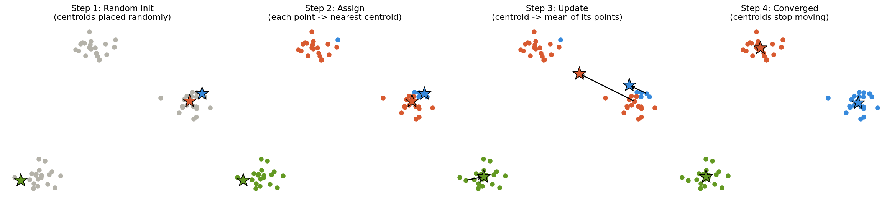
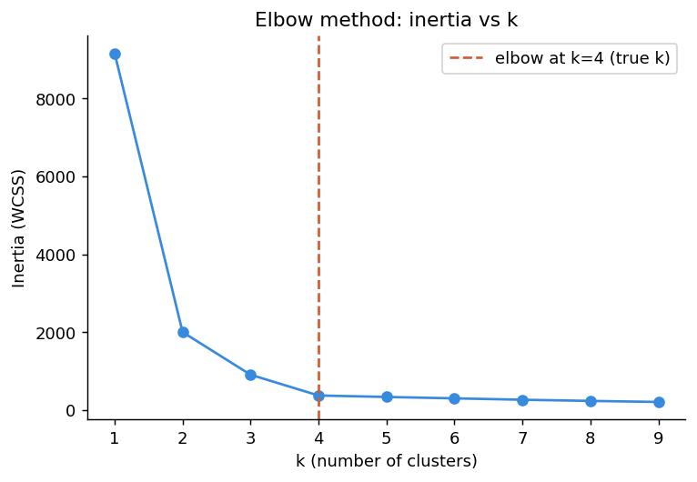
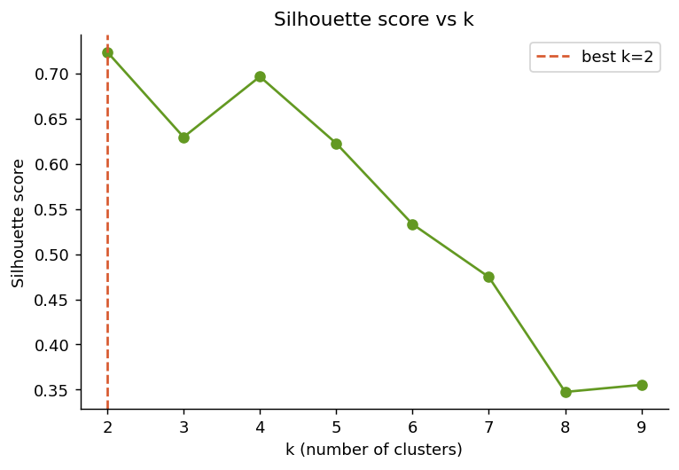
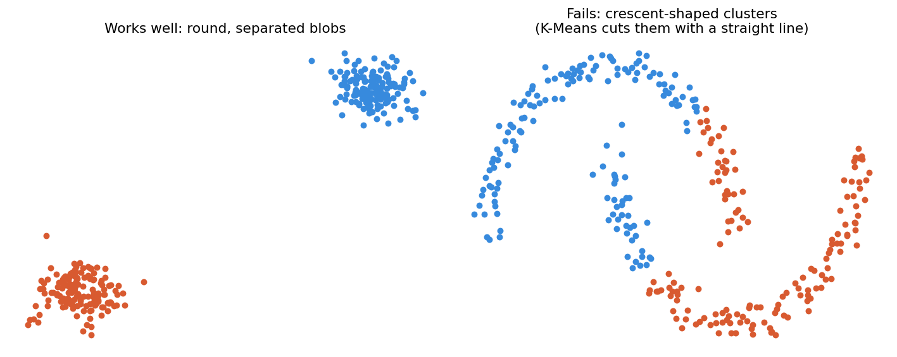

# K-Means Clustering, End to End

## 1. The problem in one sentence

Given a bunch of unlabeled points, group them into **K clusters** such that points in the same group are as close to each other as possible.

## 2. Intuition: opening K pizza stores in a city

Imagine you're opening **K pizza delivery stores** in a city, and you know where every customer lives (the data points). You want to place your stores so total delivery distance is minimized. You don't know the best spots yet, so:

1. **Guess** K random locations for your stores.
2. Assign every customer to their **nearest** store.
3. Move each store to the **center (average location)** of the customers currently assigned to it — this minimizes total driving distance for that group.
4. Now that stores moved, some customers are closer to a different store — **reassign** them.
5. Repeat steps 2–4 until stores stop moving.

That's the entire algorithm: **Assign → Recompute center → Repeat.**

Here it is running on real data (60 points, K=3), from random initialization to convergence:



Notice: in Step 3, the centroids (stars) jump toward the average of their currently-assigned points. In Step 4, some points near the boundary have already switched color because their nearest centroid changed. This assign/update cycle repeats until nothing changes.

### When to use it
- Clusters are roughly **spherical** and similar in size
- You have a rough idea of K, or can estimate it (see diagnostics below)
- Data is **numeric** (relies on Euclidean distance)
- You want something **fast** — scales roughly linearly with data size

### When NOT to use it
- Clusters have **weird shapes** (crescents, spirals, rings) — see the shape-failure diagnostic below
- Clusters have **very different sizes/densities** — K-Means tends to slice a big cluster in half to "balance" things
- Data is mostly **categorical** — Euclidean distance doesn't make sense on categories (use K-Modes instead)
- **Outliers** are present — since centroids are *means*, one extreme point can drag a centroid off-center (K-Medoids is more robust)

### What breaks without it
Without an algorithm like this, segmenting 10,000 unlabeled records into groups means manually eyeballing scatter plots — completely unscalable past 2–3 dimensions. K-Means gives a repeatable, mathematical rule for doing this automatically.

---

## 3. The math

### Notation

| Symbol | Meaning |
|---|---|
| $X = \{x_1, ..., x_n\}$ | The dataset, $n$ points |
| $K$ | Number of clusters (chosen up front) |
| $\mu_1, ..., \mu_K$ | The $K$ centroids (cluster centers) |
| $C_j$ | The set of points currently assigned to cluster $j$ |
| $\|x_i - \mu_j\|^2$ | Squared Euclidean distance between point $i$ and centroid $j$ |

### The objective function

K-Means minimizes the **within-cluster sum of squares (WCSS)**, also called inertia:

$$J = \sum_{j=1}^{K} \sum_{x_i \in C_j} \|x_i - \mu_j\|^2$$

**Plain language:** for every cluster $j$, take every point currently in that cluster, measure its squared distance to that cluster's centroid, and add it all up. $J$ is the total "wobble" in the system. K-Means tries to make this number as small as possible.

### The two update rules

**Assignment step** — put each point in the cluster of its nearest centroid:

$$c_i = \arg\min_j \|x_i - \mu_j\|^2$$

*Plain language:* for point $i$, check the distance to every centroid, and label it with whichever centroid is closest.

**Update step** — move each centroid to the mean of its assigned points:

$$\mu_j = \frac{1}{|C_j|}\sum_{x_i \in C_j} x_i$$

*Plain language:* the new centroid position is just the average (x, y, ...) of every point currently assigned to it — exactly like the "move the pizza store to the center of its customers" step from the intuition section.

These two steps are literally the loop shown in the diagram above: **Step 2 = assignment step**, **Step 3 = update step**, repeated until $J$ stops decreasing (centroids stop moving).

### Worked example, by hand

Take 4 points, K=2:

| Point | x | y |
|---|---|---|
| A | 1 | 1 |
| B | 2 | 1 |
| C | 8 | 8 |
| D | 9 | 8 |

**Init:** randomly pick A and C as the starting centroids: $\mu_1 = (1,1)$, $\mu_2 = (8,8)$

**Assignment step** — compute squared distance from every point to both centroids:

- A to $\mu_1$: $(1-1)^2+(1-1)^2 = 0$ → A to $\mu_2$: $(1-8)^2+(1-8)^2 = 98$ → **A joins cluster 1**
- B to $\mu_1$: $(2-1)^2+(1-1)^2 = 1$ → B to $\mu_2$: $(2-8)^2+(1-8)^2 = 85$ → **B joins cluster 1**
- C to $\mu_1$: $(8-1)^2+(8-1)^2 = 98$ → C to $\mu_2$: $0$ → **C joins cluster 2**
- D to $\mu_1$: $(9-1)^2+(8-1)^2 = 113$ → D to $\mu_2$: $(9-8)^2+(8-8)^2 = 1$ → **D joins cluster 2**

**Update step** — recompute centroids as the mean of their assigned points:

$$\mu_1 = \frac{(1,1)+(2,1)}{2} = (1.5,\ 1)$$
$$\mu_2 = \frac{(8,8)+(9,8)}{2} = (8.5,\ 8)$$

**Check for convergence:** reassign all 4 points to the new centroids — every point still lands in the same cluster it was already in (A, B are still closer to $\mu_1$; C, D are still closer to $\mu_2$). Since no point switched clusters, **the algorithm has converged** in a single iteration. Final centroids: $(1.5, 1)$ and $(8.5, 8)$.

This is exactly what happened at larger scale in the diagram — assign, average, check, repeat, stop when stable.

---

## 4. K-Means++: the smarter initialization

Standard K-Means picks starting centroids **uniformly at random**, which can go badly — if two random centroids land right next to each other, the algorithm might converge to a bad local minimum (two centroids splitting one true cluster, while two real clusters get merged into one).

**K-Means++ changes only the initialization**, nothing else about the algorithm:

1. Pick the first centroid uniformly at random from the data points.
2. For every other point, compute its squared distance $D(x)^2$ to the *nearest already-chosen* centroid.
3. Pick the next centroid randomly, but **weighted by $D(x)^2$** — points far from existing centroids are far more likely to be picked.
4. Repeat until K centroids are chosen, then run standard K-Means (assign/update loop) as normal.

**Plain language:** instead of throwing K darts randomly, K-Means++ throws the first dart randomly, then deliberately spreads the remaining darts toward the regions that are still empty. This alone dramatically reduces the chance of a bad initialization, and it's why `scikit-learn`'s `KMeans` uses `init='k-means++'` as the default.

---

## 5. Code

```python
import numpy as np

def kmeans(X, k, n_iters=100, seed=42):
    rng = np.random.RandomState(seed)
    centroids = X[rng.choice(len(X), k, replace=False)]

    for i in range(n_iters):
        # Assign step: distance from every point to every centroid
        distances = np.linalg.norm(X[:, None, :] - centroids[None, :, :], axis=2)
        labels = np.argmin(distances, axis=1)

        # Update step: move each centroid to the mean of its assigned points
        new_centroids = np.array([X[labels == j].mean(axis=0) for j in range(k)])

        if np.allclose(centroids, new_centroids):
            print(f"Converged after {i+1} iterations")
            break
        centroids = new_centroids

    return labels, centroids

# quick sanity check on 3 obvious clusters
np.random.seed(0)
X = np.vstack([
    np.random.randn(20, 2) + [0, 0],
    np.random.randn(20, 2) + [8, 8],
    np.random.randn(20, 2) + [0, 8],
])
labels, centroids = kmeans(X, k=3)
print("Centroids:\n", np.round(centroids, 2))
print("Label counts:", np.bincount(labels))
```

**Output (verified):**
```
Converged after 3 iterations
Centroids:
 [[0.53 0.1 ]
 [0.22 8.7 ]
 [7.46 7.8 ]]
Label counts: [20 20 20]
```

It converges in 3 iterations and correctly recovers all three true cluster centers.

**Production version** (use this in practice — it uses K-Means++ init and multiple random restarts automatically):

```python
from sklearn.cluster import KMeans

km = KMeans(n_clusters=3, init='k-means++', n_init=10, random_state=42)
km.fit(X)
print(km.cluster_centers_)
print(km.labels_)
```

---

## 6. Diagnostics: how K-Means goes wrong, and how to catch it

### 6.1 — Picking the wrong K: the Elbow method

**Symptom:** you don't know how many clusters actually exist in the data.
**Why it matters:** inertia ($J$ from the math section) always decreases as K increases — at the extreme, K = n gives zero inertia (every point is its own cluster), which is useless.
**The fix:** plot inertia vs. K and look for the "elbow" — the point where adding more clusters stops giving a big improvement.



Here the true number of clusters is 4, and the elbow (the kink where the curve flattens) lands right at k=4 — exactly where it should.

### 6.2 — Confirming K with the Silhouette score

**Symptom:** the elbow plot is ambiguous (no clear kink).
**Why it happens:** the silhouette score directly measures how well-separated clusters are (ranges from -1 to 1; higher is better), so it doesn't rely on eyeballing a curve.
**The fix:** compute silhouette score across a range of K and pick the peak.



### 6.3 — Non-spherical clusters

**Symptom:** K-Means confidently produces clusters that visibly cut through what should be a single group.
**Why it happens for K-Means specifically:** the algorithm only understands "distance to a center point" — it has no concept of shape, so it always carves the space into straight-line (Voronoi) boundaries between centroids. Crescents, rings, and spirals get sliced in half.
**The fix:** switch to a density-based method like DBSCAN, which doesn't assume spherical clusters.



### 6.4 — Bad initialization / poor local minimum

**Symptom:** running K-Means twice on the same data with different random seeds gives noticeably different cluster assignments, or the inertia is surprisingly high.
**Why it happens:** standard K-Means can get stuck in a local minimum depending on where centroids start (this is exactly the problem K-Means++ addresses in Section 4).
**The fix:** always use `init='k-means++'` (scikit-learn's default) and set `n_init=10` or higher so it runs multiple times with different seeds and keeps the best result.

### 6.5 — Unscaled features dominating distance

**Symptom:** one feature (e.g. "income in dollars", ranging 0–200,000) completely dominates clustering while another feature (e.g. "age", ranging 0–100) has almost no effect.
**Why it happens for K-Means specifically:** Euclidean distance is sensitive to scale — a feature with a larger numeric range contributes disproportionately more to the distance calculation, regardless of how meaningful it actually is.
**The fix:** always standardize features (zero mean, unit variance) before running K-Means:
```python
from sklearn.preprocessing import StandardScaler
X_scaled = StandardScaler().fit_transform(X)
```

---

## 7. Practice Q&A

Try to answer before revealing each one.

**Q1 (easy).** What are the two steps that repeat in every iteration of K-Means?

<details><summary>Answer</summary>
Assignment (put each point with its nearest centroid) and update (move each centroid to the mean of its assigned points).
</details>

**Q2 (easy).** Why does K-Means require numeric data?

<details><summary>Answer</summary>
Because it relies on Euclidean distance to measure how close a point is to a centroid, and Euclidean distance is only meaningful on numeric features. Categorical values (like "red"/"blue") have no natural distance.
</details>

**Q3 (medium).** In the worked example (Section 3), if you had initialized centroids at A=(1,1) and B=(2,1) instead of A and C, what would likely happen?

<details><summary>Answer</summary>
Both starting centroids would be close together in the bottom-left cluster, so the assignment step would likely split what should be one cluster (A, B) into two, while merging C and D into whichever centroid ends up closer. This is a bad local minimum — exactly the failure mode K-Means++ is designed to reduce, since it explicitly biases new centroids toward being far from existing ones.
</details>

**Q4 (medium).** You plot inertia vs K and the curve decreases smoothly with no visible elbow. What should you do?

<details><summary>Answer</summary>
Switch to (or add) the silhouette score across the same range of K — it directly measures cluster separation rather than relying on a visual kink, so it can surface a clear best K even when the elbow plot is ambiguous.
</details>

**Q5 (medium).** Why does scikit-learn's `KMeans` default to `n_init=10` (running the whole algorithm 10 times)?

<details><summary>Answer</summary>
Because K-Means (even K-Means++) can still converge to different local minima depending on initialization. Running it multiple times with different random starts and keeping the lowest-inertia result reduces the chance of settling on a bad solution.
</details>

**Q6 (hard).** A dataset has one feature "annual income" (0–200,000) and one feature "years of experience" (0–40). You run K-Means directly without preprocessing. What goes wrong, and why?

<details><summary>Answer</summary>
The income feature has a numeric range thousands of times larger than experience, so it dominates the Euclidean distance calculation — clusters will essentially form based on income alone, with years of experience contributing almost nothing. Fix: standardize both features (zero mean, unit variance) before clustering.
</details>

**Q7 (hard — spot the bug).** Someone clusters customer data into K=5 groups, but when they re-run their script the next day (no code changes), they get different cluster assignments. What's the likely cause, and what's missing from their code?

<details><summary>Answer</summary>
They likely didn't set a `random_state`, so each run uses a different random seed for centroid initialization (and possibly different `n_init` restarts pick different "best" results). Fix: set `random_state=<fixed integer>` in `KMeans(...)` for reproducibility.
</details>

**Q8 (hard).** Why is K-Means++'s initialization *weighted by squared distance* ($D(x)^2$) rather than just picking the single farthest point each time?

<details><summary>Answer</summary>
Always picking the single farthest point would make initialization deterministic and very sensitive to outliers — one extreme outlier would always get picked as a centroid, wasting a cluster on noise. Weighting by squared distance keeps it probabilistic: far points are much more *likely* to be chosen, but not guaranteed, which spreads centroids out while still remaining robust to occasional outliers.
</details>
