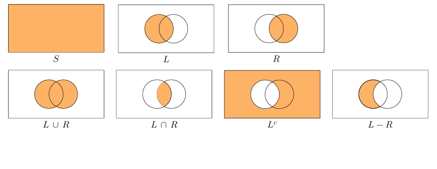
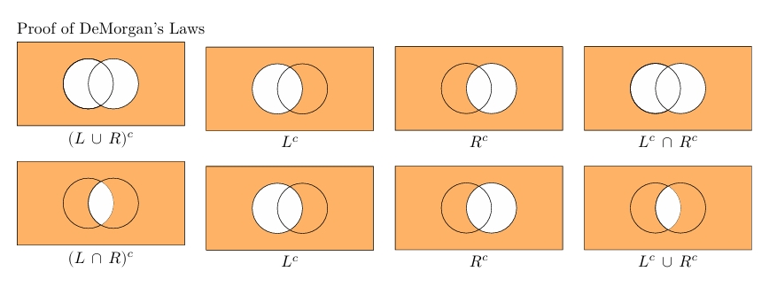

#  Sets and Notation

Our goal in this chapter is to develop techniques for **counting the number of elements of sets**.  
Before counting, we need a precise language for describing collections of objects.  
This section reviews **sets, notation, and basic set operations**, which are fundamental in probability, statistics, and combinatorics.

---

## .1 Definitions

### Set
A **set** is a collection of distinct elements.

- Sets are typically denoted by capital letters: $S, A, B$
- Elements are denoted by lowercase letters: $x, y$

---

### Element
If an element $x$ belongs to a set $S$, we write:
$$
x \in S
$$
If it does not belong to $S$:
$$
x \notin S
$$

---

### Subset
A set $A$ is a **subset** of a set $S$ if every element of $A$ is also an element of $S$.

Notation:
$$
A \subset S
$$

---

### Complement
The **complement** of a set $A$ (relative to a universe $S$) is the set of elements in $S$ that are **not** in $A$.

Notation:
$$
A^c \quad \text{or} \quad S - A
$$

Formally:
$$
A^c = \{ x \in S \mid x \notin A \}
$$

---

### Union
The **union** of sets $A$ and $B$ contains all elements that are in **at least one** of the sets.

Notation:
$$
A \cup B
$$

---

### Intersection
The **intersection** of sets $A$ and $B$ contains all elements that are in **both** sets.

Notation:
$$
A \cap B
$$

---

### Empty Set
The **empty set** is the set with no elements.

Notation:
$$
\varnothing
$$

---

### Disjoint Sets
Two sets $A$ and $B$ are **disjoint** if they share no elements.

Formally:
$$
A \cap B = \varnothing
$$

---

### Difference
The **difference** of sets $A$ and $B$ is the set of elements in $A$ that are **not** in $B$.

Notation:
$$
A - B
$$

Equivalent identity:
$$
A - B = A \cap B^c
$$

---

## .2 Example: Animals

Let the universal set be:
$$
S = \{\text{Antelope, Bee, Cat, Dog, Elephant, Frog, Gnat, Hyena, Iguana, Jaguar}\}
$$

Define two subsets:

- Mammals:
$$
M = \{\text{Antelope, Cat, Dog, Elephant, Hyena, Jaguar}\}
$$

- Wild animals:
$$
W = \{\text{Antelope, Bee, Elephant, Frog, Gnat, Hyena, Iguana, Jaguar}\}
$$

---

### Intersection
Wild mammals:
$$
M \cap W = \{\text{Antelope, Elephant, Hyena, Jaguar}\}
$$

---

### Union
Animals that are mammals **or** wild (or both):
$$
M \cup W = S
$$

---

### Complement
Non-mammals:
$$
M^c = \{\text{Bee, Frog, Gnat, Iguana}\}
$$

---

### Difference
Mammals that are **not** wild:
$$
M - W = \{\text{Cat, Dog}\}
$$

---

### Equivalent Representations
Many set expressions can be written in multiple equivalent ways:
- $M^c = S - M$
- $M - W = M \cap W^c$

---

## .3 DeMorgan’s Laws

DeMorgan’s laws describe how **union, intersection, and complement** interact.

$$
(A \cup B)^c = A^c \cap B^c
$$

$$
(A \cap B)^c = A^c \cup B^c
$$

### Interpretation (Plain English)
- Everything **not in (A or B)** is the same as everything **not in A and not in B**
- Everything **not in (A and B)** is the same as everything **not in A or not in B**

---

## .4 Verification Example

Let:
$$
S = \{1,2,3,4,5\}, \quad A = \{1,2,3\}, \quad B = \{3,4\}
$$

### First Law
$$
(A \cup B)^c = A^c \cap B^c
$$

- $A \cup B = \{1,2,3,4\} \Rightarrow (A \cup B)^c = \{5\}$
- $A^c = \{4,5\}, \; B^c = \{1,2,5\}$
- $A^c \cap B^c = \{5\}$

✔ Verified.

---

### Second Law
$$
(A \cap B)^c = A^c \cup B^c
$$

- $A \cap B = \{3\} \Rightarrow (A \cap B)^c = \{1,2,4,5\}$
- $A^c \cup B^c = \{1,2,4,5\}$

✔ Verified.

---

## .5 Venn Diagrams

Venn diagrams visually represent set relationships.

- The **rectangle** represents the universal set $S$
- Circles represent subsets
- Shaded regions correspond to operations like:
  - $L \cup R$
  - $L \cap R$
  - $L^c$
  - $L - R$

Venn diagrams are especially useful for understanding DeMorgan’s laws.

---

## .6 Products of Sets

The **Cartesian product** of sets $S$ and $T$ is the set of all ordered pairs:

$$
S \times T = \{ (s,t) \mid s \in S,\; t \in T \}
$$

---

### Finite Example
$$
\{1,2,3\} \times \{1,2,3,4\}
$$

Produces pairs such as:
$$
(1,1), (1,2), \dots, (3,4)
$$

---

### Interval Example (Important)

Let:
$$
[1,4] \times [1,3] \subset [0,5] \times [0,4]
$$

This illustrates:
- Square and rectangular regions in the plane
- If $A \subset S$ and $B \subset T$, then:
$$
A \times B \subset S \times T
$$

---



```

---
