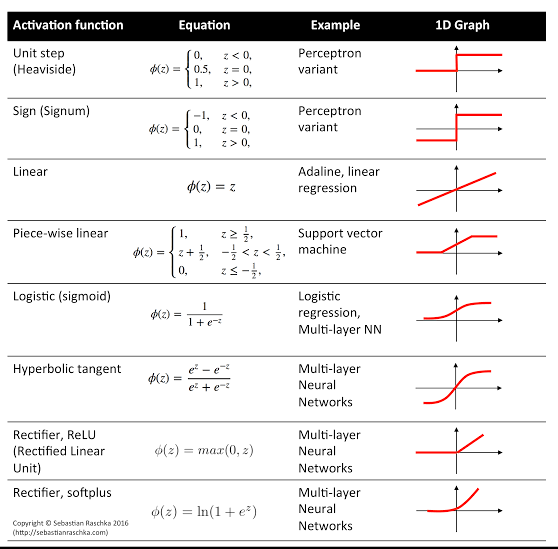

---

# 📘 Activation Functions in Neural Networks




---

## 1. **Why Do We Need Activation Functions?**

1. **Introduce Nonlinearity:**

   * A neural network without activation functions is just a stack of linear transformations:

     $$
     a^{[L]} = W^{[L]} W^{[L-1]} \dots W^{[1]} x + b
     $$

     No matter how many layers, the whole network is equivalent to **one linear transformation**.
   * Nonlinear activations allow the network to approximate **complex, nonlinear functions** (like XOR, image classification, language tasks).

2. **Bound Outputs:**

   * Some tasks require outputs in a specific range (e.g., probabilities between 0 and 1).

3. **Enable Gradient-Based Learning:**

   * Activation functions must be **differentiable** to allow **backpropagation**.

---

## 2. **Properties of a Good Activation Function**

| Property                            | Explanation                                                              |
| ----------------------------------- | ------------------------------------------------------------------------ |
| Nonlinear                           | Must allow complex mappings, otherwise deep layers collapse into linear. |
| Differentiable                      | Needed for gradient computation in backpropagation.                      |
| Computationally efficient           | Ideally simple to compute (sigmoid, ReLU).                               |
| Avoid vanishing/exploding gradients | Should not squash large input ranges to extreme outputs.                 |
| Monotonicity (optional)             | Helps convergence for some tasks, but not mandatory.                     |

---

## 3. **Common Activation Functions**

### **A. Sigmoid**

$$
\sigma(z) = \frac{1}{1 + e^{-z}}
$$

* **Range:** (0,1)
* **Pros:** Good for probabilities, smooth.
* **Cons:** Saturates for large |z| → **vanishing gradient**.
* **Typical Use:** Output layer for **binary classification**.

Derivative:

$$
\sigma'(z) = \sigma(z)(1 - \sigma(z))
$$

---

### **B. Tanh**

$$
\tanh(z) = \frac{e^z - e^{-z}}{e^z + e^{-z}}
$$

* **Range:** (-1,1)
* **Pros:** Zero-centered → faster convergence than sigmoid.
* **Cons:** Still saturates → vanishing gradient.
* **Typical Use:** Hidden layers in small networks (classic RNNs).

Derivative:

$$
\tanh'(z) = 1 - \tanh^2(z)
$$

---

### **C. ReLU (Rectified Linear Unit)**

$$
\text{ReLU}(z) = \max(0, z)
$$

* **Range:** \[0, ∞)
* **Pros:** Simple, fast, mitigates vanishing gradient.
* **Cons:** “Dead neurons” problem (gradient = 0 for z < 0).
* **Typical Use:** Most hidden layers in modern networks.

Derivative:

$$
\text{ReLU}'(z) =
\begin{cases} 
1 & z > 0 \\ 
0 & z \le 0 
\end{cases}
$$

---

### **D. Leaky ReLU**

$$
f(z) =
\begin{cases} 
z & z > 0 \\ 
0.01 z & z \le 0 
\end{cases}
$$

* **Pros:** Fixes “dead neuron” problem.
* **Typical Use:** Hidden layers in deep networks where some negative activation is desired.

---

### **E. Softmax**

$$
\text{softmax}(z_i) = \frac{e^{z_i}}{\sum_j e^{z_j}}
$$

* **Range:** (0,1), outputs sum to 1 → interpretable as **probabilities**.
* **Typical Use:** Output layer for **multi-class classification**.

Derivative:

* More complex: used with cross-entropy; derivative simplifies nicely:

$$
\frac{\partial L}{\partial z_i} = \hat{y}_i - y_i
$$

---

## 4. **Hidden Layer vs Output Layer**

| Layer Type    | Activation Functions                                         |
| ------------- | ------------------------------------------------------------ |
| Hidden Layers | ReLU (most common), Leaky ReLU, tanh (older networks)        |
| Output Layer  | Sigmoid (binary), Softmax (multi-class), Linear (regression) |

* **Rule of Thumb:**

  * Hidden layers → nonlinear, computationally efficient (ReLU)
  * Output → matches the **task requirement** (probabilities, continuous value, etc.)

---

## 5. **Differentiation**

* **Sigmoid:**

$$
\sigma'(z) = \sigma(z)(1-\sigma(z))
$$

* **Tanh:**

$$
\tanh'(z) = 1 - \tanh^2(z)
$$

* **ReLU:**

$$
\text{ReLU}'(z) =
\begin{cases} 
1 & z > 0 \\ 
0 & z \le 0 
\end{cases}
$$

* **Softmax (with cross-entropy):**

$$
\frac{\partial L}{\partial z_i} = \hat{y}_i - y_i
$$

These derivatives are exactly what you use during **backpropagation** to compute weight updates.

---

### 6. **Practical Guidelines**

* Use **ReLU** in hidden layers for most deep networks.
* If vanishing gradient occurs or negative activations matter → **Leaky ReLU**.
* Use **sigmoid** or **softmax** in output depending on task.
* Avoid sigmoid/tanh in deep hidden layers unless necessary (older networks).
* **Always check derivatives**; they determine how effectively learning occurs.

---

Perfect! Let’s make a **comprehensive table and flow diagram** summarizing activation functions, their formulas, derivatives, output ranges, and typical usage in hidden vs output layers. This will be your “cheat sheet” for designing networks.

---

# 📘 Activation Function Cheat Sheet

```
+----------------+---------------------------+--------------------------+----------------+------------------------------+
| Function       | Formula                   | Derivative               | Output Range   | Typical Usage                |
+----------------+---------------------------+--------------------------+----------------+------------------------------+
| Sigmoid        | σ(z) = 1/(1+e^-z)         | σ'(z) = σ(z)(1-σ(z))     | (0,1)          | Output layer (binary)        |
|                |                           |                          |                | Not recommended for hidden  |
+----------------+---------------------------+--------------------------+----------------+------------------------------+
| Tanh           | tanh(z) = (e^z - e^-z)/(e^z + e^-z) | tanh'(z) = 1 - tanh^2(z) | (-1,1)        | Hidden layers (older nets), | 
|                |                           |                          |                | can be zero-centered        |
+----------------+---------------------------+--------------------------+----------------+------------------------------+
| ReLU           | ReLU(z) = max(0,z)        | ReLU'(z) = 1 if z>0 else 0 | [0,∞)        | Hidden layers (modern nets) |
+----------------+---------------------------+--------------------------+----------------+------------------------------+
| Leaky ReLU     | f(z) = z if z>0 else 0.01z | f'(z) = 1 if z>0 else 0.01 | (-∞,∞)      | Hidden layers (deep nets)   |
+----------------+---------------------------+--------------------------+----------------+------------------------------+
| Softmax        | softmax(z_i) = e^{z_i}/Σ_j e^{z_j} | ∂L/∂z_i = y_hat_i - y_i (with cross-entropy) | (0,1), sum=1 | Output layer (multi-class) |
+----------------+---------------------------+--------------------------+----------------+------------------------------+
| Linear         | f(z) = z                  | f'(z) = 1                | (-∞,∞)        | Output layer (regression)   |
+----------------+---------------------------+--------------------------+----------------+------------------------------+
```

---

# 📘 ASCII Flow Diagram: Activation Function Role

```
INPUT LAYER (raw data)
        │
        ▼
HIDDEN LAYER 1
----------------
ReLU / Leaky ReLU / Tanh
Purpose: non-linear transform, create feature maps
        │
        ▼
HIDDEN LAYER 2
----------------
ReLU / Leaky ReLU
Purpose: deeper non-linear representations
        │
        ▼
OUTPUT LAYER
----------------
Sigmoid (binary) / Softmax (multi-class) / Linear (regression)
Purpose: map network output to task-specific range
```

**Notes on flow**:

1. Hidden layers → focus on **learning hierarchical features**. Nonlinear, fast activation is key.
2. Output layer → focus on **task requirements**: probabilities or continuous values.
3. Gradients (derivatives) from these activations are **what backprop uses** to adjust weights.

---

Great question! Softmax and sigmoid are related but used differently, and understanding their distinctions is **crucial** for classification tasks. Let’s go step by step.

---

# 📘 Sigmoid vs Softmax

---

## 1. **Sigmoid Function**

$$
\sigma(z) = \frac{1}{1 + e^{-z}}
$$

* **Range:** (0,1)
* **Usage:** Produces **probability for a single class**
* **Binary classification:** Usually applied to a single output neuron to predict the probability of “class 1”:

$$
\hat{y} = \sigma(z) \quad \text{for class 1}
$$

Then the probability of class 0 is:

$$
1 - \hat{y}
$$

* **Loss function:** Binary cross-entropy

---

## 2. **Softmax Function**

$$
\text{softmax}(z_i) = \frac{e^{z_i}}{\sum_{j=1}^{K} e^{z_j}}
$$

* **Range:** (0,1) for each class, **sum = 1** across all classes
* **Usage:** Multi-class classification with **K mutually exclusive classes**
* **Binary classification:** Can be applied with 2 output neurons (one per class):

$$
\hat{y}_1 = \frac{e^{z_1}}{e^{z_1} + e^{z_2}}, \quad
\hat{y}_2 = \frac{e^{z_2}}{e^{z_1} + e^{z_2}}
$$

* **Loss function:** Categorical cross-entropy

✅ **Observation:**

* For binary classification with 2 outputs, softmax is equivalent to sigmoid applied to the difference:

$$
\text{softmax}([z_1, z_2])_1 = \frac{1}{1 + e^{-(z_1-z_2)}} \approx \sigma(z_1 - z_2)
$$

* So, **sigmoid is simpler** for single-output binary tasks.

---

## 3. **When to Use Each**

| Use Case                                        | Output Layer       | Notes                                               |
| ----------------------------------------------- | ------------------ | --------------------------------------------------- |
| Binary classification                           | 1 neuron, sigmoid  | Simpler, efficient, probability of “positive class” |
| Multi-class classification (mutually exclusive) | K neurons, softmax | Each neuron = probability of a class, sum = 1       |
| Multi-label classification (non-exclusive)      | K neurons, sigmoid | Each neuron = independent probability of that label |
| Regression                                      | 1 neuron, linear   | Continuous output                                   |

---

### 4. **Key Conceptual Difference**

* **Sigmoid:** independent probability for one class; probabilities **do not need to sum to 1**.
* **Softmax:** converts a vector of logits into a **probability distribution over classes**; probabilities sum to 1.

---

### 5. **Numerical Example (Binary Case)**

Suppose logits:

$$
z_1 = 2.0, \quad z_2 = 1.0
$$

* **Sigmoid approach (1 output neuron):**

$$
\sigma(z_1) = \frac{1}{1+e^{-2}} \approx 0.881
$$

* Probability of class 0 = 0.119

* **Softmax approach (2 output neurons):**

$$
\hat{y}_1 = \frac{e^2}{e^2 + e^1} \approx 0.731
$$

$$
\hat{y}_2 = \frac{e^1}{e^2 + e^1} \approx 0.269
$$

Notice the **numbers differ**, but the ranking is preserved. If you had only **one logit difference**, softmax = sigmoid.

---

### ✅ Takeaways

1. Sigmoid = 1 output → probability of “positive” class
2. Softmax = K outputs → probabilities of all classes, sum = 1
3. For **binary classification**, sigmoid is standard (simpler, more efficient)
4. For **multi-class**, softmax is standard
5. For **multi-label** problems (non-exclusive classes), use **sigmoid on each output**, not softmax

---

Excellent — loss functions are **the heart of learning** because they tell the network how “wrong” it is and drive weight updates. Let’s go step by step, with theory, formulas, and use cases.

---

# 📘 Loss Functions in Neural Networks

---

## 1. **What is a Loss Function?**

* It’s a function that **quantifies the difference** between the network’s prediction ($\hat{y}$) and the true label ($y$).
* The goal of training is to **minimize this loss** across all training examples.
* During backpropagation, **gradients of the loss** are used to update weights.

---

## 2. **Key Properties of a Good Loss Function**

| Property           | Explanation                                                     |
| ------------------ | --------------------------------------------------------------- |
| Differentiable     | Needed for backpropagation.                                     |
| Sensitive to error | Penalizes wrong predictions appropriately.                      |
| Task-specific      | Must match the problem type (classification, regression, etc.). |
| Smooth             | Helps optimization converge faster.                             |

---

## 3. **Common Loss Functions**

### **A. Binary Cross-Entropy (Log Loss)**

For **binary classification**:

$$
L(y, \hat{y}) = - \big[ y \log(\hat{y}) + (1-y) \log(1-\hat{y}) \big]
$$

* $\hat{y}$ = predicted probability (sigmoid output)
* $y \in \{0,1\}$ = true label
* **Interpretation:** heavily penalizes confident but wrong predictions

**Derivative (w\.r.t logit z before sigmoid):**

$$
\frac{\partial L}{\partial z} = \hat{y} - y
$$

* Simple and elegant for backprop.

---

### **B. Categorical Cross-Entropy**

For **multi-class classification** with **softmax outputs**:

$$
L(y, \hat{y}) = - \sum_{i=1}^{K} y_i \log(\hat{y}_i)
$$

* $K$ = number of classes
* $y_i$ = 1 if class i is true, 0 otherwise (one-hot encoding)
* $\hat{y}_i$ = softmax output probability for class i

**Derivative (w\.r.t logits z\_i):**

$$
\frac{\partial L}{\partial z_i} = \hat{y}_i - y_i
$$

* Works beautifully with softmax → gradient is simple.

---

### **C. Mean Squared Error (MSE)**

For **regression** problems:

$$
L(y, \hat{y}) = \frac{1}{N} \sum_{i=1}^N (y_i - \hat{y}_i)^2
$$

* Penalizes the **squared difference** between predicted and true values
* Smooth, differentiable

Derivative:

$$
\frac{\partial L}{\partial \hat{y}_i} = 2(\hat{y}_i - y_i)/N
$$

* Often used with **linear output neurons**.

---

### **D. Mean Absolute Error (MAE)**

$$
L(y, \hat{y}) = \frac{1}{N} \sum_{i=1}^N |y_i - \hat{y}_i|
$$

* Less sensitive to outliers than MSE
* Derivative is piecewise:

$$
\frac{\partial L}{\partial \hat{y}_i} = 
\begin{cases} 1 & \hat{y}_i > y_i \\ -1 & \hat{y}_i < y_i \end{cases}
$$

---

### **E. Hinge Loss**

* Common in **SVMs** and “max-margin” classifiers:

$$
L(y, \hat{y}) = \max(0, 1 - y \cdot \hat{y})
$$

* $y \in \{-1, 1\}$, $\hat{y}$ = raw score
* Encourages predictions with a **margin ≥1** for correct class
* Rare in standard neural networks but still important in some classification contexts.

---

## 4. **Which Loss to Use When**

| Task Type                  | Output Activation   | Recommended Loss               |
| -------------------------- | ------------------- | ------------------------------ |
| Binary classification      | Sigmoid             | Binary cross-entropy           |
| Multi-class classification | Softmax             | Categorical cross-entropy      |
| Multi-label classification | Sigmoid (per class) | Binary cross-entropy per class |
| Regression                 | Linear              | MSE or MAE                     |
| Max-margin classification  | Linear / raw scores | Hinge loss                     |

---

## 5. **Intuition**

* **Cross-entropy:** “Punish wrong predictions more when confident”
* **MSE:** Penalizes large errors quadratically
* **MAE:** Penalizes all errors linearly, less sensitive to extreme outliers
* **Hinge:** Focus on classification margin, not probability

---

## 6. **Connection to Backprop**

* Loss function derivative w\.r.t **output** is the **first delta** in backprop.
* Choice of loss **often pairs naturally** with output activation (sigmoid + BCE, softmax + CCE, linear + MSE) to **simplify gradients**.

---

Great set of questions 👌 — these go to the heart of *why deep learning works at all*. Let’s go step by step like in a lecture:

---

## 1. **Why is Non-Linearity Important in Neural Networks?**

* If we use only **linear transformations** (matrix multiplications + additions), then no matter how many layers we stack, the whole network is **still just a single linear function** of the input.
* Non-linearity (through **activation functions**) allows the network to model **complex, non-linear relationships** in data — essential for tasks like vision, language, or decision-making.

---

## 2. **Mathematical Proof of the Need for Non-Linearity**

Let’s consider a simple 2-layer network **without non-linear activations**:

$$
h = W_1 x + b_1
$$

$$
y = W_2 h + b_2 = W_2(W_1x + b_1) + b_2
$$

Simplify:

$$
y = (W_2 W_1)x + (W_2 b_1 + b_2)
$$

👉 This is equivalent to a **single linear layer** with weights $(W_2 W_1)$ and bias $(W_2 b_1 + b_2)$.
Thus, **stacking multiple linear layers is pointless** — the representational power doesn’t increase.

Now, insert a **non-linear activation function $f$** after the first layer:

$$
h = f(W_1 x + b_1)
$$

$$
y = W_2 h + b_2
$$

Now, $f(\cdot)$ breaks the linearity, and the composition of layers can approximate **any continuous function** (this is the **Universal Approximation Theorem**).

---

## 3. **Linear vs Non-Linear Activation Functions**

* **Linear AF (e.g., f(x) = x):**

  * Pros: simple, gradient flows well.
  * Cons: collapses multi-layer networks into a single linear transformation → can’t capture non-linear patterns.
* **Non-Linear AF (e.g., ReLU, Sigmoid, Tanh):**

  * Pros: allow networks to approximate arbitrarily complex mappings.
  * Cons: may introduce vanishing/exploding gradients (especially sigmoid/tanh), but ReLU and its variants solve much of this.

---

## 4. **Impact of Activation Functions on Model Performance**

* **Sigmoid:** squashes input to $[0,1]$; good for probabilities, but suffers from vanishing gradients in deep nets.
* **Tanh:** squashes to $[-1,1]$; better centered, but still vanishes for large inputs.
* **ReLU:** fast, sparse activations, solves vanishing gradient issue, widely used in modern deep nets.
* **Leaky ReLU / ELU / GELU / Swish:** improvements over ReLU to avoid "dying neurons" or improve smoothness.

👉 **Choice of activation function dramatically impacts training speed, stability, and final accuracy**. For example:

* RNNs historically used **tanh** or **sigmoid**, but modern variants use **ReLU** or **Gated activations** (like in LSTMs/GRUs).
* Transformers use **GELU** because it’s smoother and improves performance.

---

⚡ **Key Takeaway:**
Without **non-linearity**, neural networks collapse into linear models. With **non-linear activations**, they gain the expressive power to approximate any function — and the *choice of activation* affects learning dynamics and accuracy.

---

Perfect 👌 — if you’re preparing for **FAANG interviews**, you’ll need both **theoretical clarity** and the ability to **answer conceptually under pressure**. Let’s build a **Q\&A bank** (focused on neural networks, activation functions, and core deep learning fundamentals).

---

# 🔥 FAANG Conceptual Q\&A (Neural Networks & Deep Learning)

---

### **Q1. Why do we need non-linear activation functions in neural networks?**

**A:** Without non-linearities, a neural network is just a sequence of linear transformations, which collapses into a single linear mapping. Non-linear activations enable the network to model complex, non-linear functions — making deep networks universal function approximators.

---

### **Q2. What happens if we use only linear activation functions in a deep network?**

**A:** No matter how many layers we stack, the entire network reduces to a single linear transformation:

$$
y = W_n W_{n-1} … W_1 x + b
$$

This has the same expressive power as a single linear layer.

---

### **Q3. Compare linear vs. non-linear activation functions.**

* **Linear:** Simple, gradients flow well, but cannot capture non-linear relationships.
* **Non-linear:** Allow learning of complex mappings; choice affects convergence speed, gradient flow, and final accuracy.

---

### **Q4. How do activation functions affect gradient flow?**

**A:**

* **Sigmoid/Tanh:** Gradients vanish for large |x| → slow training.
* **ReLU:** Avoids vanishing gradient for positive inputs, but neurons can “die” (always output zero).
* **Leaky ReLU, ELU, GELU:** Mitigate dying neuron problem and improve smoothness.

---

### **Q5. Why is ReLU so popular in deep learning?**

**A:**

* Computationally efficient (just threshold at 0).
* Mitigates vanishing gradients for positive values.
* Encourages sparse representations.
* Works well empirically across vision, NLP, and speech.

---

### **Q6. What is the Universal Approximation Theorem?**

**A:** It states that a feedforward neural network with at least **one hidden layer** and a **non-linear activation function** can approximate any continuous function to arbitrary precision, given enough neurons.

---

### **Q7. What are vanishing and exploding gradients, and how do activation functions impact them?**

**A:**

* **Vanishing Gradient:** Gradients shrink toward zero as they backpropagate → network stops learning. Happens in deep nets with sigmoid/tanh.
* **Exploding Gradient:** Gradients grow uncontrollably → unstable training.
* **Impact:** ReLU and variants reduce vanishing gradient issues; normalization and gradient clipping address exploding gradients.

---

### **Q8. Which activation functions are commonly used in different domains?**

* **Vision (CNNs):** ReLU, Leaky ReLU.
* **NLP (Transformers):** GELU, Swish.
* **RNNs/LSTMs:** Tanh + Sigmoid (for gates).
* **Output layers:**

  * Regression → Linear
  * Binary classification → Sigmoid
  * Multi-class classification → Softmax

---

### **Q9. Why do we use Softmax in classification?**

**A:** Softmax converts logits into probabilities that sum to 1, making interpretation and optimization via cross-entropy loss natural for classification problems.

---

### **Q10. How does the choice of activation function affect model performance in practice?**

**A:**

* Influences training speed (ReLU trains faster than sigmoid).
* Determines stability (bad AFs → vanishing gradients).
* Impacts final accuracy (e.g., GELU in Transformers outperforms ReLU).
* A poor choice can make deep networks unusable, while a good choice accelerates convergence.

---

| **Question**                                                                                                              | **Strong Answer**                                                                                                                                                                                                                                                                                                                                                                                                                                                                                                                                                                   |
| ------------------------------------------------------------------------------------------------------------------------- | ----------------------------------------------------------------------------------------------------------------------------------------------------------------------------------------------------------------------------------------------------------------------------------------------------------------------------------------------------------------------------------------------------------------------------------------------------------------------------------------------------------------------------------------------------------------------------------- |
| **1. Explain all standard activation functions: sigmoid, tanh, ReLU, Leaky ReLU, softmax. When would you use each?**      | - **Sigmoid**: Range (0,1), useful for probability outputs (binary classification). Downsides → vanishing gradient, not zero-centered.<br>- **Tanh**: Range (-1,1), zero-centered, good for hidden layers in shallow nets, but still saturates.<br>- **ReLU**: $f(x) = \max(0,x)$. Simple, efficient, avoids vanishing gradient for positive values. Standard default in CNNs/MLPs.<br>- **Leaky ReLU**: Allows small negative slope; fixes “dying ReLU” problem.<br>- **Softmax**: Converts logits to probabilities that sum to 1, standard for multi-class classification output. |
| **2. Compare ReLU vs Sigmoid (or vs Tanh). What are their pros/cons?**                                                    | - **ReLU vs Sigmoid**: ReLU is faster, reduces vanishing gradient, but has dying neurons. Sigmoid is smooth, interpretable, but saturates and gradients vanish. <br>- **ReLU vs Tanh**: Tanh is zero-centered, but suffers saturation. ReLU is unbounded, sparse activations, and trains faster.                                                                                                                                                                                                                                                                                    |
| **3. What is the ‘dying ReLU’ problem? How would you fix it?**                                                            | - **Problem**: Neurons output 0 for all inputs (weights push them permanently into negative region) → gradient is 0 → neuron never recovers.<br>- **Fixes**: Use Leaky ReLU, PReLU, ELU, better weight initialization (He init), lower learning rates, batch normalization.                                                                                                                                                                                                                                                                                                         |
| **4. Why softmax for multi-class classification? What issues might arise (numerical stability etc.)?**                    | - **Why**: Converts logits into probabilities, interpretable, works with cross-entropy loss.<br>- **Issues**: Numerical overflow when logits are large (fix: subtract max(logit) before exponentiation). Also probability outputs can be overconfident.                                                                                                                                                                                                                                                                                                                             |
| **5. How do activation functions affect training dynamics? (vanishing/exploding gradients, training speed, convergence)** | - **Vanishing gradients**: Sigmoid/tanh → poor learning in deep nets.<br>- **Exploding gradients**: Can happen with poorly chosen activations or initialization.<br>- **Training speed**: ReLU family converges faster than sigmoid/tanh.<br>- **Convergence/accuracy**: Smooth modern activations (Swish, GELU) improve accuracy in deep models like Transformers.                                                                                                                                                                                                                 |
| **6. What activation functions are used in different architectures (CNNs, RNNs, Transformers) and why?**                  | - **CNNs**: ReLU/Leaky ReLU → efficient, sparse, fast convergence.<br>- **RNNs**: Sigmoid/tanh inside gates (bounded, interpretable probabilities); modern RNNs sometimes use ReLU variants for hidden states.<br>- **Transformers**: GELU (smoother than ReLU, empirically better). Softmax for attention scores.                                                                                                                                                                                                                                                                  |
| **7. Given a new task/data set, how would you choose or experiment with activation functions?**                           | - Start with **ReLU** baseline (default).<br>- If training instability or dead neurons → try Leaky ReLU/ELU.<br>- For large modern architectures (e.g., NLP/transformers) → try GELU or Swish.<br>- For classification → sigmoid (binary) or softmax (multi-class).<br>- Use validation experiments to compare convergence speed, final accuracy, stability.                                                                                                                                                                                                                        |


