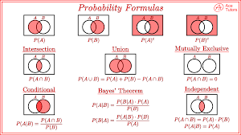

# Set Theory — The Language of Probability

Set theory is the **language of probability**. If you master this deeply, probability becomes almost mechanical. Every event is a set. Every probability rule is a statement about set operations.


## Table of Contents

1. [What Is a Set?](#1-what-is-a-set)
2. [Core Operations](#2-core-operations)
   - [Subset](#21-subset)
   - [Complement](#22-complement)
   - [Union](#23-union)
   - [Intersection](#24-intersection)
   - [Difference](#25-difference)
   - [Empty Set](#26-empty-set)
   - [Disjoint Sets](#27-disjoint-sets)
3. [Cardinality — Counting Elements](#3-cardinality--counting-elements)
4. [Products of Sets](#4-products-of-sets)
5. [DeMorgan's Laws](#5-demorgans-laws)
6. [Algebra of Sets](#6-algebra-of-sets)
7. [Venn Diagram Mental Model](#7-venn-diagram-mental-model)
8. [Set Theory → Probability: The Translation](#8-set-theory--probability-the-translation)
9. [Advanced Insight: Foundation for Measure Theory](#9-advanced-insight-foundation-for-measure-theory)

---

## 1. What Is a Set?

A set is a **well-defined collection of objects**. The objects are called **elements**.

```
S = {1, 2, 3}          — a set of numbers
{H, T}                 — outcomes of a coin toss
{Antelope, Bee, Cat}   — a set of animals
```

**Fundamental principle:**

> A set is defined only by its elements — **order does not matter, repetition does not matter**.

$$\{1,2,3\} = \{3,2,1\} = \{1,1,2,3\}$$

This distinguishes sets from *sequences* (where order matters) and *multisets* (where repetition matters). Keep this in mind when we count combinations vs. permutations.

---

## 2. Core Operations

We'll use one running example throughout to make every operation concrete.

$$S = \{\text{Antelope, Bee, Cat, Dog, Elephant, Frog, Gnat, Hyena, Iguana, Jaguar}\}$$

$$M = \text{mammals} = \{\text{Antelope, Cat, Dog, Elephant, Hyena, Jaguar}\}$$

$$W = \text{wild animals} = \{\text{Antelope, Bee, Elephant, Frog, Gnat, Hyena, Iguana, Jaguar}\}$$

---

### 2.1 Subset

$$A \subseteq S$$

means **every element of $A$ is inside $S$**.

**Two notations — know the difference:**

| Notation | Meaning | Allows $A = S$? |
|---|---|---|
| $A \subseteq S$ | Subset or equal | ✅ Yes |
| $A \subset S$ | **Strict** subset | ❌ No ($A \neq S$ required) |

In probability, we mostly use $\subset$ loosely to mean "is a subset of," but be aware of the distinction in formal proofs.

**From our example:** $M \subset S$ because every mammal is in $S$. But $M \neq S$ (Bee, Frog, etc. are in $S$ but not in $M$), so the strict subset also holds.

---

### 2.2 Complement

$$A^c = S - A$$

All elements in $S$ that are **NOT** in $A$.

> Think of complement as: **logical NOT**.

Complement is always defined **relative to a universal set $S$**. Without a universe, "not a mammal" is meaningless — not a mammal *among what?*

$$M^c = \{\text{Bee, Frog, Gnat, Iguana}\}$$

**Key identity:**
$$(A^c)^c = A$$

Taking the complement twice returns you to the original set.

---

### 2.3 Union

$$A \cup B$$

Contains everything in $A$ **or** $B$ (or both).

> Logical equivalent: **OR**

Union does **not** double-count elements. Each element appears once, even if it belongs to both sets.

$$M \cup W = S$$

Every animal in our example is either a mammal or lives in the wild (or both), so the union covers the entire universe $S$.

---

### 2.4 Intersection

$$A \cap B$$

Elements **common** to both sets.

> Logical equivalent: **AND**

$$M \cap W = \{\text{Antelope, Elephant, Hyena, Jaguar}\}$$

These are the wild mammals — animals that satisfy *both* conditions simultaneously.

---

### 2.5 Difference

$$A - B$$

Elements in $A$ but **not** in $B$.

$$M - W = \{\text{Cat, Dog}\}$$

These are mammals that are *not* wild — the domesticated ones.

**Important identity:**

$$\boxed{A - B = A \cap B^c}$$

This equivalence is used constantly in probability proofs. Taking the difference is the same as intersecting with the complement. So:

$$M - W = M \cap W^c$$

---

### 2.6 Empty Set

$$\emptyset$$

The set with **no elements**. It is a subset of every set.

**Key properties:**

$$A \cup \emptyset = A \qquad \text{(union with nothing changes nothing)}$$
$$A \cap \emptyset = \emptyset \qquad \text{(intersection with nothing gives nothing)}$$
$$A \cup A^c = S \qquad \text{(a set and its complement cover the universe)}$$
$$A \cap A^c = \emptyset \qquad \text{(a set and its complement never overlap)}$$

The last two identities are the **law of excluded middle** — every element either belongs to $A$ or it doesn't; there's no third option.

---

### 2.7 Disjoint Sets

Two sets are **disjoint** if they share no elements:

$$A \cap B = \emptyset$$

> In probability: **disjoint = mutually exclusive events**. They cannot happen simultaneously.

**Example:** The set of even numbers and the set of odd numbers are disjoint — a number cannot be both even and odd.

**Contrast with independence:** Disjoint and independent are very different concepts. Disjoint events *cannot* both occur; independent events don't *influence* each other. (If $A$ and $B$ are disjoint and $P(A) > 0$, they are actually *dependent* — knowing $A$ occurred tells you $B$ definitely did not.)

---

## 3. Cardinality — Counting Elements

If $S$ is finite, we write $|S|$ or $\#S$ to mean the **number of elements** in $S$.

$$|S| = 10, \quad |M| = 6, \quad |W| = 8, \quad |M \cap W| = 4$$

This seemingly simple notation is the bridge to probability:

$$P(\text{event}) = \frac{|\text{favorable outcomes}|}{|\text{total outcomes}|}$$

So computing probabilities *reduces to counting* — which is why we spend so much time on it.

---

## 4. Products of Sets

The **Cartesian product** of sets $S$ and $T$ is the set of all *ordered pairs*:

$$S \times T = \{(s, t) \mid s \in S,\; t \in T\}$$

**Example:**

$$\{1,2,3\} \times \{1,2,3,4\}$$

| $\times$ | 1 | 2 | 3 | 4 |
|---|---|---|---|---|
| **1** | (1,1) | (1,2) | (1,3) | (1,4) |
| **2** | (2,1) | (2,2) | (2,3) | (2,4) |
| **3** | (3,1) | (3,2) | (3,3) | (3,4) |

$$|\{1,2,3\} \times \{1,2,3,4\}| = 3 \times 4 = 12$$

In general: $|S \times T| = |S| \cdot |T|$. This is the **set-theoretic foundation of the Rule of Product**.

**Why it matters:** The sample space of "flip a coin then roll a die" is $\{H,T\} \times \{1,2,3,4,5,6\}$, which has $2 \times 6 = 12$ equally likely outcomes.

> **Key fact:** If $A \subset S$ and $B \subset T$, then $A \times B \subset S \times T$.

---

## 5. DeMorgan's Laws

These are among the most useful identities in all of mathematics — they connect complement, union, and intersection.

$$\boxed{(A \cup B)^c = A^c \cap B^c}$$

$$\boxed{(A \cap B)^c = A^c \cup B^c}$$

---

### Law 1: $(A \cup B)^c = A^c \cap B^c$

**In plain English:** NOT (A or B) = (NOT A) AND (NOT B)

**Logical form:** $\neg(A \vee B) \equiv (\neg A) \wedge (\neg B)$

**Intuition:** If something is outside the union of $A$ and $B$, it must be outside *both* $A$ and *both* $B$. There's nowhere else for it to be.

**Verification with animals:**

- $(M \cup W)^c$: Animals that are neither mammals nor wild.
  - Bee → wild ❌, Frog → wild ❌, Gnat → wild ❌, Iguana → wild ❌, Cat → mammal ❌, Dog → mammal ❌
  - None remain: $(M \cup W)^c = \emptyset$

- $M^c \cap W^c$: Not a mammal AND not wild.
  - $M^c = \{\text{Bee, Frog, Gnat, Iguana}\}$ (not mammals)
  - $W^c = \{\text{Cat, Dog}\}$ (not wild)
  - $M^c \cap W^c = \emptyset$ (no overlap) ✓

---

### Law 2: $(A \cap B)^c = A^c \cup B^c$

**In plain English:** NOT (A and B) = (NOT A) OR (NOT B)

**Logical form:** $\neg(A \wedge B) \equiv (\neg A) \vee (\neg B)$

**Intuition:** If something is *not in both*, then it must fail at least one of the two conditions.

**Verification with animals:**

- $(M \cap W)^c$: Animals that are NOT wild mammals.
  - $M \cap W = \{\text{Antelope, Elephant, Hyena, Jaguar}\}$
  - Complement: $\{\text{Bee, Cat, Dog, Frog, Gnat, Iguana}\}$

- $M^c \cup W^c$: Not a mammal OR not wild.
  - $M^c = \{\text{Bee, Frog, Gnat, Iguana}\}$
  - $W^c = \{\text{Cat, Dog}\}$
  - $M^c \cup W^c = \{\text{Bee, Cat, Dog, Frog, Gnat, Iguana}\}$ ✓

---

### Formal Proof (Element-Chasing)

To prove $X = Y$ for sets, show $X \subseteq Y$ and $Y \subseteq X$.

**Proof of Law 1:**

Let $x \in (A \cup B)^c$.  
→ $x \notin A \cup B$  
→ $x \notin A$ and $x \notin B$  
→ $x \in A^c$ and $x \in B^c$  
→ $x \in A^c \cap B^c$  

The argument reverses exactly, giving both directions. $\square$

---

## 6. Algebra of Sets

These identities parallel **Boolean algebra** and are used in formal probability proofs.

### Identity Laws
$$A \cup \emptyset = A \qquad A \cap S = A$$

### Idempotent Laws
$$A \cup A = A \qquad A \cap A = A$$

### Commutative Laws
$$A \cup B = B \cup A \qquad A \cap B = B \cap A$$

### Associative Laws
$$A \cup (B \cup C) = (A \cup B) \cup C$$
$$A \cap (B \cap C) = (A \cap B) \cap C$$

### **Distributive Laws** ← *Very important in probability proofs*
$$A \cap (B \cup C) = (A \cap B) \cup (A \cap C)$$
$$A \cup (B \cap C) = (A \cup B) \cap (A \cup C)$$

**Example of the first distributive law:**

Let $A = \{1,2,3\}$, $B = \{2,3,4\}$, $C = \{3,4,5\}$.

- Left: $B \cup C = \{2,3,4,5\}$, so $A \cap (B \cup C) = \{2,3\}$
- Right: $A \cap B = \{2,3\}$, $A \cap C = \{3\}$, so $(A \cap B) \cup (A \cap C) = \{2,3\}$ ✓

### Absorption Laws
$$A \cup (A \cap B) = A \qquad A \cap (A \cup B) = A$$

**Intuition:** If you already have all of $A$, adding the overlap with $B$ doesn't gain you anything.

### Complement Laws
$$A \cup A^c = S \qquad A \cap A^c = \emptyset$$
$$(A^c)^c = A$$

---

## 7. Venn Diagram Mental Model

Venn diagrams are a *visual proof system*. The key mapping:

| Set operation | Visual | Logic |
|---|---|---|
| $A \cup B$ | Merge regions | OR |
| $A \cap B$ | Overlapping region only | AND |
| $A^c$ | Everything outside circle $A$ | NOT |
| $A - B$ | $A$'s region with the overlap removed | AND NOT |
| Disjoint sets | Two circles that don't touch | mutual exclusion |

**In probability**, area in the Venn diagram becomes **probability mass**. The full rectangle (universe $S$) has total area = 1. Each region has area equal to its probability.

```
     S  (total area = 1)
  ┌────────────────────────┐
  │      ╭──────╮          │
  │    ╭─┤  A∩B ├─╮        │
  │    │A│      │B│        │
  │    ╰─┤      ├─╯        │
  │      ╰──────╯          │
  └────────────────────────┘
  
  A∪B = shaded interior of both circles
  A∩B = shaded overlap region
  Aᶜ  = everything outside A's circle
  A−B = A's circle, excluding the overlap
```

---

## 8. Set Theory → Probability: The Translation

This is the key mental shift. Every concept from set theory has a direct probabilistic meaning:

| Set Theory | Probability |
|---|---|
| Universal set $S$ (or $\Omega$) | **Sample space** — all possible outcomes |
| Element $\omega \in S$ | A single **outcome** |
| Subset $A \subseteq S$ | An **event** |
| $A \cup B$ | Event $A$ **or** $B$ occurs |
| $A \cap B$ | Event $A$ **and** $B$ both occur |
| $A^c$ | Event $A$ does **not** occur |
| $A \cap B = \emptyset$ | $A$ and $B$ are **mutually exclusive** |
| $\|A\| / \|S\|$ | $P(A)$ — probability of $A$ (equal likelihood) |

### DeMorgan in Probability

$$P((A \cup B)^c) = P(A^c \cap B^c)$$
$$P((A \cap B)^c) = P(A^c \cup B^c)$$

**Practical use:** It's often easier to compute the complement of an event than the event itself.

> *"What is the probability of getting at least one head in 10 flips?"*
>
> Hard to compute directly (sum over 1 head, 2 heads, …, 10 heads). Easy via complement:
> $$P(\text{at least one head}) = 1 - P(\text{no heads}) = 1 - \left(\frac{1}{2}\right)^{10} = 1 - \frac{1}{1024} \approx 0.999$$

This **complement trick** — computing $1 - P(A^c)$ instead of $P(A)$ directly — is one of the most useful tools in probability.

### Inclusion-Exclusion

Directly from the set identity $|A \cup B| = |A| + |B| - |A \cap B|$:

$$\boxed{P(A \cup B) = P(A) + P(B) - P(A \cap B)}$$

If $A$ and $B$ are disjoint ($A \cap B = \emptyset$):
$$P(A \cup B) = P(A) + P(B)$$

This is **Axiom 3** of Kolmogorov's axioms — the foundation of all probability theory.

---

## 9. Advanced Insight: Foundation for Measure Theory

In advanced probability (measure theory), the framework becomes:

| Concept | Formal Name |
|---|---|
| Sample space | $\Omega$ |
| Collection of events | $\mathcal{F}$ — a **$\sigma$-algebra** of subsets of $\Omega$ |
| Probability | $P$ — a **measure** on $(\Omega, \mathcal{F})$ |

A **$\sigma$-algebra** is simply a collection of subsets that is:
1. Closed under complement: if $A \in \mathcal{F}$, then $A^c \in \mathcal{F}$
2. Closed under countable union: if $A_1, A_2, \ldots \in \mathcal{F}$, then $\bigcup_{i=1}^\infty A_i \in \mathcal{F}$
3. Contains $\Omega$ itself

**Why this matters:** The operations you are learning right now — union, intersection, complement — are not just tools. They are the *axioms* of the structure that all of probability theory is built upon. When you prove a probability result, you're ultimately doing set algebra.

---

## Summary — Everything at a Glance

| Operation | Symbol | Logic | Key Identity |
|---|---|---|---|
| Complement | $A^c$ | NOT | $(A^c)^c = A$ |
| Union | $A \cup B$ | OR | $A \cup A^c = S$ |
| Intersection | $A \cap B$ | AND | $A \cap A^c = \emptyset$ |
| Difference | $A - B$ | AND NOT | $A - B = A \cap B^c$ |
| Disjoint | $A \cap B = \emptyset$ | Mutually exclusive | — |
| DeMorgan 1 | $(A \cup B)^c$ | $= A^c \cap B^c$ | NOT OR = AND NOT |
| DeMorgan 2 | $(A \cap B)^c$ | $= A^c \cup B^c$ | NOT AND = OR NOT |
| Inclusion-Exclusion | $\|A \cup B\|$ | $= \|A\|+\|B\|-\|A \cap B\|$ | Avoids double-counting |

> **The master key:** Every event is a set. Every probability rule is a statement about set operations. Once you see this, the entire course becomes a coherent whole.

---

*Next: Counting Techniques — the Rule of Product, Permutations, and Combinations.*



