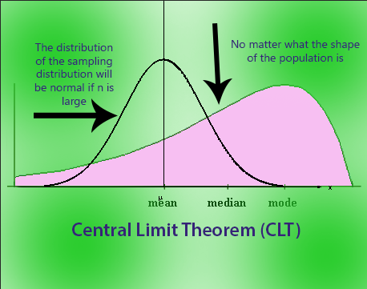
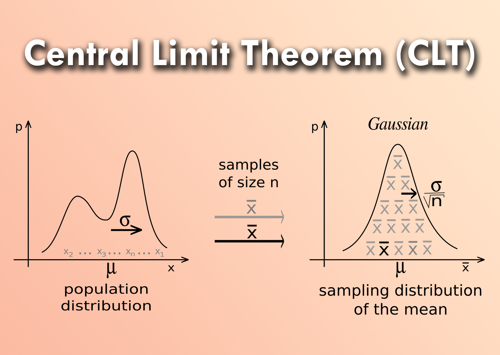

# Central Limit Theorem 

---

## 1. Definition & Formula

The **Central Limit Theorem (CLT)** states that if you take sufficiently large random samples from *any* population — regardless of its shape — the distribution of the **sample means** will approximate a **normal (bell-curve) distribution**, provided samples are independent and identically distributed (i.i.d.).

> **Plain English:** No matter how weird or skewed the original data is, average it enough times with big-enough samples, and those averages will always form a bell curve.

### Formula

If a population has mean **μ** and standard deviation **σ**, then for samples of size **n**:

```
Mean of sampling distribution  =  μ
Standard Error (SE)             =  σ / √n
Shape                           →  Normal(μ, σ²/n)  as  n → ∞
```

| Term | Symbol | Meaning |
|------|--------|---------|
| Population mean | μ | True average of the population |
| Population std dev | σ | Spread of individual values |
| Sample size | n | Number of observations per sample |
| Sample mean | x̄ | Average of one drawn sample |
| Standard error | σ/√n | How much x̄ varies across samples |
| CLT threshold | n ≥ 30 | Rule of thumb for normality to hold |

---

## 2. Explanation

The key intuition: **extreme values cancel out when averaged.** One person earning $1M and one earning $0 average to $500K — a middle value. Repeat that with samples of size n thousands of times, and those averages cluster symmetrically around the true mean.

Three things happen as **n grows**:

- **Shape** → Converges to normal, regardless of whether the population is uniform, exponential, or bimodal
- **Center** → Stays at μ — the sample mean is an unbiased estimator of the population mean
- **Spread** → Shrinks. SE = σ/√n. Double your sample size, estimates become √2 ≈ 1.41× more precise

### The n ≥ 30 Rule

This is a heuristic, not a law:
- Nearly-normal populations → n = 5 may be enough
- Heavily skewed distributions (e.g. income) → may need n = 100+
- Always verify with a QQ-plot or bootstrap in practice

### Why Does It Work?

When you sum independent random variables, their variances add. When you *average* them, variance divides by n — pulling values tighter around the mean. The normal distribution is the unique mathematical "attractor" of this averaging process (provable via characteristic/moment-generating functions).

---

## 3. Uses & Applications

### Statistical Inference
Confidence intervals and hypothesis tests (z-tests, t-tests) rely entirely on CLT. When you say *"we are 95% confident the mean lies between X and Y"*, you are using the normal sampling distribution CLT guarantees. Without CLT, these tests would only be valid for normally distributed populations.

### A/B Testing (Big Tech)
The primary mathematical backbone of every online experiment. Metrics like conversion rate (Bernoulli 0/1) or revenue per user (heavily skewed) are non-normal. CLT justifies using z-tests and t-tests as long as sample sizes are large enough — which is why every major tech company runs experiments at scale.

### Quality Control & Manufacturing
Control charts (Shewhart charts) plot sample means over time to detect process drift. CLT ensures those means are normally distributed, validating the "3 sigma" rule (99.7% of values within ±3 SD) for defect flagging.

### Finance & Risk Management
Portfolio returns: even if individual asset returns are non-normal, the average return of a large diversified portfolio approximates normality. Directly used in Value at Risk (VaR) models and options pricing.

### Polling & Surveys
Margin of error calculations use CLT. A sample of 1,000 people gives a normally distributed proportion estimate, enabling precise confidence intervals like "±3 percentage points."

### Machine Learning
Mini-batch gradient descent averages gradients — CLT explains why those batch estimates are well-behaved. Also central to bootstrapping, cross-validation, and uncertainty quantification.

---

## 4. FAANG Interview Q&A

### Conceptual Questions

---

**Q: What does CLT actually say? State it precisely.**

> For a population with mean μ and variance σ², the distribution of the sample mean x̄ from n i.i.d. draws converges to Normal(μ, σ²/n) as n → ∞. It says nothing about the shape of the population itself — only about the distribution of *averages*.

---

**Q: Why is CLT important for A/B testing?**

> In A/B testing, metrics like conversion rate (Bernoulli) or revenue per user (right-skewed) are non-normal. CLT guarantees that the sampling distribution of the mean becomes approximately normal for large n, which justifies using z-tests and t-tests to compute p-values and confidence intervals correctly.

---

**Q: What are the assumptions of CLT? What breaks it?**

> **Assumptions:** (1) Samples are i.i.d. (2) Population has finite mean and variance.
>
> **Breaks when:** variance is infinite (e.g. Cauchy distribution), data is not independent (time series with autocorrelation, clustered data), or n is too small for a heavily skewed distribution.

---

**Q: What is standard error, and how does it differ from standard deviation?**

> Standard deviation (σ) measures variability in the *population* or individual observations. Standard error (SE = σ/√n) measures variability of the *sample mean* — how much the mean estimate fluctuates across different samples. SE shrinks with more data; SD does not.

---

**Q: If you double your sample size, how does your CI change?**

> CI width is proportional to SE = σ/√n. Doubling n multiplies SE by 1/√2 ≈ 0.707, so the interval shrinks by ~29%. To *halve* the CI width, you need to **quadruple** n — diminishing returns.

---

**Q: Can you use CLT for proportions (e.g. click-through rate)?**

> Yes. A proportion p̂ is the mean of a Bernoulli(p) with variance p(1−p). By CLT, p̂ ~ Normal(p, p(1−p)/n) for large n. Rule of thumb: np ≥ 10 and n(1−p) ≥ 10.

---

### Practical / Case-Based Questions

---

**Q: Revenue per user is very right-skewed (most spend $0, a few spend thousands). Your PM wants results in 3 days. What do you do?**

> Because of CLT, mean revenue *is* approximately normal if n is large enough — but "large enough" is higher for skewed metrics. Options:
> 1. Check if sample sizes are sufficient (usually **10k+ per arm** for revenue)
> 2. Apply a **log or capped transformation** to reduce skew and speed up convergence
> 3. Use a **non-parametric test** (Mann-Whitney) that doesn't rely on CLT
> 4. Use **bootstrapping** to empirically estimate the sampling distribution

---

**Q: What minimum sample size would you recommend for CLT to hold?**

> n ≥ 30 is the textbook heuristic, but context-dependent. For symmetric metrics (time-on-page), n = 20 may be fine. For highly skewed metrics (revenue, session count), you may need n = 200+ per group. Always verify with a **QQ-plot** or bootstrap before drawing conclusions.

---

**Q: At Google/Meta scale you have millions of users. Does CLT still matter?**

> Yes — it validates *why* standard statistical tools work at scale. But at massive sample sizes, statistical significance becomes trivially easy to achieve for tiny, meaningless effects ("curse of large n"). The focus shifts to **practical significance** and **minimum detectable effects (MDE)**. CLT remains the foundation, but multiple comparisons and effect size matter more.

---

**Q: How does CLT relate to bootstrapping?**

> Bootstrapping is an empirical alternative to CLT — instead of relying on the theorem to assume normality, you resample your actual data thousands of times and observe the sampling distribution directly. Especially useful when CLT assumptions don't hold (small n, heavy tails, dependent data). Both approaches characterize the sampling distribution — CLT uses math, bootstrapping uses computation.

---

**Q: What's the difference between CLT and the Law of Large Numbers?**

> The **Law of Large Numbers** says the sample mean *converges to* μ as n → ∞ (about the destination). **CLT** describes the *rate and shape* of that convergence — the sample mean is normally distributed with SE = σ/√n (about the journey). LLN tells you where you're heading; CLT tells you how quickly and in what shape you get there.

---




