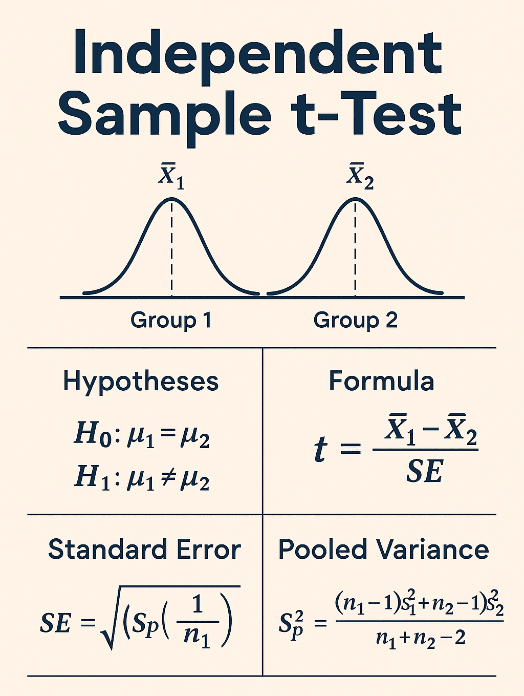
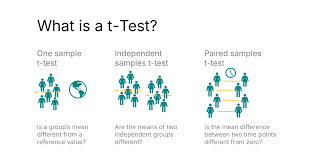
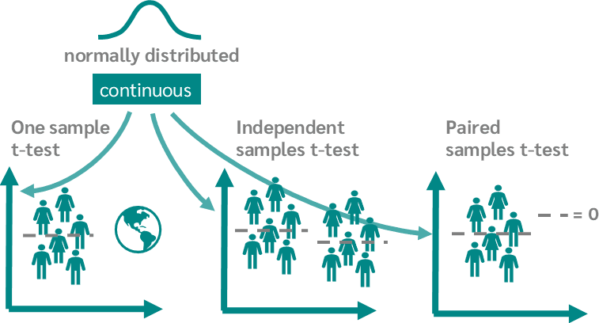
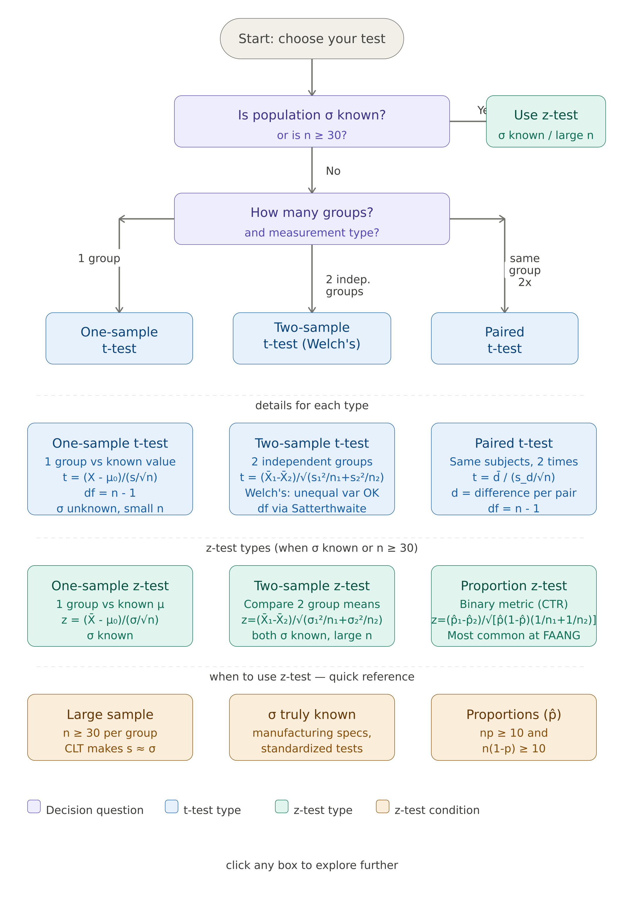

# t-Test & z-Test

---

## 1. Definition & Formula

Both tests answer the same core question: **"Is the observed difference real, or just random chance?"** They differ in *when* they're used and *what they assume* about the data.

---

### z-Test

A **z-test** is a hypothesis test used when:
- The **population standard deviation (σ) is known**, OR
- The **sample size is large (n ≥ 30)**, so σ can be reliably estimated by s

> **Plain English:** You know (or can reliably estimate) how spread out the population is. You're testing whether your sample mean is far enough from the hypothesized mean to be considered a real difference.

#### One-Sample z-Test Formula

```
z = (X̄ - μ₀) / (σ / √n)

Where:
  X̄  = sample mean
  μ₀ = hypothesized population mean (under H₀)
  σ  = population standard deviation (or s for large n)
  n  = sample size
```

#### Two-Sample z-Test Formula (A/B Testing)

```
z = (X̄₁ - X̄₂) / √(σ₁²/n₁ + σ₂²/n₂)
```

#### Proportion z-Test Formula (most common in A/B testing)

```
z = (p̂₁ - p̂₂) / √[ p̂(1 - p̂)(1/n₁ + 1/n₂) ]

Where:
  p̂₁, p̂₂ = observed proportions in each group
  p̂       = pooled proportion = (x₁ + x₂) / (n₁ + n₂)
  n₁, n₂  = sample sizes
```

---

### t-Test

A **t-test** is a hypothesis test used when:
- The **population standard deviation (σ) is unknown**
- The **sample size is small (n < 30)**
- The population is approximately normally distributed

> **Plain English:** You don't know the true spread of the population, so you estimate it from your sample. The t-distribution accounts for this extra uncertainty by having heavier tails than the normal — being more conservative.

#### One-Sample t-Test Formula

```
t = (X̄ - μ₀) / (s / √n)

Where:
  X̄  = sample mean
  μ₀ = hypothesized population mean
  s  = sample standard deviation
  n  = sample size

Degrees of freedom: df = n - 1
```

#### Two-Sample Independent t-Test (Welch's — most common)

```
t = (X̄₁ - X̄₂) / √(s₁²/n₁ + s₂²/n₂)

Degrees of freedom (Welch-Satterthwaite):
df = (s₁²/n₁ + s₂²/n₂)² / [ (s₁²/n₁)²/(n₁-1) + (s₂²/n₂)²/(n₂-1) ]
```

#### Paired t-Test Formula

```
t = d̄ / (s_d / √n)

Where:
  d̄   = mean of differences (after - before) for each pair
  s_d = standard deviation of those differences
  n   = number of pairs

df = n - 1
```

---

### Side-by-Side Comparison

| Feature | z-Test | t-Test |
|---------|--------|--------|
| σ known? | Yes (or n ≥ 30) | No — estimated from sample |
| Sample size | Large (n ≥ 30) | Small (n < 30) or any size |
| Distribution used | Standard Normal Z | t-distribution with df = n−1 |
| Tail heaviness | Thinner tails | Heavier tails (more conservative) |
| As n → ∞ | — | t-distribution → Normal |
| Use case | Proportions, large-scale A/B | Clinical trials, small experiments |

---

### Key Terms

| Term | Symbol | Meaning |
|------|--------|---------|
| Sample mean | X̄ | Average of your sample |
| Population mean | μ | True average of the population |
| Sample std dev | s | Estimated spread from your sample |
| Population std dev | σ | True spread (known for z-test) |
| Degrees of freedom | df | n − 1 for one-sample; adjusts for estimation |
| Standard error | SE | σ/√n or s/√n — spread of the sampling distribution |
| Test statistic | z or t | How many standard errors away from H₀ |
| Critical value | z* or t* | Threshold beyond which you reject H₀ |

---

### Common Critical Values

```
z-test (two-tailed):
  α = 0.05  →  z* = ±1.96
  α = 0.01  →  z* = ±2.576
  α = 0.001 →  z* = ±3.291

t-test (two-tailed, varies with df):
  df = 10, α = 0.05  →  t* = ±2.228
  df = 30, α = 0.05  →  t* = ±2.042
  df = ∞,  α = 0.05  →  t* = ±1.96  (converges to z)
```

---

## 2. Explanation

### The Core Logic (Same for Both)

Both tests follow the same logic:

```
1. State H₀ (no difference) and H₁ (there is a difference)
2. Compute a test statistic measuring how far your sample is from H₀
3. Find the probability (p-value) of seeing this extreme a result under H₀
4. If p ≤ α → reject H₀. If p > α → fail to reject H₀.
```

The test statistic is always of the form:

```
Test statistic = (Observed - Expected under H₀) / Standard Error

           signal
         ─────────
           noise
```

A large test statistic means your observed value is many standard errors away from what H₀ predicts — strong evidence against H₀.

---

### Why t-Test Has Heavier Tails

When σ is unknown, you estimate it with s. This introduces additional uncertainty. The t-distribution captures this by having **heavier tails** than the normal — it's harder to reject H₀, making the test more conservative.

```
t-distribution tails vs Normal:

           Normal (z)
              ____
             /    \
____________/      \____________

         t-distribution (small df)
            ______
           /      \
__________/        \__________
  ←heavier→        ←heavier→
```

As **df increases (larger n)**, the t-distribution converges to the standard normal. By df ≈ 30+, the difference is negligible — which is why z-test is acceptable for n ≥ 30.

---

### Degrees of Freedom — Intuition

Degrees of freedom = the number of values free to vary after computing a constraint (like the mean). For a sample of n values, once you fix the mean, only n−1 values are free — the last one is determined. This is why df = n−1 for one-sample tests.

For Welch's two-sample t-test, df is fractional (Welch-Satterthwaite formula) to account for unequal variances. Most software handles this automatically.

---

### Paired vs Independent Tests

| Scenario | Use |
|----------|-----|
| Same users measured before & after | Paired t-test |
| Two separate, unrelated groups | Two-sample (independent) t-test |
| Large n, testing proportions | Proportion z-test |

Paired tests are more powerful because **within-subject variability is eliminated** — each subject acts as its own control, reducing noise.

---

### Assumptions

#### z-Test Assumptions
- Observations are independent
- Population is normally distributed OR n ≥ 30 (CLT applies)
- σ is known or n is large enough that s ≈ σ

#### t-Test Assumptions
- Observations are independent
- Population is approximately normally distributed (robust to mild violations for large n)
- For two-sample: Welch's t-test handles unequal variances (preferred over Student's t-test)
- For paired: differences between pairs are approximately normally distributed

---

### What Happens When Assumptions Break?

| Violated Assumption | Consequence | Fix |
|--------------------|-------------|-----|
| Non-normality (small n) | Inaccurate p-values | Use Mann-Whitney U (non-parametric) |
| Dependent observations | Inflated significance | Use paired t-test, or mixed models |
| Outliers | Distorted mean and variance | Winsorize, or use robust tests |
| Very skewed distribution | Poor CLT convergence | Log-transform, or bootstrap |
| Unequal variances (two-sample) | Student's t-test invalid | Use Welch's t-test (default in most software) |

---

## 3. Uses & Applications

### A/B Testing — Proportion z-Test (Most Common at FAANG)

Testing whether a new feature changes conversion rate, click-through rate, or any binary metric. With millions of users, CLT applies and z-test for proportions is standard. The pooled proportion z-test is used when assuming equal variance under H₀.

```
Example:
  Control: 1,200 conversions out of 20,000 users  → p̂₁ = 0.060
  Variant: 1,350 conversions out of 20,000 users  → p̂₂ = 0.0675
  Pooled:  p̂ = 2,550 / 40,000 = 0.06375

  z = (0.0675 - 0.060) / √[0.06375 × 0.93625 × (1/20000 + 1/20000)]
  z ≈ 3.87  →  p < 0.0001  →  Reject H₀
```

### Clinical Trials — t-Test

Drug trials often have small, expensive-to-recruit samples. A two-sample Welch's t-test compares treatment vs placebo groups. Paired t-tests are used in crossover designs where the same patient receives both treatments.

### Feature Significance in ML Models

Linear and logistic regression output t-statistics and p-values for each coefficient. A significant t-test (p < 0.05) for a coefficient suggests the feature has a real relationship with the target beyond what's explained by random chance.

### Mean Response Time Testing (Engineering)

Testing whether a new API version has significantly lower latency than the current version. If sample sizes are small (early load testing), use t-test. At scale, use z-test.

### Manufacturing & Quality Control

Testing whether a batch of products meets specifications. Sample means are compared to the target specification using a one-sample t-test or z-test depending on whether σ is known.

### Finance — Return Analysis

Testing whether a trading strategy's mean return is significantly different from zero (one-sample t-test), or whether two portfolios have significantly different mean returns (two-sample t-test).

---

## 4. FAANG Interview Q&A

### Conceptual Questions

---

**Q: When do you use a z-test vs a t-test?**

> Use a **z-test** when: (1) σ is known, or (2) n ≥ 30 (CLT makes s a reliable estimate of σ), or (3) you're testing proportions with large samples.
>
> Use a **t-test** when: (1) σ is unknown and n < 30, or (2) you're comparing means from small samples and the population is approximately normal.
>
> In practice at FAANG, most A/B tests have millions of users, so z-tests (especially proportion z-tests) are the default. t-tests appear in early-stage experiments, clinical research, or when analyzing small internal datasets.

---

**Q: What are degrees of freedom and why do they matter?**

> Degrees of freedom represent the number of independent pieces of information available to estimate a parameter. For a one-sample t-test, df = n − 1 because computing the sample mean uses up one degree of freedom — the last value in your sample is not free once you know the mean and the other n−1 values.
>
> They matter because the shape of the t-distribution depends on df. Lower df = heavier tails = more conservative test = harder to reject H₀. As df → ∞, the t-distribution becomes the standard normal — which is why z-test and t-test converge for large n.

---

**Q: Why does the t-distribution have heavier tails than the normal?**

> Because the t-test uses the sample standard deviation s instead of the true σ. Estimating σ from the data introduces additional uncertainty. The heavier tails of the t-distribution reflect this — they give more probability to extreme values, making it harder to achieve significance. This is the statistically honest way to account for "we don't know σ exactly."

---

**Q: What is Welch's t-test and when should you use it over Student's t-test?**

> Student's t-test assumes equal variances in both groups (pooled variance). Welch's t-test does not make this assumption — it uses each group's variance separately and computes an adjusted degrees of freedom via the Welch-Satterthwaite formula.
>
> **Always default to Welch's t-test** for two-sample comparisons. It performs just as well as Student's when variances are equal, and is more robust when they're not. Most statistical software (R, Python's `scipy`) uses Welch's by default.

---

**Q: What is a paired t-test? When is it more appropriate than a two-sample t-test?**

> A paired t-test is used when each observation in one group is matched to a specific observation in another — typically the same subject measured twice (before/after). Instead of comparing group means, it computes the difference for each pair and tests whether the mean difference is zero.
>
> It's more appropriate when: (1) you have a before/after design, (2) subjects are naturally matched (twins, same user across time periods). It's more **statistically powerful** than two-sample because it eliminates between-subject variability — each person's baseline is subtracted out, leaving only the treatment effect.

---

**Q: What is the standard error and why is it in the denominator of both formulas?**

> Standard error (SE = σ/√n or s/√n) measures how much the sample mean varies across different samples — it's the standard deviation of the sampling distribution of X̄. Dividing by SE in the test statistic **standardizes** the observed difference: it expresses the difference in units of "how much random variation you'd expect." A test statistic of 3.0 means the observed difference is 3 standard errors away from H₀ — that's very unlikely by chance.

---

**Q: How does sample size affect z and t statistics?**

> Both test statistics include √n in the denominator of SE = σ/√n. So larger n → smaller SE → larger test statistic → smaller p-value. Specifically, the test statistic scales as √n: doubling n multiplies the test statistic by √2 ≈ 1.41. At massive scale, even trivially small effects produce enormous test statistics and p ≈ 0. This is why **effect size** (not just the test statistic) must always be reported.

---

**Q: What is the relationship between a confidence interval and a t-test or z-test?**

> They are two sides of the same coin. A 95% confidence interval is all values of μ₀ for which the two-tailed test at α = 0.05 would *not* reject H₀. So:
> - If the CI **excludes** the null value (e.g. 0 for a difference) → p < 0.05
> - If the CI **includes** the null value → p > 0.05
>
> CIs are often preferred in practice because they convey both statistical significance *and* practical magnitude. Reporting only p = 0.03 is less informative than reporting a lift of 2.3% (95% CI: 0.8%, 3.8%).

---

### Practical / Case-Based Questions

---

**Q: You're running an A/B test on conversion rate. Which test do you use and why?**

> For conversion rate (binary: converted or not), I'd use a **two-sample proportion z-test**. Conversion rate is a proportion, and at FAANG scale the sample sizes are typically large enough (n >> 30) for CLT to apply, making the normal approximation valid. I'd verify np ≥ 10 and n(1−p) ≥ 10 for both groups. The test statistic uses the pooled proportion under H₀ (assuming equal rates), and I'd use a two-tailed test to detect both improvements and degradations.

---

**Q: You're testing a new recommendation algorithm on 50 users. Which test do you use?**

> With n = 50, both z and t are technically valid, but I'd use a **two-sample Welch's t-test** because σ is unknown and I want the more conservative, appropriate test. Key checks: (1) Is the metric approximately normally distributed? If heavily skewed, consider a log transform or Mann-Whitney U test. (2) Are the two groups independent? (3) Is n = 50 per group or total? If total, n = 25 per group is small — watch for low power.

---

**Q: Your A/B test shows a statistically significant result but the effect is tiny. What do you do?**

> This is the statistical vs practical significance problem, especially acute at large n. Steps:
> 1. **Quantify the effect size** — report relative lift (%), absolute change, and Cohen's d.
> 2. **Compute the business impact** — does a 0.05% conversion rate increase justify the engineering and maintenance cost?
> 3. **Check guardrail metrics** — did anything degrade (latency, error rate)?
> 4. **Consider long-term effects** — novelty effect? Will the lift persist?
> 5. **Make a cost-benefit call** — statistical significance is a threshold, not a decision. The decision requires business context.

---

**Q: How would you test whether two ML models have significantly different accuracy?**

> Use a **paired t-test** or **McNemar's test** (for binary classification):
> - **Paired t-test on cross-validation folds:** Train both models on the same k folds. The per-fold accuracy differences are paired observations. Test whether the mean difference is zero with a paired t-test. This controls for dataset variability.
> - **McNemar's test:** For the same test set, compare the pattern of correct/incorrect predictions between models. Tests whether Model A and Model B disagree significantly and in what direction.
> - Avoid comparing accuracy on independent test sets with a two-sample t-test — this ignores that the same data could have been used.

---

**Q: Your metric is average revenue per user, which is highly skewed. Can you still use a t-test?**

> Technically yes, if n is large enough — CLT ensures the sampling distribution of the mean normalizes regardless of the underlying distribution's skewness. But "large enough" depends on the severity of skew:
> 1. **Check the skewness** — revenue is often extremely right-skewed with a few whale users.
> 2. **For large n (10k+ per group):** CLT usually kicks in and the t-test / z-test p-values are reliable.
> 3. **For smaller n:** Options include (a) **Winsorize** at the 95th or 99th percentile, (b) **log-transform** revenue, (c) **bootstrap the p-value** (permutation test — no distributional assumption), (d) use a **Mann-Whitney U test** for ordinal comparison.
> 4. **Always verify** with a QQ-plot of the sample means from bootstrap resampling.

---

**Q: What is the multiple testing problem in the context of z-tests and t-tests? How do you handle it?**

> When running many tests simultaneously (e.g. testing 20 metrics in one experiment), the probability of at least one false positive at α = 0.05 is:
>
> ```
> P(at least one false positive) = 1 - (1 - 0.05)²⁰ ≈ 0.64
> ```
>
> Nearly a 64% chance of a spurious significant result. Solutions:
> - **Bonferroni correction:** α_adjusted = α / m (m = number of tests). Very conservative.
> - **Benjamini-Hochberg (FDR):** Controls the false discovery rate — proportion of significant results that are false. More powerful than Bonferroni, preferred for many simultaneous tests.
> - **Pre-specify primary metric:** Designate one primary metric before the experiment. All others are secondary/exploratory with appropriate caveats.
> - **Hierarchy of metrics:** Primary → guardrail → secondary. Only apply strict α control to primary.

---

**Q: What's the difference between a one-sample, two-sample, and paired t-test? Give a real-world example for each.**

> - **One-sample t-test:** Test whether a single group's mean differs from a known value.
>   *Example:* Is the average checkout time (X̄ = 4.2 min) significantly different from the target of 4.0 min? H₀: μ = 4.0.
>
> - **Two-sample t-test:** Test whether two independent groups have different means.
>   *Example:* Does the new search ranking algorithm produce higher average dwell time than the old one, across two randomly assigned user groups?
>
> - **Paired t-test:** Test whether the mean of within-subject differences is zero.
>   *Example:* Do the same users spend more time on the app after a UI redesign? Measure each user before and after — the difference per user is the unit of analysis.

---


## Types of t-Test — When to Use What

---

### Type 1 — One-Sample t-Test

**Use when:** You have one group and want to compare its mean against a known or hypothesized value.

**Formula:**
```
t = (X̄ - μ₀) / (s / √n)       df = n - 1
```

**Conditions:**
- σ is unknown (you only have your sample's `s`)
- n < 30 (or any size if population is normal)
- Population is approximately normal

**Real-world examples:**

| Domain | Scenario |
|--------|----------|
| Manufacturing | A factory claims its bolts are 50mm long. You sample 20 bolts (X̄ = 49.3mm). Is this significantly different from 50mm? |
| Healthcare | A hospital claims average patient wait time is 30 min. You sample 25 visits. Did they meet the target? |
| Education | A school tests whether its students' average score (X̄ = 74) differs from the national average (μ₀ = 70). |
| Tech/Eng | Your API has a target latency of 200ms. You sample 15 requests. Is actual latency significantly above target? |

---

### Type 2 — Two-Sample t-Test (Welch's)

**Use when:** You have two independent groups and want to compare their means.

**Formula:**
```
t = (X̄₁ - X̄₂) / √(s₁²/n₁ + s₂²/n₂)

df = (s₁²/n₁ + s₂²/n₂)² / [(s₁²/n₁)²/(n₁-1) + (s₂²/n₂)²/(n₂-1)]
```

> Always default to Welch's over Student's t-test. It works equally well when variances are equal, and is more robust when they aren't.

**Conditions:**
- Two independent, unrelated groups
- σ unknown in both groups
- Both groups approximately normal (or n ≥ 30 each)

**Real-world examples:**

| Domain | Scenario |
|--------|----------|
| A/B Testing (small scale) | 40 users see old UI, 40 see new UI. Compare average session duration. |
| Drug trials | Treatment group (n=25) vs placebo group (n=25). Compare blood pressure reduction. |
| HR/People Analytics | Do engineers in team A have higher productivity scores than team B? |
| Education | Do students taught with Method A score higher than those with Method B? |
| E-commerce | Does a new checkout flow reduce cart abandonment time vs old flow? (small pilot) |

---

### Type 3 — Paired t-Test

**Use when:** The same subjects are measured twice — before/after, or matched in pairs.

**Formula:**
```
d_i  = X_after,i  -  X_before,i     (difference per subject)
t    = d̄ / (s_d / √n)               df = n - 1
```

**Conditions:**
- Same subjects measured under two conditions (or naturally matched pairs)
- The *differences* d_i are approximately normally distributed
- More powerful than two-sample t-test when applicable — removes between-subject noise

**Real-world examples:**

| Domain | Scenario |
|--------|----------|
| Product/UX | Same 30 users complete a task on old UI, then new UI. Compare task completion times. |
| Healthcare | Same 20 patients measured before and after taking a drug. Compare cholesterol levels. |
| Sports science | Athletes' sprint times before vs after a 6-week training programme. |
| Finance | Same portfolio's return before vs after a strategy change. |
| ML | Same test set evaluated by Model A and Model B — paired accuracy per sample (McNemar's is related). |

---

### At a Glance — Which t-Test?

| Situation | Test | Key signal |
|-----------|------|-----------|
| 1 group vs a fixed number | One-sample t | "Is our mean = target?" |
| 2 separate, unrelated groups | Two-sample (Welch's) | "Do these two groups differ?" |
| Same group measured twice | Paired t | "Did this group change?" |
| Large n (≥30), proportions, σ known | z-test | "Scale data, binary metric" |

---

## When Is z-Test Applicable? — The Full Checklist

This is one of the most common interview questions. The z-test is valid under **any of these three conditions**:

### Condition 1 — σ (population standard deviation) is truly known

This is rarer in practice than textbooks imply. Real scenarios:

- **Standardized tests** — SAT, GRE, IQ tests have known population σ from decades of data
- **Manufacturing processes** — a calibrated machine produces parts where σ is known from historical spec sheets
- **Quality control baselines** — a production line has a known defect rate σ established over millions of runs
- **Psychometric instruments** — validated scales with known population parameters

```
z = (X̄ - μ₀) / (σ / √n)       ← use true σ here
```

### Condition 2 — Sample size is large (n ≥ 30)

When n ≥ 30, by the Central Limit Theorem:
- The sampling distribution of X̄ is approximately normal regardless of the population shape
- The sample standard deviation `s` becomes a reliable estimate of σ
- The t-distribution with df ≥ 29 is nearly identical to the standard normal (z)

So you can substitute `s` for `σ` and use z-tables:

```
z ≈ (X̄ - μ₀) / (s / √n)       ← s substitutes for σ when n ≥ 30
```

> At FAANG scale (millions of users), n >> 30 is always true. z-test is the default.

### Condition 3 — Testing proportions (binary metrics)

For binary outcomes (clicked/not, converted/not, churned/not), the proportion `p̂` follows a binomial distribution. When:

```
n × p ≥ 10    AND    n × (1 - p) ≥ 10
```

The binomial is well-approximated by the normal, and you use the proportion z-test:

```
z = (p̂₁ - p̂₂) / √[ p̂(1-p̂)(1/n₁ + 1/n₂) ]

where p̂ = (x₁ + x₂) / (n₁ + n₂)    ← pooled proportion
```

This is the most common test in online A/B experimentation at tech companies.

---

### z-Test vs t-Test — The Convergence

As degrees of freedom (df) grow, t → z:

| df (≈ n) | t critical value (α=0.05, two-tail) | z critical value |
|----------|--------------------------------------|-----------------|
| 5 | ±2.571 | ±1.960 |
| 10 | ±2.228 | ±1.960 |
| 20 | ±2.086 | ±1.960 |
| 30 | ±2.042 | ±1.960 |
| 100 | ±1.984 | ±1.960 |
| ∞ | ±1.960 | ±1.960 |

By df = 30, the difference is tiny. By df = 100, it's negligible. This is the mathematical reason "n ≥ 30 → use z-test" works.

---

### Summary Decision Rule

```
Do you know σ?
  YES → z-test

Is n ≥ 30?
  YES → z-test (s reliably estimates σ)

Is your metric a proportion (binary)?
  YES → proportion z-test (if np ≥ 10 and n(1-p) ≥ 10)

Are you comparing 1 group to a known value, with small n and unknown σ?
  → One-sample t-test

Are you comparing 2 independent groups, small n, unknown σ?
  → Two-sample Welch's t-test

Are you comparing the same subjects measured twice?
  → Paired t-test
```




