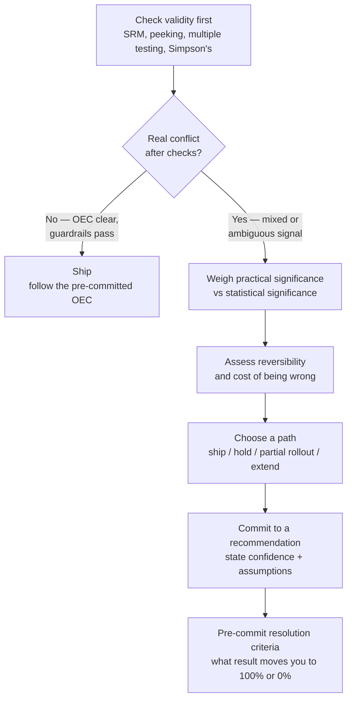

# Chapter 19 (continued): Ship Decision Flow

> The chapter's six-step framework, condensed into something you can trace through live in an interview — plus the two-axis matrix that actually drives Step 5 (choose a path).

## 1. The decision flow

Two things worth noticing about this flow that are easy to skip past:

- **The exit at step B is deliberate, not a shortcut.** Most "conflicts" interviewers describe are resolved right there — a pre-specified OEC that's clearly significant and guardrails that clearly pass mean there's no real tradeoff to reason about, just noisy secondaries that were never supposed to drive the call. Naming this explicitly, out loud, is itself a signal — it shows you're not manufacturing drama in data that doesn't have any.
- **Step H isn't optional decoration.** A "partial rollout, keep monitoring" recommendation without a pre-committed threshold for what graduates it to 100% (or kills it) isn't actually a decision — it's a postponement that will quietly never get resolved. This is Trap #4 from the chapter, and it's the single most common way an otherwise-strong L5-shaped answer loses points at the very end.

## 2. The matrix that actually drives step 5

Step 4 (reversibility) and the strength of the concerning signal from steps 2–3 combine into a 2×2 that maps cleanly onto "which path do I choose":

| | **Weak / no coherent secondary signal** | **Coherent, mechanistically-plausible signal** |
|---|---|---|
| **Easily reversible** (flag-gated UI, easy rollback) | Ship. The concern doesn't clear the bar and the downside of being wrong is small and fast to fix. | Partial rollout + monitoring, with a pre-set resolution threshold. Get most of the upside now, cap the downside while you gather more signal. |
| **Hard to reverse** (pricing, trust & safety, platform ranking, data migration) | Ship, but say so explicitly — don't let a low-stakes irreversibility spook you into an unnecessary hold when there's genuinely nothing concerning in the data. | Hold or extend. The combination of "real mechanistic risk" and "hard to walk back if wrong" is exactly the case that justifies slowing down, even against a statistically significant primary win. |

This is the piece that turns "I'd consider reversibility" (a fact) into "here's specifically what I'd do" (a decision) — naming which quadrant a scenario falls into, out loud, is a stronger answer than listing reversibility as one more consideration among many.

## 3. Worked example, mapped onto the flow

Revisiting the ad-format case from the chapter against the flow above:

| Flow step | What happened in the case |
|---|---|
| A — validity checks | Clean: no SRM, no peeking, secondary metric count noted (~12) so the organic CTR p=0.01 is treated with appropriate skepticism, not blind trust |
| B — real conflict? | **Yes** — primary OEC wins, guardrails pass, but a coherent secondary pattern (ads crowding organic attention) exists |
| D — practical vs statistical | Satisfaction score regression is statistically non-significant relative to its tolerance band, but directionally coherent with the CTR decline — not dismissed just because it didn't breach a hard threshold |
| E — reversibility | Moderately reversible (flag-gated) but with slow-burn reputational risk if it compounds — sits in the matrix's top-right quadrant |
| F — choose a path | **Partial rollout** (20–30% of traffic), matching the top-right cell's recommendation |
| G — commit | Explicit recommendation stated with named confidence and reasoning |
| H — resolution criteria | (The gap to close in your own answer: specify in advance what organic CTR / satisfaction reading, over what horizon, moves this to 100% vs. rollback) |

## 4. Interview-ready version

If asked to walk through a conflicting-metrics case cold, narrate it in this order out loud: *"First I'd check validity — SRM, peeking, multiple testing. If that's clean and the primary OEC alone resolves it, I'd say so and stop there. If there's a real, coherent conflict, I'd weigh practical vs. statistical significance, then plot it against reversibility — easily reversible and no real signal, I ship; hard to reverse and a real signal, I hold; the two in-between cells point to a partial rollout or extension with a pre-committed threshold for resolving it."* That's the whole chapter in four sentences, and it's structured enough that an interviewer can follow exactly where you are in your own reasoning at any point.
